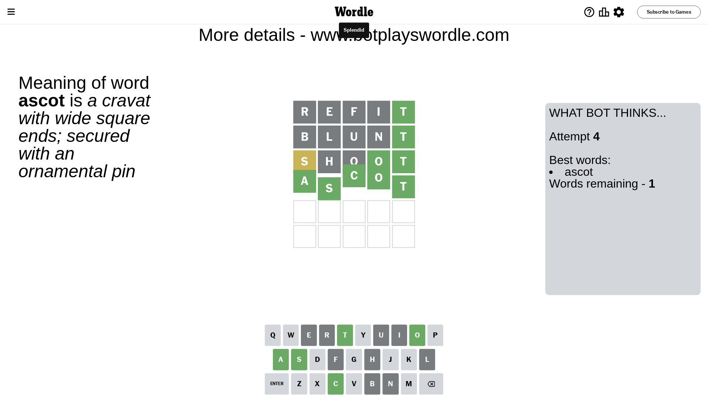

# Wordle for February 15, 2024 - \#971

## Attempt 1

This is the first attempt and we'll choose a random word to start with.

Let's start with word `refit`

Attempt for `refit` gives us 1 correct letters, 0 present letters and 4 wrong letters.

If we look into details, we can see that:

Letter `r` is not present in the word and we will not use it any more

Letter `e` is not present in the word and we will not use it any more

Letter `f` is not present in the word and we will not use it any more

Letter `i` is not present in the word and we will not use it any more

Letter `t` should be at position 5

We got information about the correct letters and it should make next attempt easier

Some letters are missing (like `r`, `e`, `f`, `i`) but it's also important piece of information

Word should contain letters `[t]`

That was a great guess that limited number of remaining words

## Attempt 2

Right now we have 106 words to choose from and best of them seem to be `[slant plant blunt daunt shalt]`

So far we know that possible letters are:

At position 1: `[a b c d g h j k l m n o p q s t u v w x y z]`

At position 2: `[a b c d g h j k l m n o p q s t u v w x y z]`

At position 3: `[a b c d g h j k l m n o p q s t u v w x y z]`

At position 4: `[a b c d g h j k l m n o p q s t u v w x y z]`

At position 5: `[t]`

Next guess is `blunt`, let's see what it gives us

Attempt for `blunt` gives us 1 correct letters, 0 present letters and 4 wrong letters.

If we look into details, we can see that:

Letter `b` is not present in the word and we will not use it any more

Letter `l` is not present in the word and we will not use it any more

Letter `u` is not present in the word and we will not use it any more

Letter `n` is not present in the word and we will not use it any more

Some letters are missing (like `b`, `l`, `u`, `n`) but it's also important piece of information

Word should contain letters `[t]`

Not a bad guess in general

## Attempt 3

Right now we have 25 words to choose from and best of them seem to be `[hoast shoat chapt ghost shoot]`

So far we know that possible letters are:

At position 1: `[a c d g h j k m o p q s t v w x y z]`

At position 2: `[a c d g h j k m o p q s t v w x y z]`

At position 3: `[a c d g h j k m o p q s t v w x y z]`

At position 4: `[a c d g h j k m o p q s t v w x y z]`

At position 5: `[t]`

Next guess is `shoot`, let's see what it gives us

Attempt for `shoot` gives us 2 correct letters, 1 present letters and 2 wrong letters.

If we look into details, we can see that:

Letter `s` is on a different spot - this means that it cannot be at position 1

Letter `h` is not present in the word and we will not use it any more

Letter `o` is not present in the word and we will not use it any more

Letter `o` should be at position 4

We got information about the correct letters and it should make next attempt easier

Some letters are missing (like `h`, `o`) but it's also important piece of information

Word should contain letters `[t s o]`

That was a great guess that limited number of remaining words

## Attempt 4

Right now we have 1 words to choose from and best of them seem to be `[ascot]`

So far we know that possible letters are:

At position 1: `[a c d g j k m p q t v w x y z]`

At position 2: `[a c d g j k m p q s t v w x y z]`

At position 3: `[a c d g j k m p q s t v w x y z]`

At position 4: `[o]`

At position 5: `[t]`

It must be `ascot`

That's the correct answer! The word is `ascot`!

## Conclusion

Today's word is `ascot` and it took 4 attempts to guess it

