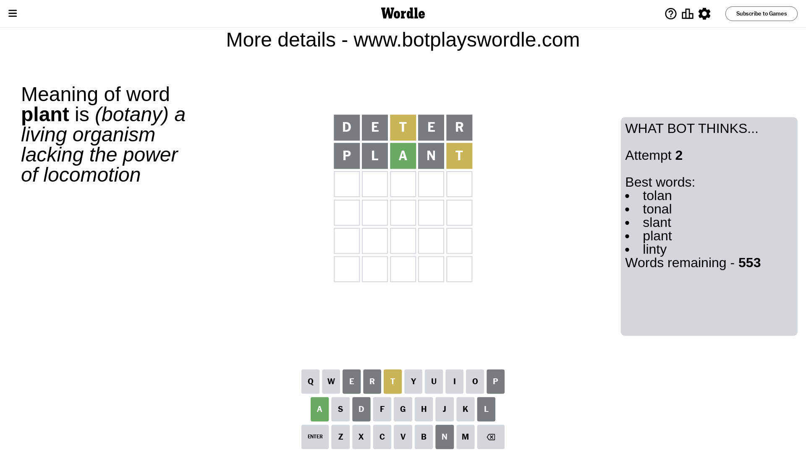

# Wordle for February 16, 2024 - \#972

## Attempt 1

This is the first attempt and we'll choose a random word to start with.

Let's start with word `deter`

Attempt for `deter` gives us 0 correct letters, 1 present letters and 4 wrong letters.

If we look into details, we can see that:

Letter `d` is not present in the word and we will not use it any more

Letter `e` is not present in the word and we will not use it any more

Letter `t` is on a different spot - this means that it cannot be at position 3

Letter `e` is not present in the word and we will not use it any more

Letter `r` is not present in the word and we will not use it any more

Some letters are missing (like `d`, `e`, `r`) but it's also important piece of information

Word should contain letters `[t]`

That was a great guess that limited number of remaining words

## Attempt 2

Right now we have 553 words to choose from and best of them seem to be `[tolan tonal slant plant linty]`

So far we know that possible letters are:

At position 1: `[a b c f g h i j k l m n o p q s t u v w x y z]`

At position 2: `[a b c f g h i j k l m n o p q s t u v w x y z]`

At position 3: `[a b c f g h i j k l m n o p q s u v w x y z]`

At position 4: `[a b c f g h i j k l m n o p q s t u v w x y z]`

At position 5: `[a b c f g h i j k l m n o p q s t u v w x y z]`

Next guess is `plant`, let's see what it gives us

Attempt for `plant` gives us 1 correct letters, 1 present letters and 3 wrong letters.

If we look into details, we can see that:

Letter `p` is not present in the word and we will not use it any more

Letter `l` is not present in the word and we will not use it any more

Letter `a` should be at position 3

Letter `n` is not present in the word and we will not use it any more

Letter `t` is on a different spot - this means that it cannot be at position 5

We got information about the correct letters and it should make next attempt easier

Some letters are missing (like `p`, `l`, `n`) but it's also important piece of information

Word should contain letters `[t a]`

That was a great guess that limited number of remaining words

## Attempt 3

Right now we have 20 words to choose from and best of them seem to be `[swath whats thack stash thawy]`

So far we know that possible letters are:

At position 1: `[a b c f g h i j k m o q s t u v w x y z]`

At position 2: `[a b c f g h i j k m o q s t u v w x y z]`

At position 3: `[a]`

At position 4: `[a b c f g h i j k m o q s t u v w x y z]`

At position 5: `[a b c f g h i j k m o q s u v w x y z]`

Next guess is `stash`, let's see what it gives us

That's the correct answer! The word is `stash`!

To be honest that was a pretty lucky guess, but it worked out well.

## Conclusion

Today's word is `stash` and it took 3 attempts to guess it

