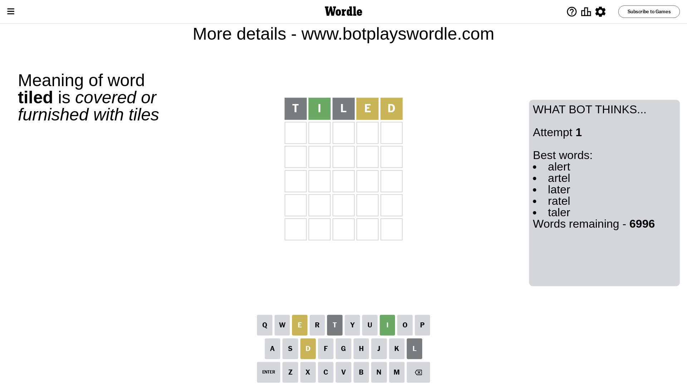
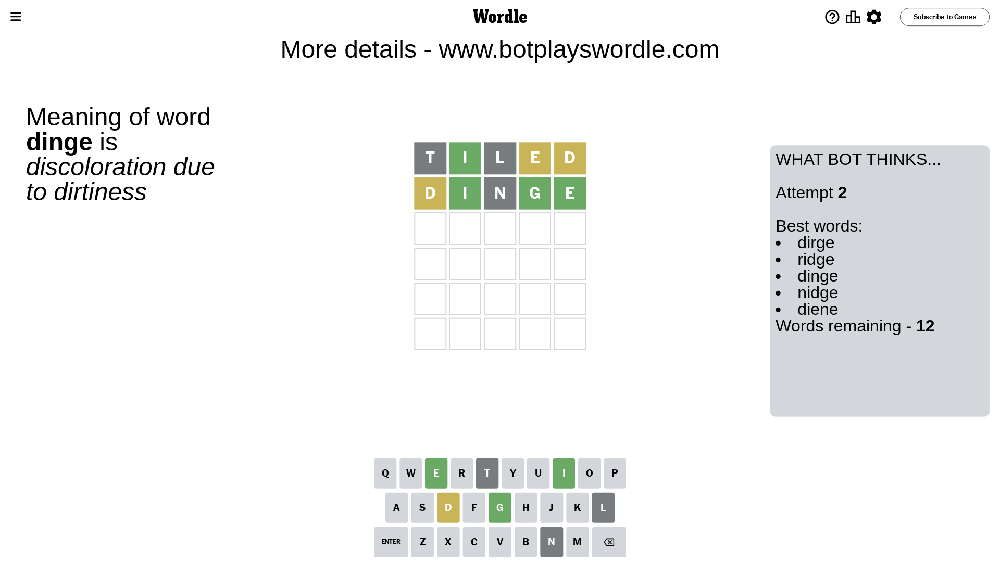
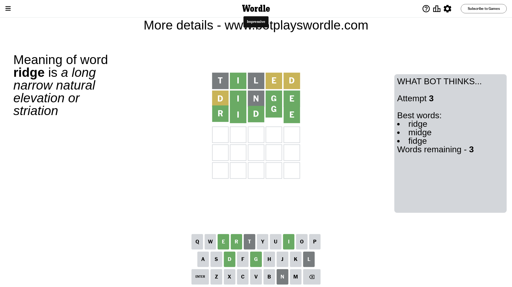

# Wordle for February 18, 2024 - \#974

## Attempt 1

This is the first attempt and we'll choose a random word to start with.

Let's start with word `tiled`

Attempt for `tiled` gives us 1 correct letters, 2 present letters and 2 wrong letters.

If we look into details, we can see that:

Letter `t` is not present in the word and we will not use it any more

Letter `i` should be at position 2

Letter `l` is not present in the word and we will not use it any more

Letter `e` is on a different spot - this means that it cannot be at position 4

Letter `d` is on a different spot - this means that it cannot be at position 5

We got information about the correct letters and it should make next attempt easier

Some letters are missing (like `t`, `l`) but it's also important piece of information

Word should contain letters `[i e d]`

That was a great guess that limited number of remaining words

## Attempt 2

Right now we have 12 words to choose from and best of them seem to be `[dirge ridge dinge nidge diene]`

So far we know that possible letters are:

At position 1: `[a b c d e f g h i j k m n o p q r s u v w x y z]`

At position 2: `[i]`

At position 3: `[a b c d e f g h i j k m n o p q r s u v w x y z]`

At position 4: `[a b c d f g h i j k m n o p q r s u v w x y z]`

At position 5: `[a b c e f g h i j k m n o p q r s u v w x y z]`

Next guess is `dinge`, let's see what it gives us

Attempt for `dinge` gives us 3 correct letters, 1 present letters and 1 wrong letters.

If we look into details, we can see that:

Letter `d` is on a different spot - this means that it cannot be at position 1

Letter `n` is not present in the word and we will not use it any more

Letter `g` should be at position 4

Letter `e` should be at position 5

We got information about the correct letters and it should make next attempt easier

Some letters are missing (like `n`) but it's also important piece of information

Word should contain letters `[i e d g]`

Could be a better guess

## Attempt 3

Right now we have 3 words to choose from and best of them seem to be `[ridge midge fidge]`

So far we know that possible letters are:

At position 1: `[a b c e f g h i j k m o p q r s u v w x y z]`

At position 2: `[i]`

At position 3: `[a b c d e f g h i j k m o p q r s u v w x y z]`

At position 4: `[g]`

At position 5: `[e]`

Next guess is `ridge`, let's see what it gives us

That's the correct answer! The word is `ridge`!

## Conclusion

Today's word is `ridge` and it took 3 attempts to guess it

