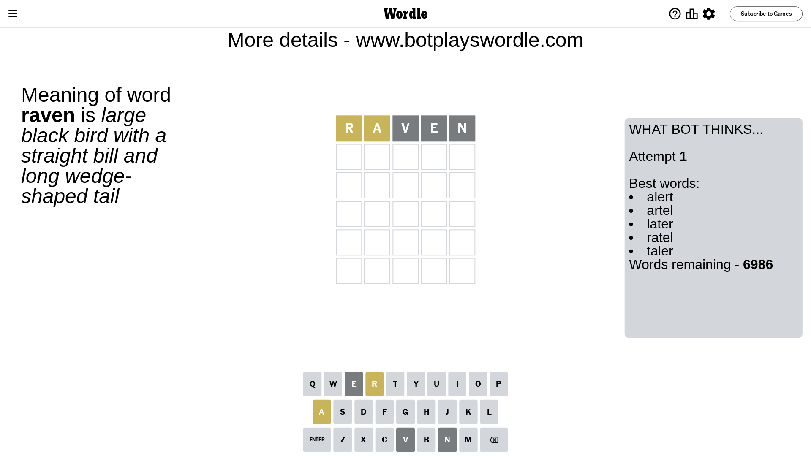
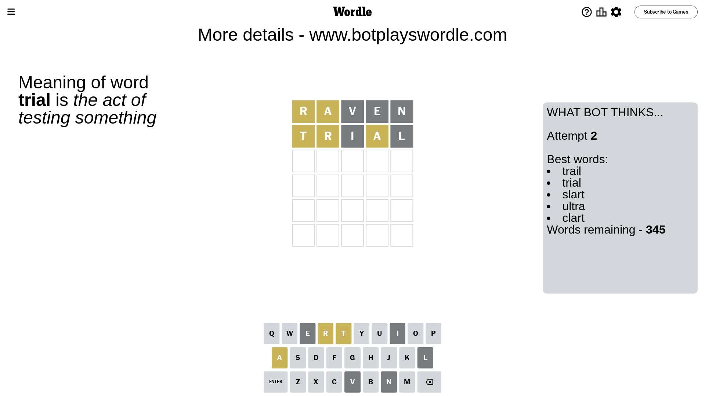
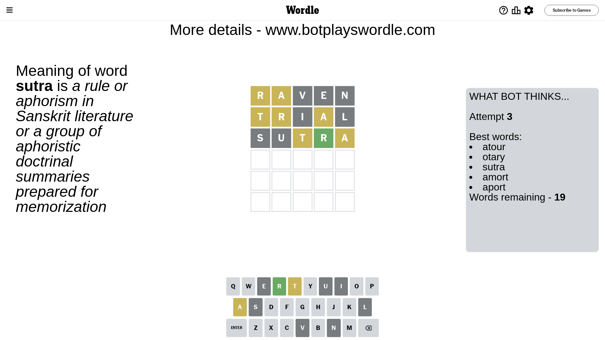
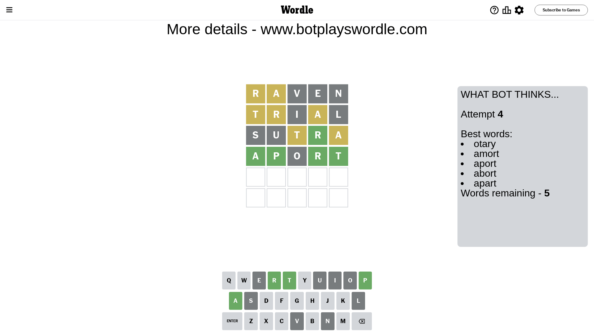
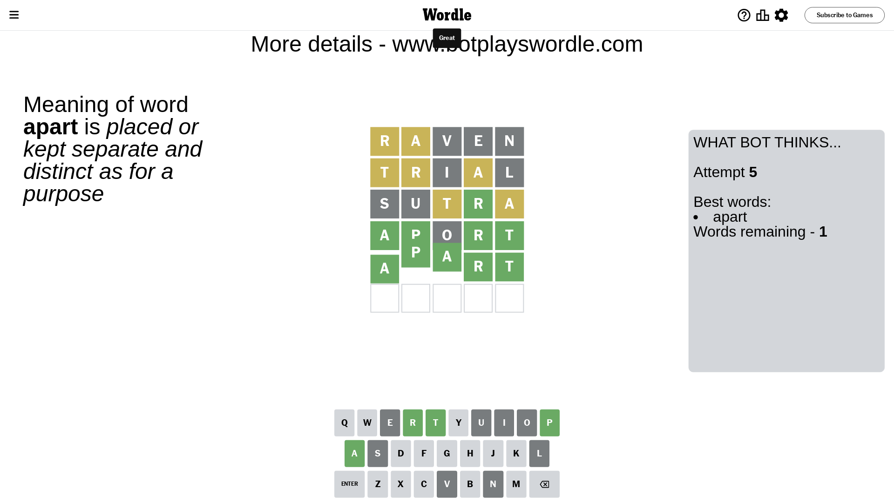

# Wordle for February 23, 2024 - \#979

## Attempt 1

This is the first attempt and we'll choose a random word to start with.

Let's start with word `raven`

Attempt for `raven` gives us 0 correct letters, 2 present letters and 3 wrong letters.

If we look into details, we can see that:

Letter `r` is on a different spot - this means that it cannot be at position 1

Letter `a` is on a different spot - this means that it cannot be at position 2

Letter `v` is not present in the word and we will not use it any more

Letter `e` is not present in the word and we will not use it any more

Letter `n` is not present in the word and we will not use it any more

Some letters are missing (like `v`, `e`, `n`) but it's also important piece of information

Word should contain letters `[r a]`

That was a great guess that limited number of remaining words

## Attempt 2

Right now we have 345 words to choose from and best of them seem to be `[trail trial slart ultra clart]`

So far we know that possible letters are:

At position 1: `[a b c d f g h i j k l m o p q s t u w x y z]`

At position 2: `[b c d f g h i j k l m o p q r s t u w x y z]`

At position 3: `[a b c d f g h i j k l m o p q r s t u w x y z]`

At position 4: `[a b c d f g h i j k l m o p q r s t u w x y z]`

At position 5: `[a b c d f g h i j k l m o p q r s t u w x y z]`

Next guess is `trial`, let's see what it gives us

Attempt for `trial` gives us 0 correct letters, 3 present letters and 2 wrong letters.

If we look into details, we can see that:

Letter `t` is on a different spot - this means that it cannot be at position 1

Letter `r` is on a different spot - this means that it cannot be at position 2

Letter `i` is not present in the word and we will not use it any more

Letter `a` is on a different spot - this means that it cannot be at position 4

Letter `l` is not present in the word and we will not use it any more

Some letters are missing (like `i`, `l`) but it's also important piece of information

Word should contain letters `[r a t]`

That was a great guess that limited number of remaining words

## Attempt 3

Right now we have 19 words to choose from and best of them seem to be `[atour otary sutra amort aport]`

So far we know that possible letters are:

At position 1: `[a b c d f g h j k m o p q s u w x y z]`

At position 2: `[b c d f g h j k m o p q s t u w x y z]`

At position 3: `[a b c d f g h j k m o p q r s t u w x y z]`

At position 4: `[b c d f g h j k m o p q r s t u w x y z]`

At position 5: `[a b c d f g h j k m o p q r s t u w x y z]`

Next guess is `sutra`, let's see what it gives us

Attempt for `sutra` gives us 1 correct letters, 2 present letters and 2 wrong letters.

If we look into details, we can see that:

Letter `s` is not present in the word and we will not use it any more

Letter `u` is not present in the word and we will not use it any more

Letter `t` is on a different spot - this means that it cannot be at position 3

Letter `r` should be at position 4

Letter `a` is on a different spot - this means that it cannot be at position 5

We got information about the correct letters and it should make next attempt easier

Some letters are missing (like `s`, `u`) but it's also important piece of information

Word should contain letters `[r a t]`

Could be a better guess

## Attempt 4

Right now we have 5 words to choose from and best of them seem to be `[otary amort aport abort apart]`

So far we know that possible letters are:

At position 1: `[a b c d f g h j k m o p q w x y z]`

At position 2: `[b c d f g h j k m o p q t w x y z]`

At position 3: `[a b c d f g h j k m o p q r w x y z]`

At position 4: `[r]`

At position 5: `[b c d f g h j k m o p q r t w x y z]`

Next guess is `aport`, let's see what it gives us

Attempt for `aport` gives us 4 correct letters, 0 present letters and 1 wrong letters.

If we look into details, we can see that:

Letter `a` should be at position 1

Letter `p` should be at position 2

Letter `o` is not present in the word and we will not use it any more

Letter `t` should be at position 5

We got information about the correct letters and it should make next attempt easier

Some letters are missing (like `o`) but it's also important piece of information

Word should contain letters `[r a t p]`

Not a bad guess in general

## Attempt 5

Right now we have 1 words to choose from and best of them seem to be `[apart]`

So far we know that possible letters are:

At position 1: `[a]`

At position 2: `[p]`

At position 3: `[a b c d f g h j k m p q r w x y z]`

At position 4: `[r]`

At position 5: `[t]`

It must be `apart`

That's the correct answer! The word is `apart`!

## Conclusion

Today's word is `apart` and it took 5 attempts to guess it

