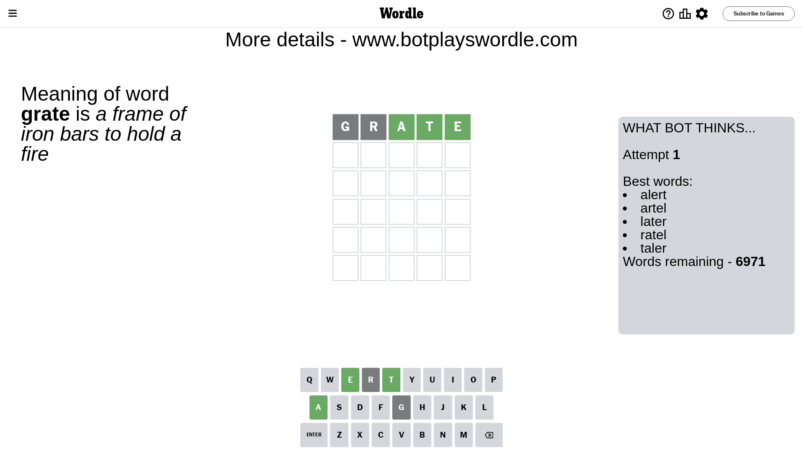
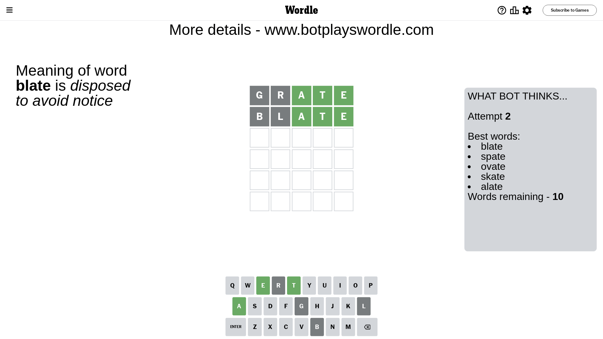
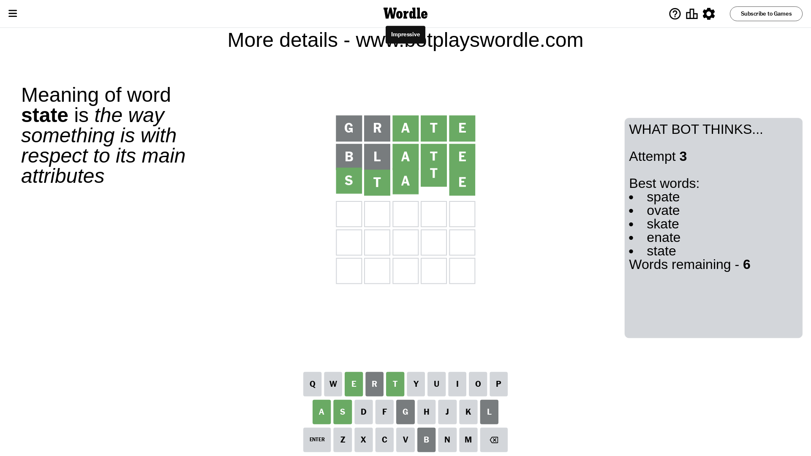

# Wordle for March 3, 2024 - \#988

## Attempt 1

This is the first attempt and we'll choose a random word to start with.

Let's start with word `grate`

Attempt for `grate` gives us 3 correct letters, 0 present letters and 2 wrong letters.

If we look into details, we can see that:

Letter `g` is not present in the word and we will not use it any more

Letter `r` is not present in the word and we will not use it any more

Letter `a` should be at position 3

Letter `t` should be at position 4

Letter `e` should be at position 5

We got information about the correct letters and it should make next attempt easier

Some letters are missing (like `g`, `r`) but it's also important piece of information

Word should contain letters `[a t e]`

That was a great guess that limited number of remaining words

## Attempt 2

Right now we have 10 words to choose from and best of them seem to be `[blate spate ovate skate alate]`

So far we know that possible letters are:

At position 1: `[a b c d e f h i j k l m n o p q s t u v w x y z]`

At position 2: `[a b c d e f h i j k l m n o p q s t u v w x y z]`

At position 3: `[a]`

At position 4: `[t]`

At position 5: `[e]`

Next guess is `blate`, let's see what it gives us

Attempt for `blate` gives us 3 correct letters, 0 present letters and 2 wrong letters.

If we look into details, we can see that:

Letter `b` is not present in the word and we will not use it any more

Letter `l` is not present in the word and we will not use it any more

Some letters are missing (like `b`, `l`) but it's also important piece of information

Word should contain letters `[a t e]`

This was a waste, almost no valuable information...

## Attempt 3

Right now we have 6 words to choose from and best of them seem to be `[spate ovate skate enate state]`

So far we know that possible letters are:

At position 1: `[a c d e f h i j k m n o p q s t u v w x y z]`

At position 2: `[a c d e f h i j k m n o p q s t u v w x y z]`

At position 3: `[a]`

At position 4: `[t]`

At position 5: `[e]`

Next guess is `state`, let's see what it gives us

That's the correct answer! The word is `state`!

## Conclusion

Today's word is `state` and it took 3 attempts to guess it

