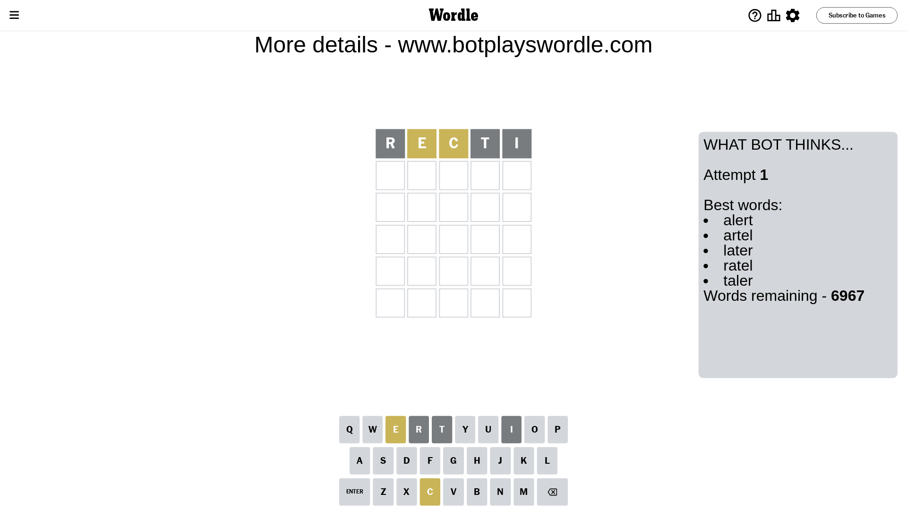

# Wordle for March 7, 2024 - \#992

## Attempt 1

This is the first attempt and we'll choose a random word to start with.

Let's start with word `recti`

Attempt for `recti` gives us 0 correct letters, 2 present letters and 3 wrong letters.

If we look into details, we can see that:

Letter `r` is not present in the word and we will not use it any more

Letter `e` is on a different spot - this means that it cannot be at position 2

Letter `c` is on a different spot - this means that it cannot be at position 3

Letter `t` is not present in the word and we will not use it any more

Letter `i` is not present in the word and we will not use it any more

Some letters are missing (like `r`, `t`, `i`) but it's also important piece of information

Word should contain letters `[e c]`

That was a great guess that limited number of remaining words

## Attempt 2

Right now we have 104 words to choose from and best of them seem to be `[canel lance clone chela coned]`

So far we know that possible letters are:

At position 1: `[a b c d e f g h j k l m n o p q s u v w x y z]`

At position 2: `[a b c d f g h j k l m n o p q s u v w x y z]`

At position 3: `[a b d e f g h j k l m n o p q s u v w x y z]`

At position 4: `[a b c d e f g h j k l m n o p q s u v w x y z]`

At position 5: `[a b c d e f g h j k l m n o p q s u v w x y z]`

Next guess is `lance`, let's see what it gives us

Attempt for `lance` gives us 1 correct letters, 3 present letters and 1 wrong letters.

If we look into details, we can see that:

Letter `l` is on a different spot - this means that it cannot be at position 1

Letter `a` is not present in the word and we will not use it any more

Letter `n` is on a different spot - this means that it cannot be at position 3

Letter `c` is on a different spot - this means that it cannot be at position 4

Letter `e` should be at position 5

We got information about the correct letters and it should make next attempt easier

Some letters are missing (like `a`) but it's also important piece of information

Word should contain letters `[e c l n]`

That was a great guess that limited number of remaining words

## Attempt 3

Right now we have 1 words to choose from and best of them seem to be `[clone]`

So far we know that possible letters are:

At position 1: `[b c d e f g h j k m n o p q s u v w x y z]`

At position 2: `[b c d f g h j k l m n o p q s u v w x y z]`

At position 3: `[b d e f g h j k l m o p q s u v w x y z]`

At position 4: `[b d e f g h j k l m n o p q s u v w x y z]`

At position 5: `[e]`

It must be `clone`

That's the correct answer! The word is `clone`!

## Conclusion

Today's word is `clone` and it took 3 attempts to guess it

