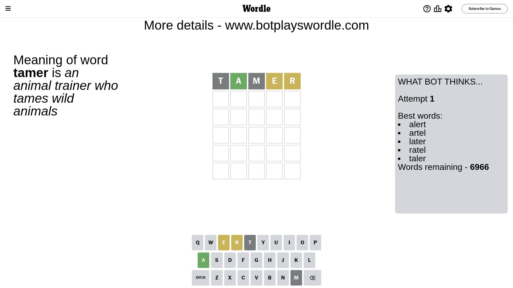

# Wordle for March 8, 2024 - \#993

## Attempt 1

This is the first attempt and we'll choose a random word to start with.

Let's start with word `tamer`

Attempt for `tamer` gives us 1 correct letters, 2 present letters and 2 wrong letters.

If we look into details, we can see that:

Letter `t` is not present in the word and we will not use it any more

Letter `a` should be at position 2

Letter `m` is not present in the word and we will not use it any more

Letter `e` is on a different spot - this means that it cannot be at position 4

Letter `r` is on a different spot - this means that it cannot be at position 5

We got information about the correct letters and it should make next attempt easier

Some letters are missing (like `t`, `m`) but it's also important piece of information

Word should contain letters `[a e r]`

That was a great guess that limited number of remaining words

## Attempt 2

Right now we have 34 words to choose from and best of them seem to be `[early parle nacre rance cadre]`

So far we know that possible letters are:

At position 1: `[a b c d e f g h i j k l n o p q r s u v w x y z]`

At position 2: `[a]`

At position 3: `[a b c d e f g h i j k l n o p q r s u v w x y z]`

At position 4: `[a b c d f g h i j k l n o p q r s u v w x y z]`

At position 5: `[a b c d e f g h i j k l n o p q s u v w x y z]`

Next guess is `rance`, let's see what it gives us

Attempt for `rance` gives us 1 correct letters, 2 present letters and 2 wrong letters.

If we look into details, we can see that:

Letter `r` is on a different spot - this means that it cannot be at position 1

Letter `n` is not present in the word and we will not use it any more

Letter `c` is not present in the word and we will not use it any more

Letter `e` is on a different spot - this means that it cannot be at position 5

Some letters are missing (like `n`, `c`) but it's also important piece of information

Word should contain letters `[a e r]`

That was a great guess that limited number of remaining words

## Attempt 3

Right now we have 2 words to choose from and best of them seem to be `[early faery]`

So far we know that possible letters are:

At position 1: `[a b d e f g h i j k l o p q s u v w x y z]`

At position 2: `[a]`

At position 3: `[a b d e f g h i j k l o p q r s u v w x y z]`

At position 4: `[a b d f g h i j k l o p q r s u v w x y z]`

At position 5: `[a b d f g h i j k l o p q s u v w x y z]`

Next guess is `early`, let's see what it gives us

That's the correct answer! The word is `early`!

## Conclusion

Today's word is `early` and it took 3 attempts to guess it

