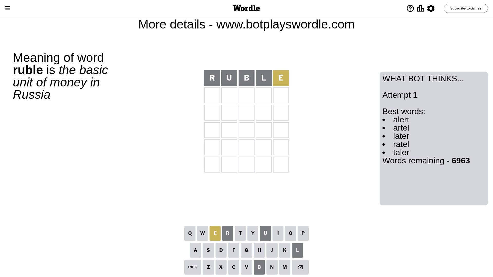
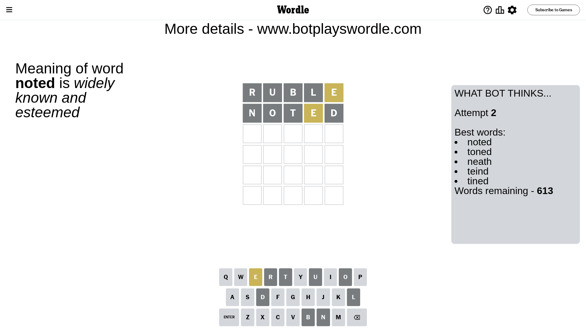
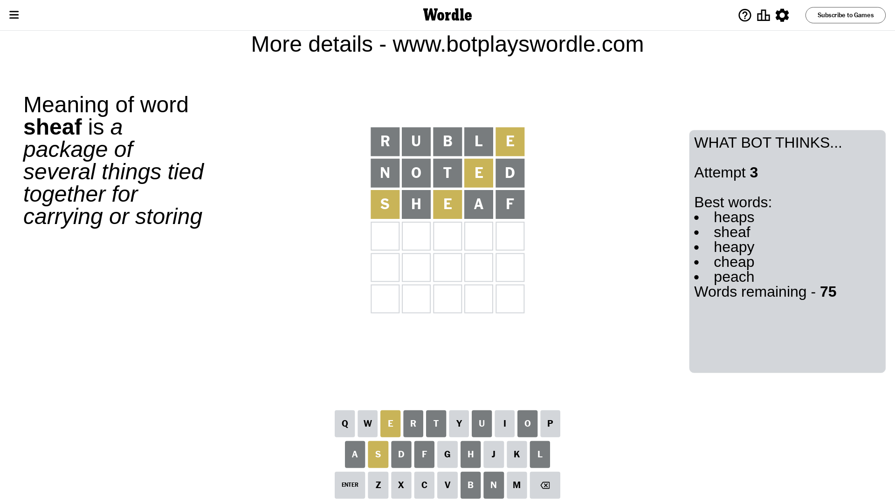
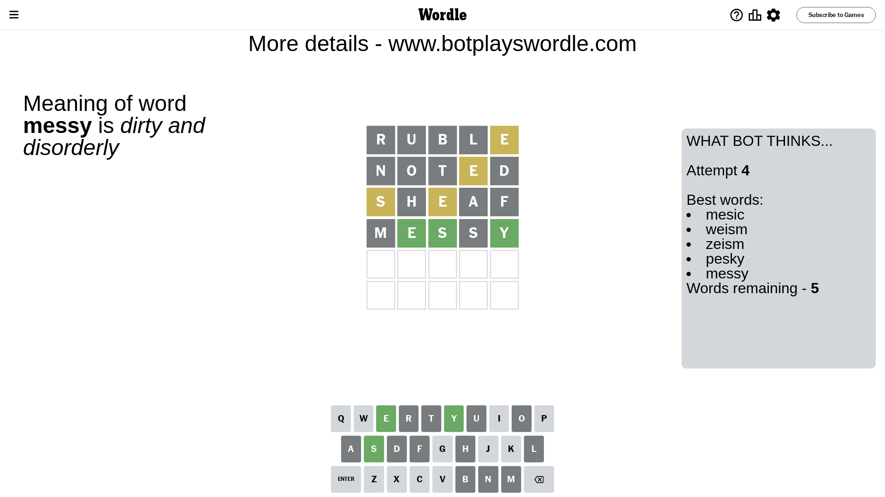
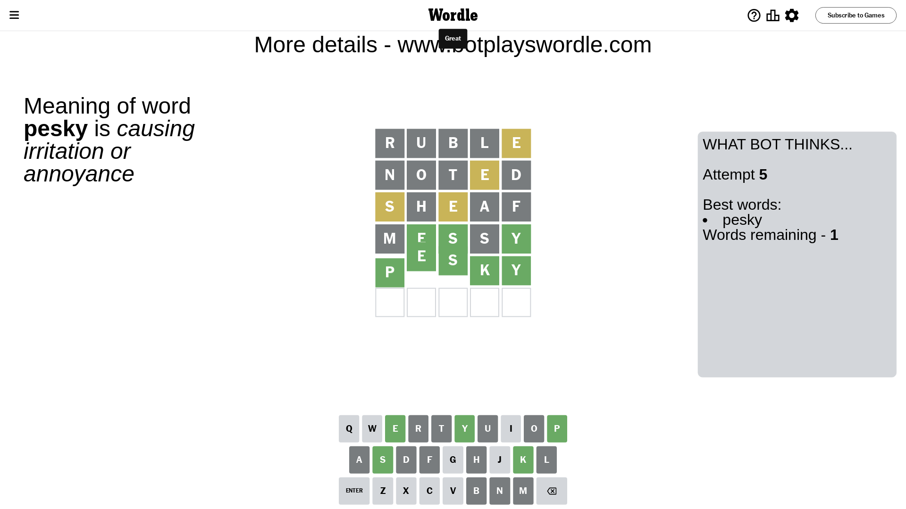

# Wordle for March 11, 2024 - \#996

## Attempt 1

This is the first attempt and we'll choose a random word to start with.

Let's start with word `ruble`

Attempt for `ruble` gives us 0 correct letters, 1 present letters and 4 wrong letters.

If we look into details, we can see that:

Letter `r` is not present in the word and we will not use it any more

Letter `u` is not present in the word and we will not use it any more

Letter `b` is not present in the word and we will not use it any more

Letter `l` is not present in the word and we will not use it any more

Letter `e` is on a different spot - this means that it cannot be at position 5

Some letters are missing (like `r`, `u`, `b`, `l`) but it's also important piece of information

Word should contain letters `[e]`

That was a great guess that limited number of remaining words

## Attempt 2

Right now we have 613 words to choose from and best of them seem to be `[noted toned neath teind tined]`

So far we know that possible letters are:

At position 1: `[a c d e f g h i j k m n o p q s t v w x y z]`

At position 2: `[a c d e f g h i j k m n o p q s t v w x y z]`

At position 3: `[a c d e f g h i j k m n o p q s t v w x y z]`

At position 4: `[a c d e f g h i j k m n o p q s t v w x y z]`

At position 5: `[a c d f g h i j k m n o p q s t v w x y z]`

Next guess is `noted`, let's see what it gives us

Attempt for `noted` gives us 0 correct letters, 1 present letters and 4 wrong letters.

If we look into details, we can see that:

Letter `n` is not present in the word and we will not use it any more

Letter `o` is not present in the word and we will not use it any more

Letter `t` is not present in the word and we will not use it any more

Letter `e` is on a different spot - this means that it cannot be at position 4

Letter `d` is not present in the word and we will not use it any more

Some letters are missing (like `n`, `o`, `t`, `d`) but it's also important piece of information

Word should contain letters `[e]`

That was a great guess that limited number of remaining words

## Attempt 3

Right now we have 75 words to choose from and best of them seem to be `[heaps sheaf heapy cheap peach]`

So far we know that possible letters are:

At position 1: `[a c e f g h i j k m p q s v w x y z]`

At position 2: `[a c e f g h i j k m p q s v w x y z]`

At position 3: `[a c e f g h i j k m p q s v w x y z]`

At position 4: `[a c f g h i j k m p q s v w x y z]`

At position 5: `[a c f g h i j k m p q s v w x y z]`

Next guess is `sheaf`, let's see what it gives us

Attempt for `sheaf` gives us 0 correct letters, 2 present letters and 3 wrong letters.

If we look into details, we can see that:

Letter `s` is on a different spot - this means that it cannot be at position 1

Letter `h` is not present in the word and we will not use it any more

Letter `e` is on a different spot - this means that it cannot be at position 3

Letter `a` is not present in the word and we will not use it any more

Letter `f` is not present in the word and we will not use it any more

Some letters are missing (like `h`, `a`, `f`) but it's also important piece of information

Word should contain letters `[e s]`

That was a great guess that limited number of remaining words

## Attempt 4

Right now we have 5 words to choose from and best of them seem to be `[mesic weism zeism pesky messy]`

So far we know that possible letters are:

At position 1: `[c e g i j k m p q v w x y z]`

At position 2: `[c e g i j k m p q s v w x y z]`

At position 3: `[c g i j k m p q s v w x y z]`

At position 4: `[c g i j k m p q s v w x y z]`

At position 5: `[c g i j k m p q s v w x y z]`

Next guess is `messy`, let's see what it gives us

Attempt for `messy` gives us 3 correct letters, 0 present letters and 2 wrong letters.

If we look into details, we can see that:

Letter `m` is not present in the word and we will not use it any more

Letter `e` should be at position 2

Letter `s` should be at position 3

Letter `s` is not present in the word and we will not use it any more

Letter `y` should be at position 5

We got information about the correct letters and it should make next attempt easier

Some letters are missing (like `m`, `s`) but it's also important piece of information

Word should contain letters `[e s y]`

Not a bad guess in general

## Attempt 5

Right now we have 1 words to choose from and best of them seem to be `[pesky]`

So far we know that possible letters are:

At position 1: `[c e g i j k p q v w x y z]`

At position 2: `[e]`

At position 3: `[s]`

At position 4: `[c g i j k p q v w x y z]`

At position 5: `[y]`

It must be `pesky`

That's the correct answer! The word is `pesky`!

## Conclusion

Today's word is `pesky` and it took 5 attempts to guess it

