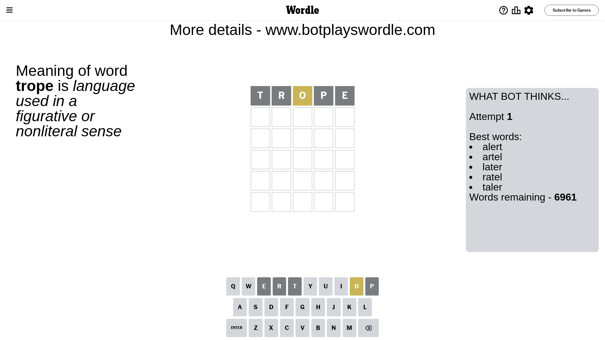
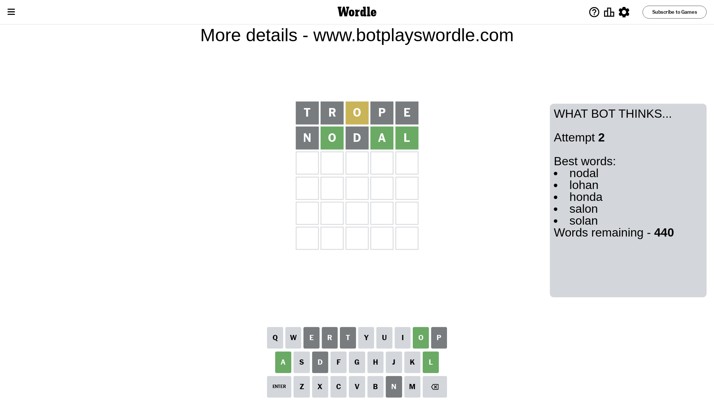
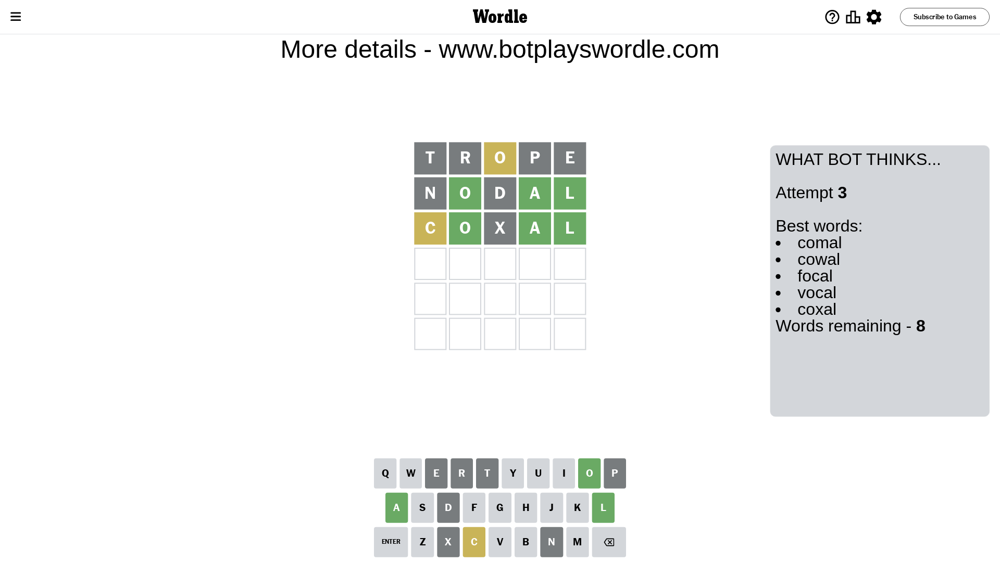
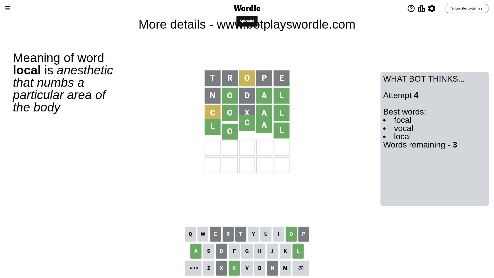

# Wordle for March 13, 2024 - \#998

## Attempt 1

This is the first attempt and we'll choose a random word to start with.

Let's start with word `trope`

Attempt for `trope` gives us 0 correct letters, 1 present letters and 4 wrong letters.

If we look into details, we can see that:

Letter `t` is not present in the word and we will not use it any more

Letter `r` is not present in the word and we will not use it any more

Letter `o` is on a different spot - this means that it cannot be at position 3

Letter `p` is not present in the word and we will not use it any more

Letter `e` is not present in the word and we will not use it any more

Some letters are missing (like `t`, `r`, `p`, `e`) but it's also important piece of information

Word should contain letters `[o]`

That was a great guess that limited number of remaining words

## Attempt 2

Right now we have 440 words to choose from and best of them seem to be `[nodal lohan honda salon solan]`

So far we know that possible letters are:

At position 1: `[a b c d f g h i j k l m n o q s u v w x y z]`

At position 2: `[a b c d f g h i j k l m n o q s u v w x y z]`

At position 3: `[a b c d f g h i j k l m n q s u v w x y z]`

At position 4: `[a b c d f g h i j k l m n o q s u v w x y z]`

At position 5: `[a b c d f g h i j k l m n o q s u v w x y z]`

Next guess is `nodal`, let's see what it gives us

Attempt for `nodal` gives us 3 correct letters, 0 present letters and 2 wrong letters.

If we look into details, we can see that:

Letter `n` is not present in the word and we will not use it any more

Letter `o` should be at position 2

Letter `d` is not present in the word and we will not use it any more

Letter `a` should be at position 4

Letter `l` should be at position 5

We got information about the correct letters and it should make next attempt easier

Some letters are missing (like `n`, `d`) but it's also important piece of information

Word should contain letters `[o a l]`

That was a great guess that limited number of remaining words

## Attempt 3

Right now we have 8 words to choose from and best of them seem to be `[comal cowal focal vocal coxal]`

So far we know that possible letters are:

At position 1: `[a b c f g h i j k l m o q s u v w x y z]`

At position 2: `[o]`

At position 3: `[a b c f g h i j k l m q s u v w x y z]`

At position 4: `[a]`

At position 5: `[l]`

Next guess is `coxal`, let's see what it gives us

Attempt for `coxal` gives us 3 correct letters, 1 present letters and 1 wrong letters.

If we look into details, we can see that:

Letter `c` is on a different spot - this means that it cannot be at position 1

Letter `x` is not present in the word and we will not use it any more

Some letters are missing (like `x`) but it's also important piece of information

Word should contain letters `[o a l c]`

Could be a better guess

## Attempt 4

Right now we have 3 words to choose from and best of them seem to be `[focal vocal local]`

So far we know that possible letters are:

At position 1: `[a b f g h i j k l m o q s u v w y z]`

At position 2: `[o]`

At position 3: `[a b c f g h i j k l m q s u v w y z]`

At position 4: `[a]`

At position 5: `[l]`

Next guess is `local`, let's see what it gives us

That's the correct answer! The word is `local`!

## Conclusion

Today's word is `local` and it took 4 attempts to guess it

