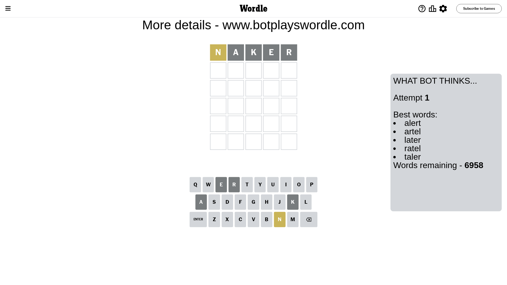
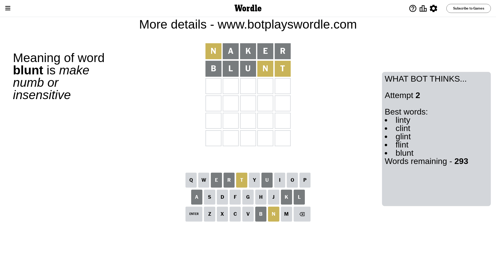
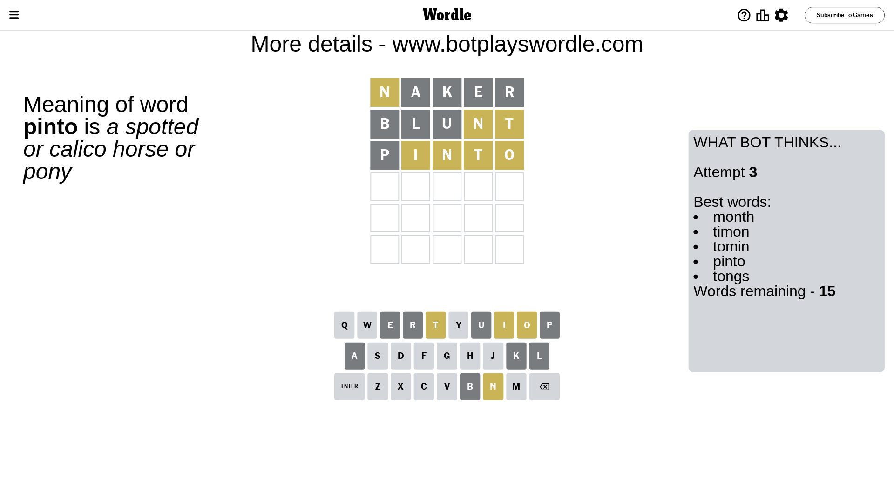
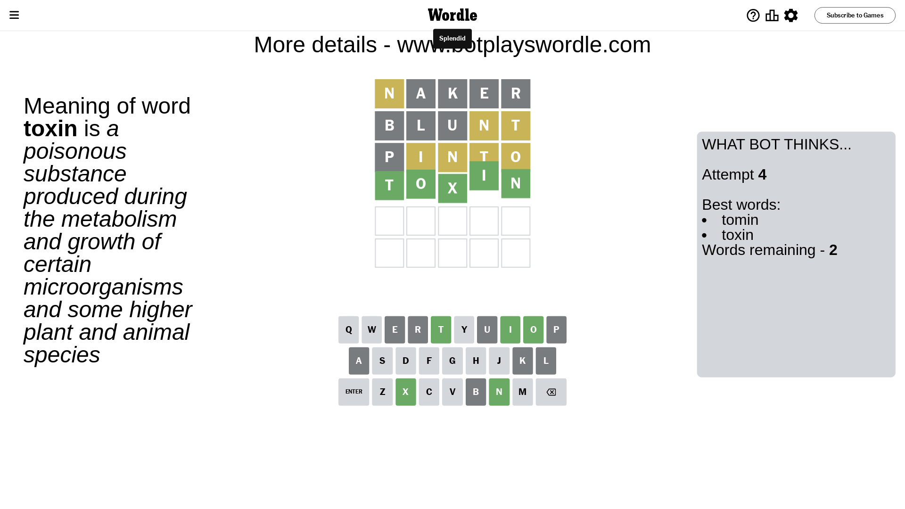

# Wordle for March 16, 2024 - \#1001

## Attempt 1

This is the first attempt and we'll choose a random word to start with.

Let's start with word `naker`

Attempt for `naker` gives us 0 correct letters, 1 present letters and 4 wrong letters.

If we look into details, we can see that:

Letter `n` is on a different spot - this means that it cannot be at position 1

Letter `a` is not present in the word and we will not use it any more

Letter `k` is not present in the word and we will not use it any more

Letter `e` is not present in the word and we will not use it any more

Letter `r` is not present in the word and we will not use it any more

Some letters are missing (like `a`, `k`, `e`, `r`) but it's also important piece of information

Word should contain letters `[n]`

That was a great guess that limited number of remaining words

## Attempt 2

Right now we have 293 words to choose from and best of them seem to be `[linty clint glint flint blunt]`

So far we know that possible letters are:

At position 1: `[b c d f g h i j l m o p q s t u v w x y z]`

At position 2: `[b c d f g h i j l m n o p q s t u v w x y z]`

At position 3: `[b c d f g h i j l m n o p q s t u v w x y z]`

At position 4: `[b c d f g h i j l m n o p q s t u v w x y z]`

At position 5: `[b c d f g h i j l m n o p q s t u v w x y z]`

Next guess is `blunt`, let's see what it gives us

Attempt for `blunt` gives us 0 correct letters, 2 present letters and 3 wrong letters.

If we look into details, we can see that:

Letter `b` is not present in the word and we will not use it any more

Letter `l` is not present in the word and we will not use it any more

Letter `u` is not present in the word and we will not use it any more

Letter `n` is on a different spot - this means that it cannot be at position 4

Letter `t` is on a different spot - this means that it cannot be at position 5

Some letters are missing (like `b`, `l`, `u`) but it's also important piece of information

Word should contain letters `[n t]`

That was a great guess that limited number of remaining words

## Attempt 3

Right now we have 15 words to choose from and best of them seem to be `[month timon tomin pinto tongs]`

So far we know that possible letters are:

At position 1: `[c d f g h i j m o p q s t v w x y z]`

At position 2: `[c d f g h i j m n o p q s t v w x y z]`

At position 3: `[c d f g h i j m n o p q s t v w x y z]`

At position 4: `[c d f g h i j m o p q s t v w x y z]`

At position 5: `[c d f g h i j m n o p q s v w x y z]`

Next guess is `pinto`, let's see what it gives us

Attempt for `pinto` gives us 0 correct letters, 4 present letters and 1 wrong letters.

If we look into details, we can see that:

Letter `p` is not present in the word and we will not use it any more

Letter `i` is on a different spot - this means that it cannot be at position 2

Letter `n` is on a different spot - this means that it cannot be at position 3

Letter `t` is on a different spot - this means that it cannot be at position 4

Letter `o` is on a different spot - this means that it cannot be at position 5

Some letters are missing (like `p`) but it's also important piece of information

Word should contain letters `[n t i o]`

Not a bad guess in general

## Attempt 4

Right now we have 2 words to choose from and best of them seem to be `[tomin toxin]`

So far we know that possible letters are:

At position 1: `[c d f g h i j m o q s t v w x y z]`

At position 2: `[c d f g h j m n o q s t v w x y z]`

At position 3: `[c d f g h i j m o q s t v w x y z]`

At position 4: `[c d f g h i j m o q s v w x y z]`

At position 5: `[c d f g h i j m n q s v w x y z]`

Next guess is `toxin`, let's see what it gives us

That's the correct answer! The word is `toxin`!

## Conclusion

Today's word is `toxin` and it took 4 attempts to guess it

