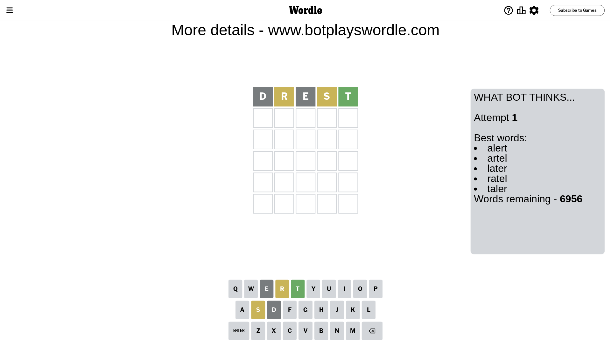
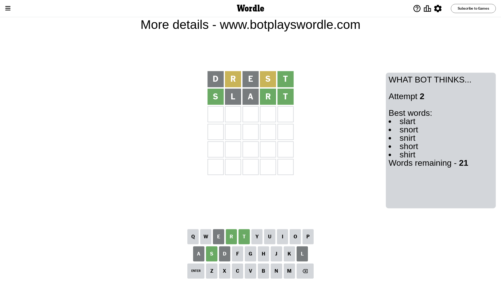
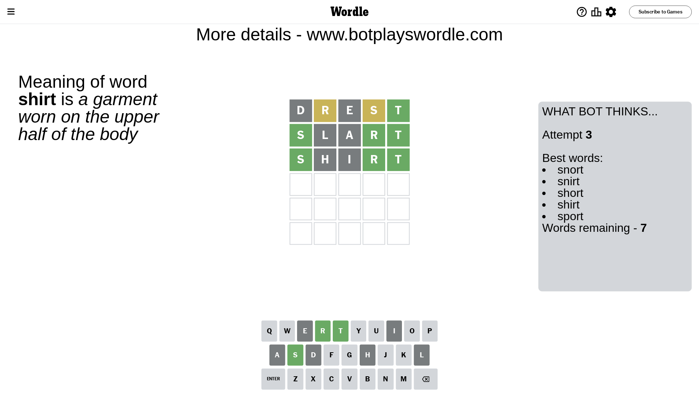
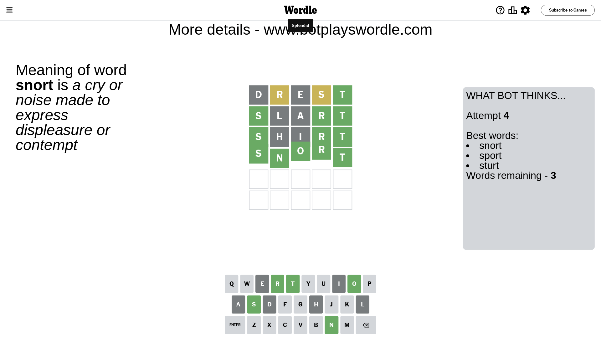

# Wordle for March 17, 2024 - \#1002

## Attempt 1

This is the first attempt and we'll choose a random word to start with.

Let's start with word `drest`

Attempt for `drest` gives us 1 correct letters, 2 present letters and 2 wrong letters.

If we look into details, we can see that:

Letter `d` is not present in the word and we will not use it any more

Letter `r` is on a different spot - this means that it cannot be at position 2

Letter `e` is not present in the word and we will not use it any more

Letter `s` is on a different spot - this means that it cannot be at position 4

Letter `t` should be at position 5

We got information about the correct letters and it should make next attempt easier

Some letters are missing (like `d`, `e`) but it's also important piece of information

Word should contain letters `[r s t]`

That was a great guess that limited number of remaining words

## Attempt 2

Right now we have 21 words to choose from and best of them seem to be `[slart snort snirt short shirt]`

So far we know that possible letters are:

At position 1: `[a b c f g h i j k l m n o p q r s t u v w x y z]`

At position 2: `[a b c f g h i j k l m n o p q s t u v w x y z]`

At position 3: `[a b c f g h i j k l m n o p q r s t u v w x y z]`

At position 4: `[a b c f g h i j k l m n o p q r t u v w x y z]`

At position 5: `[t]`

Next guess is `slart`, let's see what it gives us

Attempt for `slart` gives us 3 correct letters, 0 present letters and 2 wrong letters.

If we look into details, we can see that:

Letter `s` should be at position 1

Letter `l` is not present in the word and we will not use it any more

Letter `a` is not present in the word and we will not use it any more

Letter `r` should be at position 4

We got information about the correct letters and it should make next attempt easier

Some letters are missing (like `l`, `a`) but it's also important piece of information

Word should contain letters `[r s t]`

Could be a better guess

## Attempt 3

Right now we have 7 words to choose from and best of them seem to be `[snort snirt short shirt sport]`

So far we know that possible letters are:

At position 1: `[s]`

At position 2: `[b c f g h i j k m n o p q s t u v w x y z]`

At position 3: `[b c f g h i j k m n o p q r s t u v w x y z]`

At position 4: `[r]`

At position 5: `[t]`

Next guess is `shirt`, let's see what it gives us

Attempt for `shirt` gives us 3 correct letters, 0 present letters and 2 wrong letters.

If we look into details, we can see that:

Letter `h` is not present in the word and we will not use it any more

Letter `i` is not present in the word and we will not use it any more

Some letters are missing (like `h`, `i`) but it's also important piece of information

Word should contain letters `[r s t]`

Could be a better guess

## Attempt 4

Right now we have 3 words to choose from and best of them seem to be `[snort sport sturt]`

So far we know that possible letters are:

At position 1: `[s]`

At position 2: `[b c f g j k m n o p q s t u v w x y z]`

At position 3: `[b c f g j k m n o p q r s t u v w x y z]`

At position 4: `[r]`

At position 5: `[t]`

Next guess is `snort`, let's see what it gives us

That's the correct answer! The word is `snort`!

## Conclusion

Today's word is `snort` and it took 4 attempts to guess it

