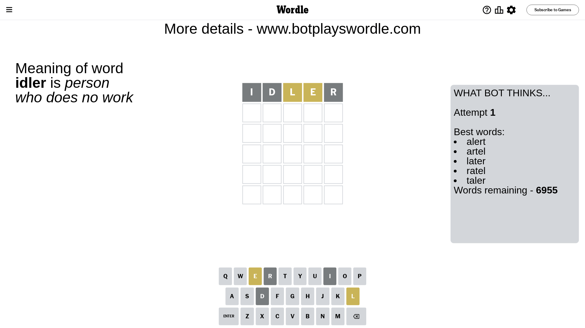
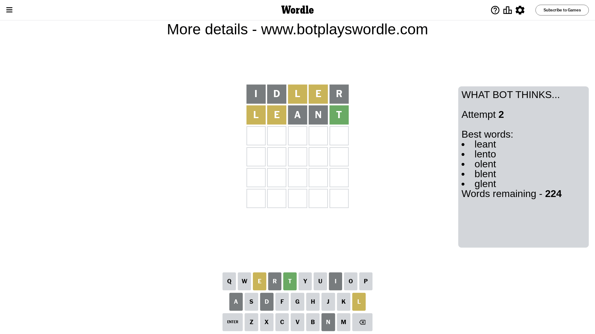
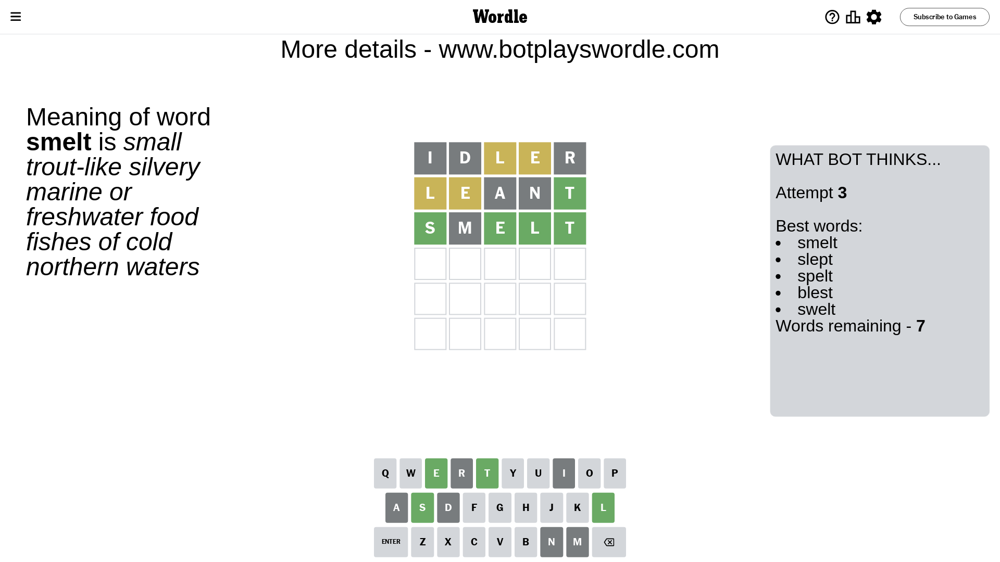
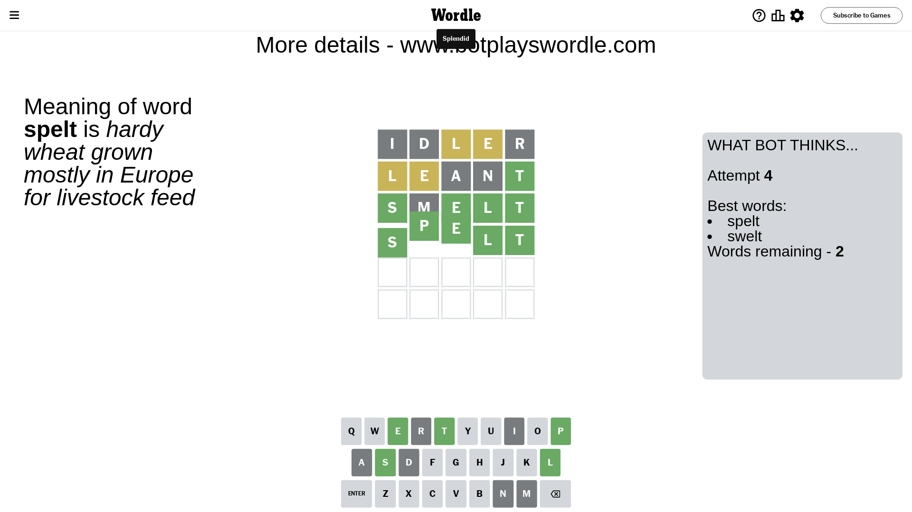

# Wordle for March 18, 2024 - \#1003

## Attempt 1

This is the first attempt and we'll choose a random word to start with.

Let's start with word `idler`

Attempt for `idler` gives us 0 correct letters, 2 present letters and 3 wrong letters.

If we look into details, we can see that:

Letter `i` is not present in the word and we will not use it any more

Letter `d` is not present in the word and we will not use it any more

Letter `l` is on a different spot - this means that it cannot be at position 3

Letter `e` is on a different spot - this means that it cannot be at position 4

Letter `r` is not present in the word and we will not use it any more

Some letters are missing (like `i`, `d`, `r`) but it's also important piece of information

Word should contain letters `[l e]`

That was a great guess that limited number of remaining words

## Attempt 2

Right now we have 224 words to choose from and best of them seem to be `[leant lento olent blent glent]`

So far we know that possible letters are:

At position 1: `[a b c e f g h j k l m n o p q s t u v w x y z]`

At position 2: `[a b c e f g h j k l m n o p q s t u v w x y z]`

At position 3: `[a b c e f g h j k m n o p q s t u v w x y z]`

At position 4: `[a b c f g h j k l m n o p q s t u v w x y z]`

At position 5: `[a b c e f g h j k l m n o p q s t u v w x y z]`

Next guess is `leant`, let's see what it gives us

Attempt for `leant` gives us 1 correct letters, 2 present letters and 2 wrong letters.

If we look into details, we can see that:

Letter `l` is on a different spot - this means that it cannot be at position 1

Letter `e` is on a different spot - this means that it cannot be at position 2

Letter `a` is not present in the word and we will not use it any more

Letter `n` is not present in the word and we will not use it any more

Letter `t` should be at position 5

We got information about the correct letters and it should make next attempt easier

Some letters are missing (like `a`, `n`) but it's also important piece of information

Word should contain letters `[l e t]`

That was a great guess that limited number of remaining words

## Attempt 3

Right now we have 7 words to choose from and best of them seem to be `[smelt slept spelt blest swelt]`

So far we know that possible letters are:

At position 1: `[b c e f g h j k m o p q s t u v w x y z]`

At position 2: `[b c f g h j k l m o p q s t u v w x y z]`

At position 3: `[b c e f g h j k m o p q s t u v w x y z]`

At position 4: `[b c f g h j k l m o p q s t u v w x y z]`

At position 5: `[t]`

Next guess is `smelt`, let's see what it gives us

Attempt for `smelt` gives us 4 correct letters, 0 present letters and 1 wrong letters.

If we look into details, we can see that:

Letter `s` should be at position 1

Letter `m` is not present in the word and we will not use it any more

Letter `e` should be at position 3

Letter `l` should be at position 4

We got information about the correct letters and it should make next attempt easier

Some letters are missing (like `m`) but it's also important piece of information

Word should contain letters `[l e t s]`

Could be a better guess

## Attempt 4

Right now we have 2 words to choose from and best of them seem to be `[spelt swelt]`

So far we know that possible letters are:

At position 1: `[s]`

At position 2: `[b c f g h j k l o p q s t u v w x y z]`

At position 3: `[e]`

At position 4: `[l]`

At position 5: `[t]`

Next guess is `spelt`, let's see what it gives us

That's the correct answer! The word is `spelt`!

## Conclusion

Today's word is `spelt` and it took 4 attempts to guess it

