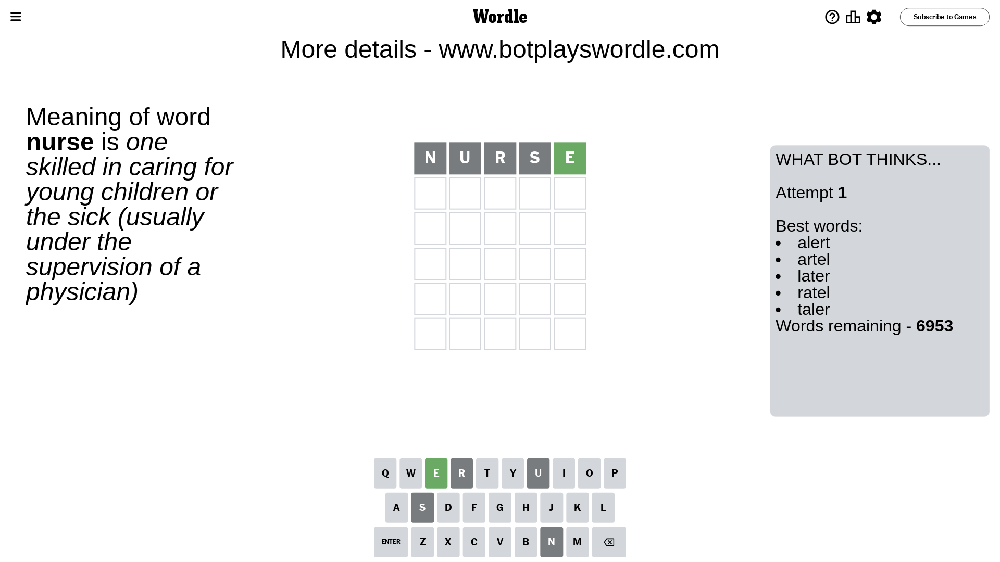
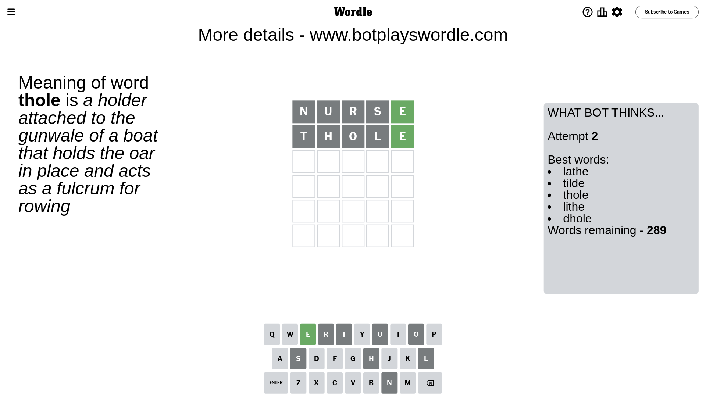
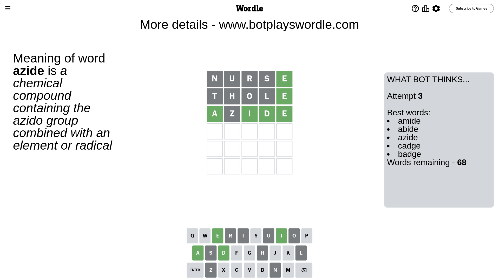
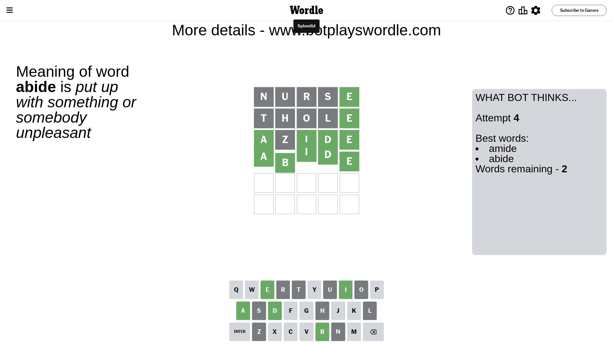

# Wordle for March 19, 2024 - \#1004

## Attempt 1

This is the first attempt and we'll choose a random word to start with.

Let's start with word `nurse`

Attempt for `nurse` gives us 1 correct letters, 0 present letters and 4 wrong letters.

If we look into details, we can see that:

Letter `n` is not present in the word and we will not use it any more

Letter `u` is not present in the word and we will not use it any more

Letter `r` is not present in the word and we will not use it any more

Letter `s` is not present in the word and we will not use it any more

Letter `e` should be at position 5

We got information about the correct letters and it should make next attempt easier

Some letters are missing (like `n`, `u`, `r`, `s`) but it's also important piece of information

Word should contain letters `[e]`

That was a great guess that limited number of remaining words

## Attempt 2

Right now we have 289 words to choose from and best of them seem to be `[lathe tilde thole lithe dhole]`

So far we know that possible letters are:

At position 1: `[a b c d e f g h i j k l m o p q t v w x y z]`

At position 2: `[a b c d e f g h i j k l m o p q t v w x y z]`

At position 3: `[a b c d e f g h i j k l m o p q t v w x y z]`

At position 4: `[a b c d e f g h i j k l m o p q t v w x y z]`

At position 5: `[e]`

Next guess is `thole`, let's see what it gives us

Attempt for `thole` gives us 1 correct letters, 0 present letters and 4 wrong letters.

If we look into details, we can see that:

Letter `t` is not present in the word and we will not use it any more

Letter `h` is not present in the word and we will not use it any more

Letter `o` is not present in the word and we will not use it any more

Letter `l` is not present in the word and we will not use it any more

Some letters are missing (like `t`, `h`, `o`, `l`) but it's also important piece of information

Word should contain letters `[e]`

Not a bad guess in general

## Attempt 3

Right now we have 68 words to choose from and best of them seem to be `[amide abide azide cadge badge]`

So far we know that possible letters are:

At position 1: `[a b c d e f g i j k m p q v w x y z]`

At position 2: `[a b c d e f g i j k m p q v w x y z]`

At position 3: `[a b c d e f g i j k m p q v w x y z]`

At position 4: `[a b c d e f g i j k m p q v w x y z]`

At position 5: `[e]`

Next guess is `azide`, let's see what it gives us

Attempt for `azide` gives us 4 correct letters, 0 present letters and 1 wrong letters.

If we look into details, we can see that:

Letter `a` should be at position 1

Letter `z` is not present in the word and we will not use it any more

Letter `i` should be at position 3

Letter `d` should be at position 4

We got information about the correct letters and it should make next attempt easier

Some letters are missing (like `z`) but it's also important piece of information

Word should contain letters `[e a i d]`

That was a great guess that limited number of remaining words

## Attempt 4

Right now we have 2 words to choose from and best of them seem to be `[amide abide]`

So far we know that possible letters are:

At position 1: `[a]`

At position 2: `[a b c d e f g i j k m p q v w x y]`

At position 3: `[i]`

At position 4: `[d]`

At position 5: `[e]`

Next guess is `abide`, let's see what it gives us

That's the correct answer! The word is `abide`!

## Conclusion

Today's word is `abide` and it took 4 attempts to guess it

