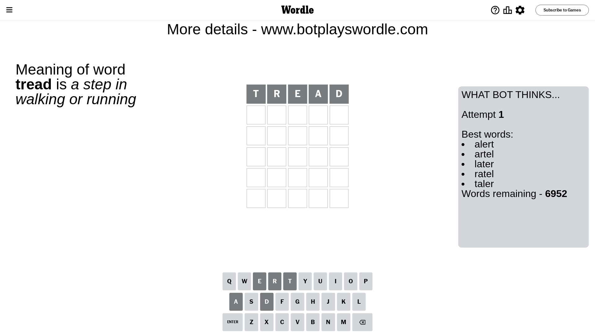
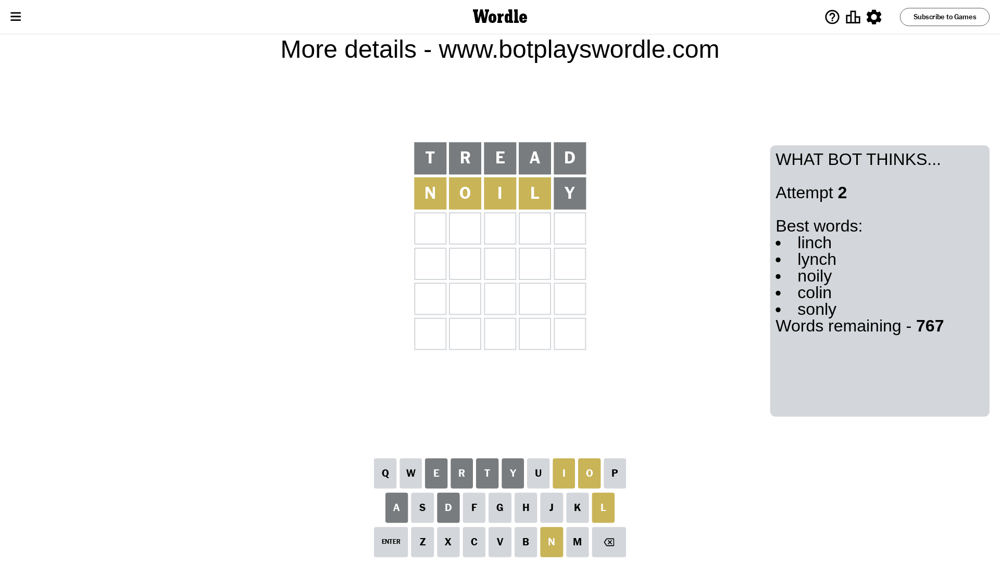
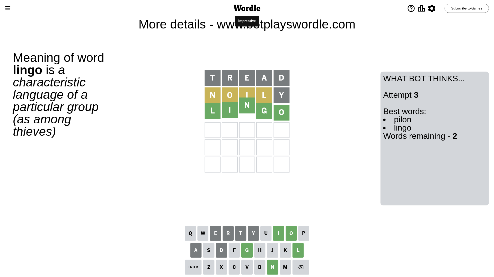

# Wordle for March 20, 2024 - \#1005

## Attempt 1

This is the first attempt and we'll choose a random word to start with.

Let's start with word `tread`

Attempt for `tread` gives us 0 correct letters, 0 present letters and 5 wrong letters.

If we look into details, we can see that:

Letter `t` is not present in the word and we will not use it any more

Letter `r` is not present in the word and we will not use it any more

Letter `e` is not present in the word and we will not use it any more

Letter `a` is not present in the word and we will not use it any more

Letter `d` is not present in the word and we will not use it any more

Some letters are missing (like `t`, `r`, `e`, `a`, `d`) but it's also important piece of information

So far we don't know any of the letters!

That was a great guess that limited number of remaining words

## Attempt 2

Right now we have 767 words to choose from and best of them seem to be `[linch lynch noily colin sonly]`

So far we know that possible letters are:

At position 1: `[b c f g h i j k l m n o p q s u v w x y z]`

At position 2: `[b c f g h i j k l m n o p q s u v w x y z]`

At position 3: `[b c f g h i j k l m n o p q s u v w x y z]`

At position 4: `[b c f g h i j k l m n o p q s u v w x y z]`

At position 5: `[b c f g h i j k l m n o p q s u v w x y z]`

Next guess is `noily`, let's see what it gives us

Attempt for `noily` gives us 0 correct letters, 4 present letters and 1 wrong letters.

If we look into details, we can see that:

Letter `n` is on a different spot - this means that it cannot be at position 1

Letter `o` is on a different spot - this means that it cannot be at position 2

Letter `i` is on a different spot - this means that it cannot be at position 3

Letter `l` is on a different spot - this means that it cannot be at position 4

Letter `y` is not present in the word and we will not use it any more

Some letters are missing (like `y`) but it's also important piece of information

Word should contain letters `[n o i l]`

That was a great guess that limited number of remaining words

## Attempt 3

Right now we have 2 words to choose from and best of them seem to be `[pilon lingo]`

So far we know that possible letters are:

At position 1: `[b c f g h i j k l m o p q s u v w x z]`

At position 2: `[b c f g h i j k l m n p q s u v w x z]`

At position 3: `[b c f g h j k l m n o p q s u v w x z]`

At position 4: `[b c f g h i j k m n o p q s u v w x z]`

At position 5: `[b c f g h i j k l m n o p q s u v w x z]`

Next guess is `lingo`, let's see what it gives us

That's the correct answer! The word is `lingo`!

## Conclusion

Today's word is `lingo` and it took 3 attempts to guess it

