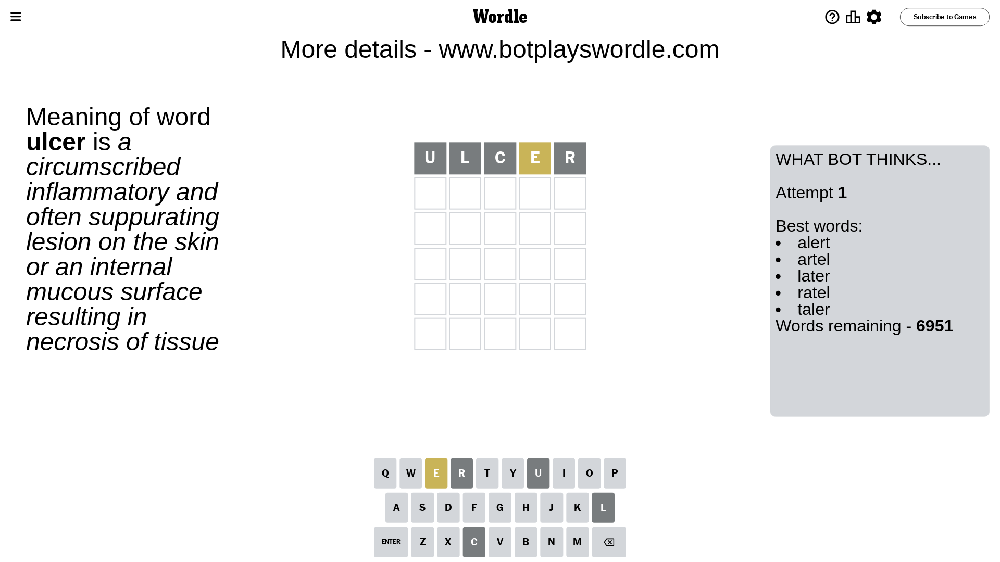
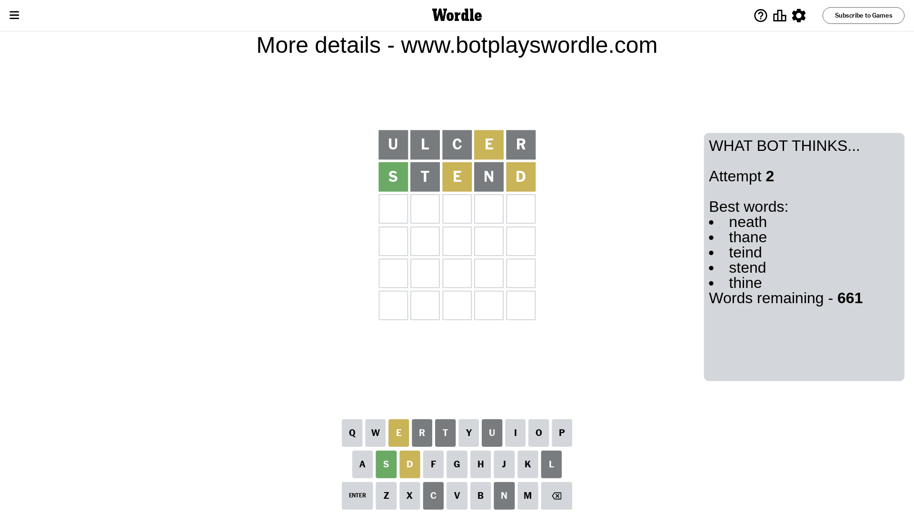
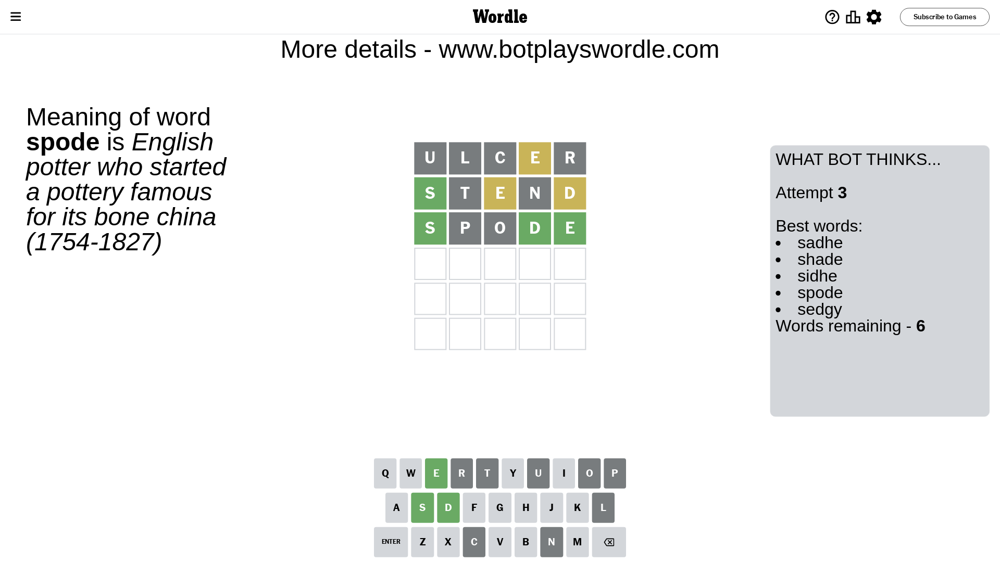
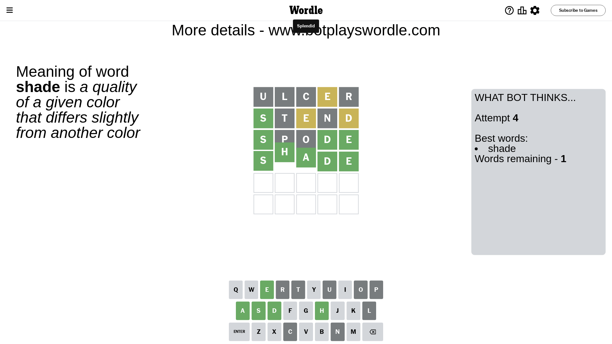

# Wordle for March 21, 2024 - \#1006

## Attempt 1

This is the first attempt and we'll choose a random word to start with.

Let's start with word `ulcer`

Attempt for `ulcer` gives us 0 correct letters, 1 present letters and 4 wrong letters.

If we look into details, we can see that:

Letter `u` is not present in the word and we will not use it any more

Letter `l` is not present in the word and we will not use it any more

Letter `c` is not present in the word and we will not use it any more

Letter `e` is on a different spot - this means that it cannot be at position 4

Letter `r` is not present in the word and we will not use it any more

Some letters are missing (like `u`, `l`, `c`, `r`) but it's also important piece of information

Word should contain letters `[e]`

That was a great guess that limited number of remaining words

## Attempt 2

Right now we have 661 words to choose from and best of them seem to be `[neath thane teind stend thine]`

So far we know that possible letters are:

At position 1: `[a b d e f g h i j k m n o p q s t v w x y z]`

At position 2: `[a b d e f g h i j k m n o p q s t v w x y z]`

At position 3: `[a b d e f g h i j k m n o p q s t v w x y z]`

At position 4: `[a b d f g h i j k m n o p q s t v w x y z]`

At position 5: `[a b d e f g h i j k m n o p q s t v w x y z]`

Next guess is `stend`, let's see what it gives us

Attempt for `stend` gives us 1 correct letters, 2 present letters and 2 wrong letters.

If we look into details, we can see that:

Letter `s` should be at position 1

Letter `t` is not present in the word and we will not use it any more

Letter `e` is on a different spot - this means that it cannot be at position 3

Letter `n` is not present in the word and we will not use it any more

Letter `d` is on a different spot - this means that it cannot be at position 5

We got information about the correct letters and it should make next attempt easier

Some letters are missing (like `t`, `n`) but it's also important piece of information

Word should contain letters `[e s d]`

That was a great guess that limited number of remaining words

## Attempt 3

Right now we have 6 words to choose from and best of them seem to be `[sadhe shade sidhe spode sedgy]`

So far we know that possible letters are:

At position 1: `[s]`

At position 2: `[a b d e f g h i j k m o p q s v w x y z]`

At position 3: `[a b d f g h i j k m o p q s v w x y z]`

At position 4: `[a b d f g h i j k m o p q s v w x y z]`

At position 5: `[a b e f g h i j k m o p q s v w x y z]`

Next guess is `spode`, let's see what it gives us

Attempt for `spode` gives us 3 correct letters, 0 present letters and 2 wrong letters.

If we look into details, we can see that:

Letter `p` is not present in the word and we will not use it any more

Letter `o` is not present in the word and we will not use it any more

Letter `d` should be at position 4

Letter `e` should be at position 5

We got information about the correct letters and it should make next attempt easier

Some letters are missing (like `p`, `o`) but it's also important piece of information

Word should contain letters `[e s d]`

Not a bad guess in general

## Attempt 4

Right now we have 1 words to choose from and best of them seem to be `[shade]`

So far we know that possible letters are:

At position 1: `[s]`

At position 2: `[a b d e f g h i j k m q s v w x y z]`

At position 3: `[a b d f g h i j k m q s v w x y z]`

At position 4: `[d]`

At position 5: `[e]`

It must be `shade`

That's the correct answer! The word is `shade`!

## Conclusion

Today's word is `shade` and it took 4 attempts to guess it

