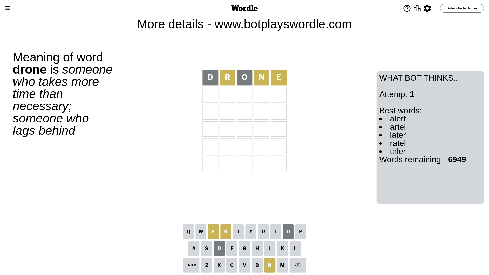
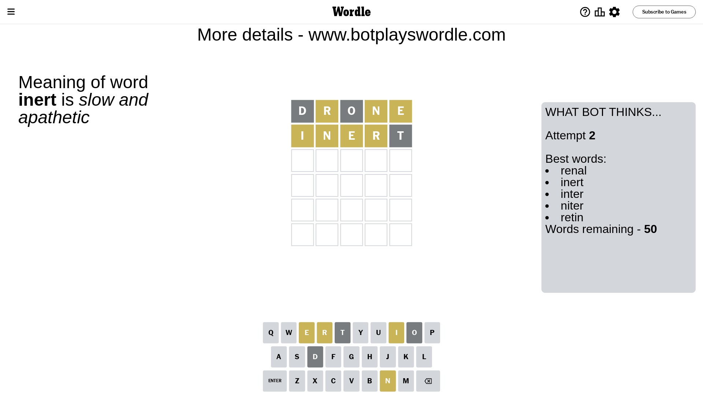
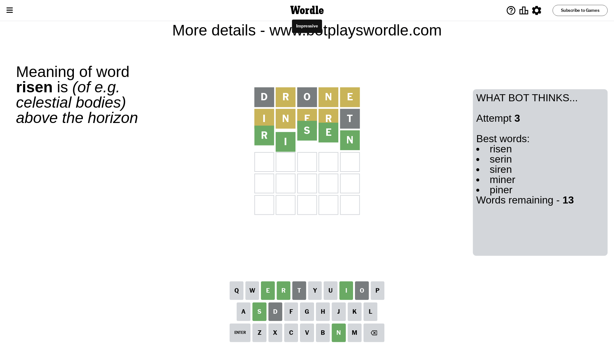

# Wordle for March 23, 2024 - \#1008

## Attempt 1

This is the first attempt and we'll choose a random word to start with.

Let's start with word `drone`

Attempt for `drone` gives us 0 correct letters, 3 present letters and 2 wrong letters.

If we look into details, we can see that:

Letter `d` is not present in the word and we will not use it any more

Letter `r` is on a different spot - this means that it cannot be at position 2

Letter `o` is not present in the word and we will not use it any more

Letter `n` is on a different spot - this means that it cannot be at position 4

Letter `e` is on a different spot - this means that it cannot be at position 5

Some letters are missing (like `d`, `o`) but it's also important piece of information

Word should contain letters `[r n e]`

That was a great guess that limited number of remaining words

## Attempt 2

Right now we have 50 words to choose from and best of them seem to be `[renal inert inter niter retin]`

So far we know that possible letters are:

At position 1: `[a b c e f g h i j k l m n p q r s t u v w x y z]`

At position 2: `[a b c e f g h i j k l m n p q s t u v w x y z]`

At position 3: `[a b c e f g h i j k l m n p q r s t u v w x y z]`

At position 4: `[a b c e f g h i j k l m p q r s t u v w x y z]`

At position 5: `[a b c f g h i j k l m n p q r s t u v w x y z]`

Next guess is `inert`, let's see what it gives us

Attempt for `inert` gives us 0 correct letters, 4 present letters and 1 wrong letters.

If we look into details, we can see that:

Letter `i` is on a different spot - this means that it cannot be at position 1

Letter `n` is on a different spot - this means that it cannot be at position 2

Letter `e` is on a different spot - this means that it cannot be at position 3

Letter `r` is on a different spot - this means that it cannot be at position 4

Letter `t` is not present in the word and we will not use it any more

Some letters are missing (like `t`) but it's also important piece of information

Word should contain letters `[r n e i]`

Could be a better guess

## Attempt 3

Right now we have 13 words to choose from and best of them seem to be `[risen serin siren miner piner]`

So far we know that possible letters are:

At position 1: `[a b c e f g h j k l m n p q r s u v w x y z]`

At position 2: `[a b c e f g h i j k l m p q s u v w x y z]`

At position 3: `[a b c f g h i j k l m n p q r s u v w x y z]`

At position 4: `[a b c e f g h i j k l m p q s u v w x y z]`

At position 5: `[a b c f g h i j k l m n p q r s u v w x y z]`

Next guess is `risen`, let's see what it gives us

That's the correct answer! The word is `risen`!

To be honest that was a pretty lucky guess, but it worked out well.

## Conclusion

Today's word is `risen` and it took 3 attempts to guess it

