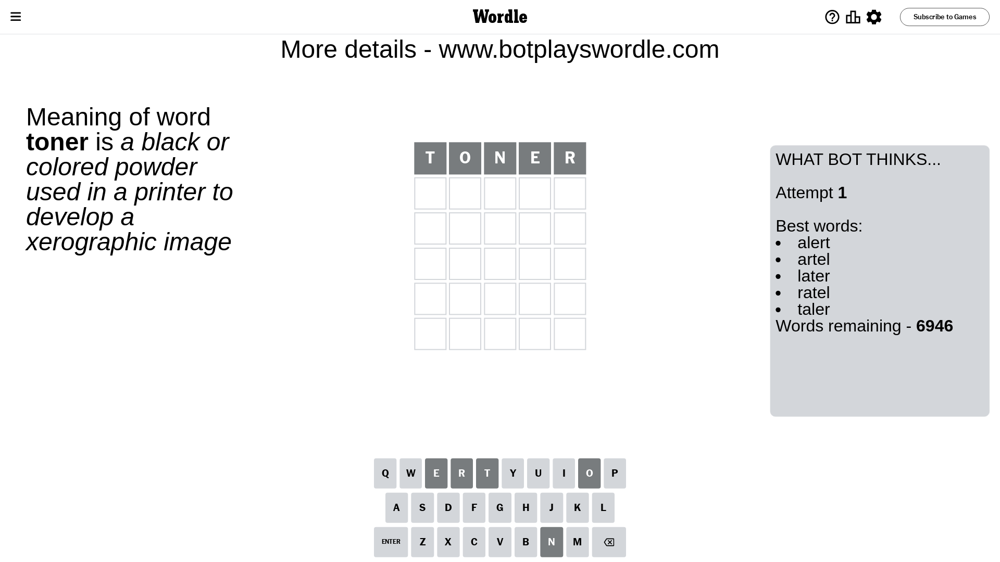
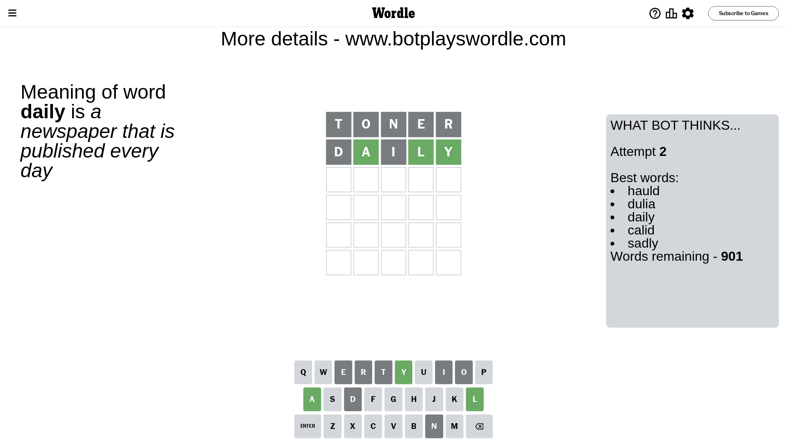
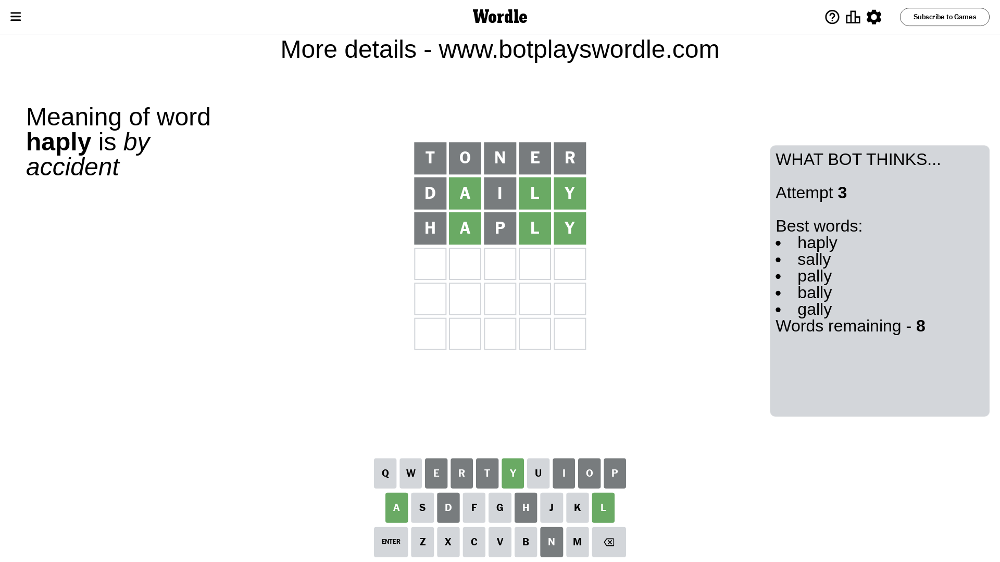
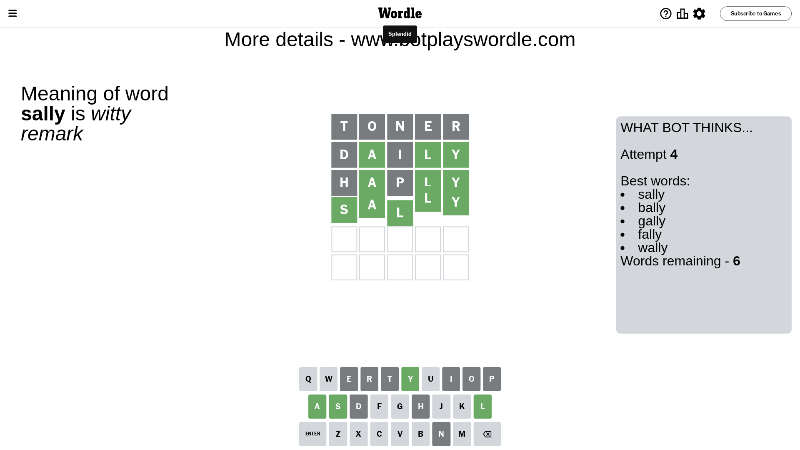

# Wordle for March 25, 2024 - \#1010

## Attempt 1

This is the first attempt and we'll choose a random word to start with.

Let's start with word `toner`

Attempt for `toner` gives us 0 correct letters, 0 present letters and 5 wrong letters.

If we look into details, we can see that:

Letter `t` is not present in the word and we will not use it any more

Letter `o` is not present in the word and we will not use it any more

Letter `n` is not present in the word and we will not use it any more

Letter `e` is not present in the word and we will not use it any more

Letter `r` is not present in the word and we will not use it any more

Some letters are missing (like `t`, `o`, `n`, `e`, `r`) but it's also important piece of information

So far we don't know any of the letters!

Not a bad guess in general

## Attempt 2

Right now we have 901 words to choose from and best of them seem to be `[hauld dulia daily calid sadly]`

So far we know that possible letters are:

At position 1: `[a b c d f g h i j k l m p q s u v w x y z]`

At position 2: `[a b c d f g h i j k l m p q s u v w x y z]`

At position 3: `[a b c d f g h i j k l m p q s u v w x y z]`

At position 4: `[a b c d f g h i j k l m p q s u v w x y z]`

At position 5: `[a b c d f g h i j k l m p q s u v w x y z]`

Next guess is `daily`, let's see what it gives us

Attempt for `daily` gives us 3 correct letters, 0 present letters and 2 wrong letters.

If we look into details, we can see that:

Letter `d` is not present in the word and we will not use it any more

Letter `a` should be at position 2

Letter `i` is not present in the word and we will not use it any more

Letter `l` should be at position 4

Letter `y` should be at position 5

We got information about the correct letters and it should make next attempt easier

Some letters are missing (like `d`, `i`) but it's also important piece of information

Word should contain letters `[a l y]`

That was a great guess that limited number of remaining words

## Attempt 3

Right now we have 8 words to choose from and best of them seem to be `[haply sally pally bally gally]`

So far we know that possible letters are:

At position 1: `[a b c f g h j k l m p q s u v w x y z]`

At position 2: `[a]`

At position 3: `[a b c f g h j k l m p q s u v w x y z]`

At position 4: `[l]`

At position 5: `[y]`

Next guess is `haply`, let's see what it gives us

Attempt for `haply` gives us 3 correct letters, 0 present letters and 2 wrong letters.

If we look into details, we can see that:

Letter `h` is not present in the word and we will not use it any more

Letter `p` is not present in the word and we will not use it any more

Some letters are missing (like `h`, `p`) but it's also important piece of information

Word should contain letters `[a l y]`

This was a waste, almost no valuable information...

## Attempt 4

Right now we have 6 words to choose from and best of them seem to be `[sally bally gally fally wally]`

So far we know that possible letters are:

At position 1: `[a b c f g j k l m q s u v w x y z]`

At position 2: `[a]`

At position 3: `[a b c f g j k l m q s u v w x y z]`

At position 4: `[l]`

At position 5: `[y]`

Next guess is `sally`, let's see what it gives us

That's the correct answer! The word is `sally`!

## Conclusion

Today's word is `sally` and it took 4 attempts to guess it

