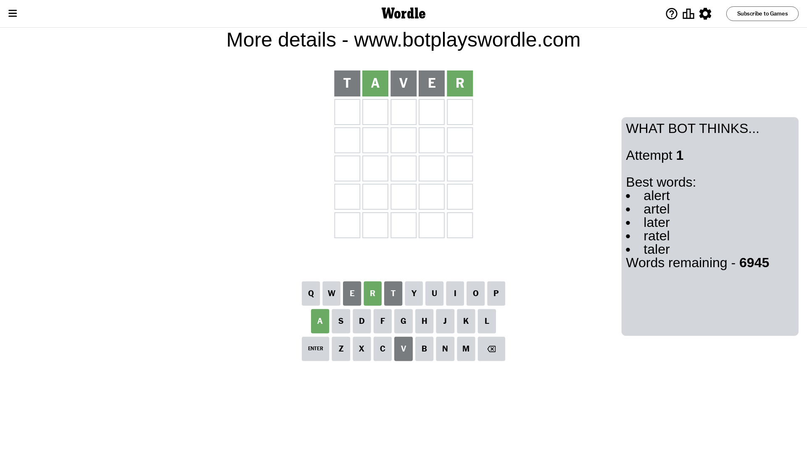
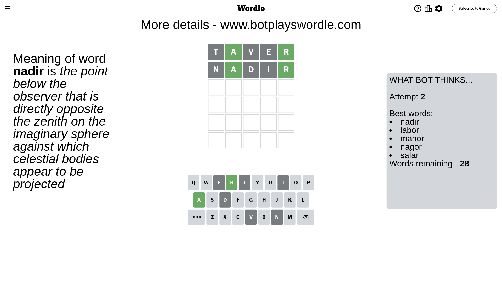
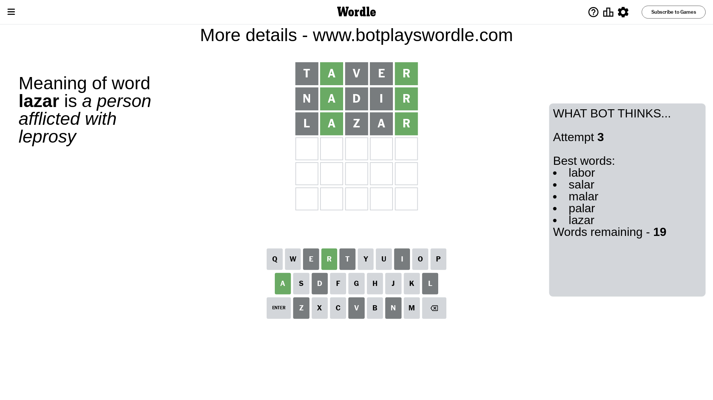
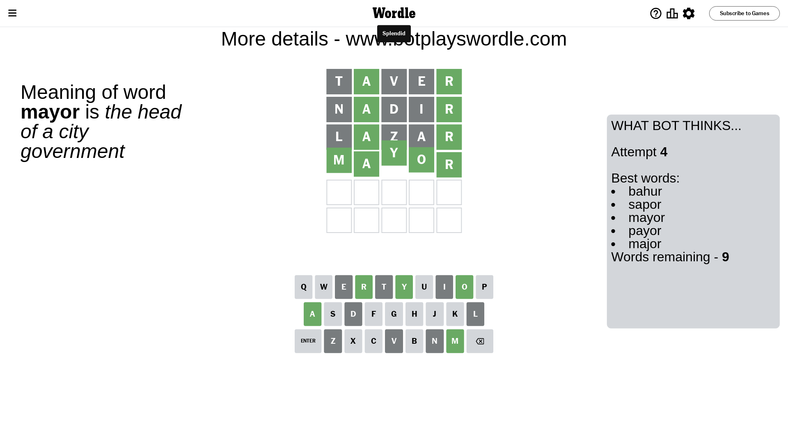

# Wordle for March 26, 2024 - \#1011

## Attempt 1

This is the first attempt and we'll choose a random word to start with.

Let's start with word `taver`

Attempt for `taver` gives us 2 correct letters, 0 present letters and 3 wrong letters.

If we look into details, we can see that:

Letter `t` is not present in the word and we will not use it any more

Letter `a` should be at position 2

Letter `v` is not present in the word and we will not use it any more

Letter `e` is not present in the word and we will not use it any more

Letter `r` should be at position 5

We got information about the correct letters and it should make next attempt easier

Some letters are missing (like `t`, `v`, `e`) but it's also important piece of information

Word should contain letters `[a r]`

That was a great guess that limited number of remaining words

## Attempt 2

Right now we have 28 words to choose from and best of them seem to be `[nadir labor manor nagor salar]`

So far we know that possible letters are:

At position 1: `[a b c d f g h i j k l m n o p q r s u w x y z]`

At position 2: `[a]`

At position 3: `[a b c d f g h i j k l m n o p q r s u w x y z]`

At position 4: `[a b c d f g h i j k l m n o p q r s u w x y z]`

At position 5: `[r]`

Next guess is `nadir`, let's see what it gives us

Attempt for `nadir` gives us 2 correct letters, 0 present letters and 3 wrong letters.

If we look into details, we can see that:

Letter `n` is not present in the word and we will not use it any more

Letter `d` is not present in the word and we will not use it any more

Letter `i` is not present in the word and we will not use it any more

Some letters are missing (like `n`, `d`, `i`) but it's also important piece of information

Word should contain letters `[a r]`

This was a waste, almost no valuable information...

## Attempt 3

Right now we have 19 words to choose from and best of them seem to be `[labor salar malar palar lazar]`

So far we know that possible letters are:

At position 1: `[a b c f g h j k l m o p q r s u w x y z]`

At position 2: `[a]`

At position 3: `[a b c f g h j k l m o p q r s u w x y z]`

At position 4: `[a b c f g h j k l m o p q r s u w x y z]`

At position 5: `[r]`

Next guess is `lazar`, let's see what it gives us

Attempt for `lazar` gives us 2 correct letters, 0 present letters and 3 wrong letters.

If we look into details, we can see that:

Letter `l` is not present in the word and we will not use it any more

Letter `z` is not present in the word and we will not use it any more

Letter `a` is not present in the word and we will not use it any more

Some letters are missing (like `l`, `z`, `a`) but it's also important piece of information

Word should contain letters `[a r]`

Could be a better guess

## Attempt 4

Right now we have 9 words to choose from and best of them seem to be `[bahur sapor mayor payor major]`

So far we know that possible letters are:

At position 1: `[b c f g h j k m o p q r s u w x y]`

At position 2: `[a]`

At position 3: `[b c f g h j k m o p q r s u w x y]`

At position 4: `[b c f g h j k m o p q r s u w x y]`

At position 5: `[r]`

Next guess is `mayor`, let's see what it gives us

That's the correct answer! The word is `mayor`!

## Conclusion

Today's word is `mayor` and it took 4 attempts to guess it

