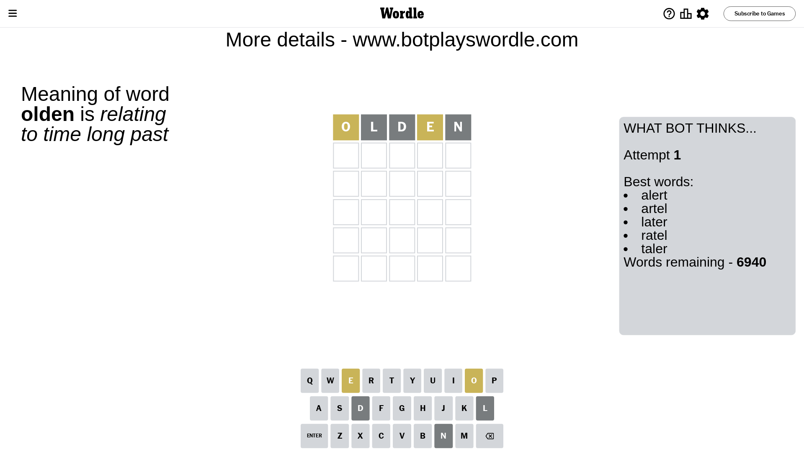

# Wordle for March 30, 2024 - \#1015

## Attempt 1

This is the first attempt and we'll choose a random word to start with.

Let's start with word `olden`

Attempt for `olden` gives us 0 correct letters, 2 present letters and 3 wrong letters.

If we look into details, we can see that:

Letter `o` is on a different spot - this means that it cannot be at position 1

Letter `l` is not present in the word and we will not use it any more

Letter `d` is not present in the word and we will not use it any more

Letter `e` is on a different spot - this means that it cannot be at position 4

Letter `n` is not present in the word and we will not use it any more

Some letters are missing (like `l`, `d`, `n`) but it's also important piece of information

Word should contain letters `[o e]`

That was a great guess that limited number of remaining words

## Attempt 2

Right now we have 180 words to choose from and best of them seem to be `[throe store torse recto repot]`

So far we know that possible letters are:

At position 1: `[a b c e f g h i j k m p q r s t u v w x y z]`

At position 2: `[a b c e f g h i j k m o p q r s t u v w x y z]`

At position 3: `[a b c e f g h i j k m o p q r s t u v w x y z]`

At position 4: `[a b c f g h i j k m o p q r s t u v w x y z]`

At position 5: `[a b c e f g h i j k m o p q r s t u v w x y z]`

Next guess is `throe`, let's see what it gives us

Attempt for `throe` gives us 2 correct letters, 1 present letters and 2 wrong letters.

If we look into details, we can see that:

Letter `t` is not present in the word and we will not use it any more

Letter `h` is not present in the word and we will not use it any more

Letter `r` should be at position 3

Letter `o` is on a different spot - this means that it cannot be at position 4

Letter `e` should be at position 5

We got information about the correct letters and it should make next attempt easier

Some letters are missing (like `t`, `h`) but it's also important piece of information

Word should contain letters `[o e r]`

That was a great guess that limited number of remaining words

## Attempt 3

Right now we have 8 words to choose from and best of them seem to be `[corse morse gorse porge force]`

So far we know that possible letters are:

At position 1: `[a b c e f g i j k m p q r s u v w x y z]`

At position 2: `[a b c e f g i j k m o p q r s u v w x y z]`

At position 3: `[r]`

At position 4: `[a b c f g i j k m p q r s u v w x y z]`

At position 5: `[e]`

Next guess is `force`, let's see what it gives us

That's the correct answer! The word is `force`!

## Conclusion

Today's word is `force` and it took 3 attempts to guess it

