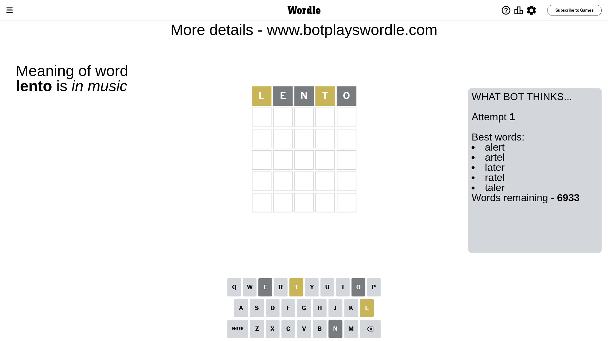
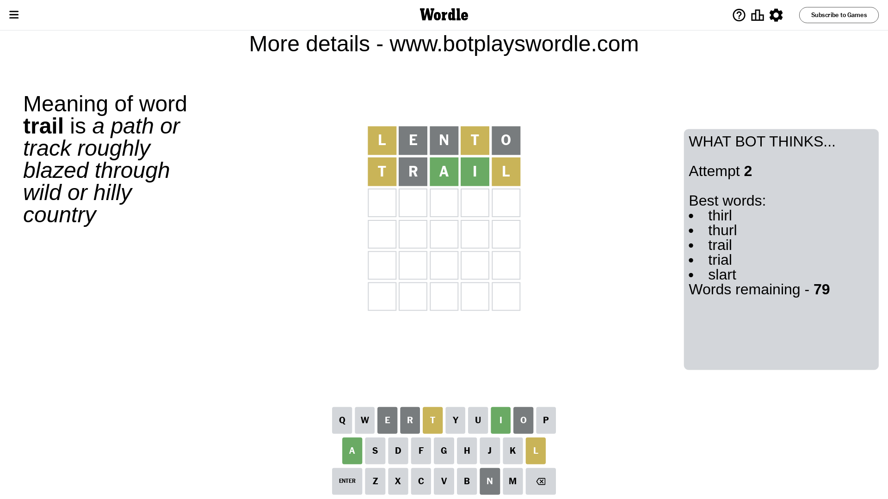

# Wordle for April 3, 2024 - \#1019

## Attempt 1

This is the first attempt and we'll choose a random word to start with.

Let's start with word `lento`

Attempt for `lento` gives us 0 correct letters, 2 present letters and 3 wrong letters.

If we look into details, we can see that:

Letter `l` is on a different spot - this means that it cannot be at position 1

Letter `e` is not present in the word and we will not use it any more

Letter `n` is not present in the word and we will not use it any more

Letter `t` is on a different spot - this means that it cannot be at position 4

Letter `o` is not present in the word and we will not use it any more

Some letters are missing (like `e`, `n`, `o`) but it's also important piece of information

Word should contain letters `[l t]`

That was a great guess that limited number of remaining words

## Attempt 2

Right now we have 79 words to choose from and best of them seem to be `[thirl thurl trail trial slart]`

So far we know that possible letters are:

At position 1: `[a b c d f g h i j k m p q r s t u v w x y z]`

At position 2: `[a b c d f g h i j k l m p q r s t u v w x y z]`

At position 3: `[a b c d f g h i j k l m p q r s t u v w x y z]`

At position 4: `[a b c d f g h i j k l m p q r s u v w x y z]`

At position 5: `[a b c d f g h i j k l m p q r s t u v w x y z]`

Next guess is `trail`, let's see what it gives us

Attempt for `trail` gives us 2 correct letters, 2 present letters and 1 wrong letters.

If we look into details, we can see that:

Letter `t` is on a different spot - this means that it cannot be at position 1

Letter `r` is not present in the word and we will not use it any more

Letter `a` should be at position 3

Letter `i` should be at position 4

Letter `l` is on a different spot - this means that it cannot be at position 5

We got information about the correct letters and it should make next attempt easier

Some letters are missing (like `r`) but it's also important piece of information

Word should contain letters `[l t a i]`

That was a great guess that limited number of remaining words

## Attempt 3

Right now we have 1 words to choose from and best of them seem to be `[plait]`

So far we know that possible letters are:

At position 1: `[a b c d f g h i j k m p q s u v w x y z]`

At position 2: `[a b c d f g h i j k l m p q s t u v w x y z]`

At position 3: `[a]`

At position 4: `[i]`

At position 5: `[a b c d f g h i j k m p q s t u v w x y z]`

It must be `plait`

That's the correct answer! The word is `plait`!

## Conclusion

Today's word is `plait` and it took 3 attempts to guess it

