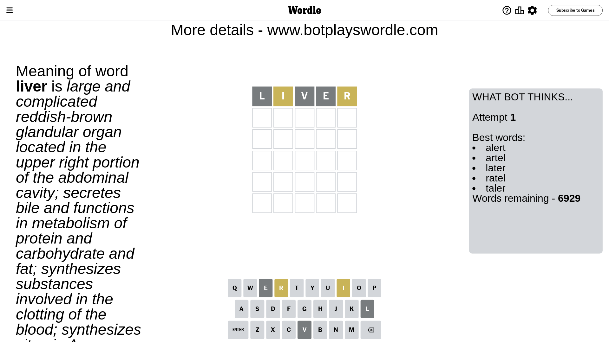
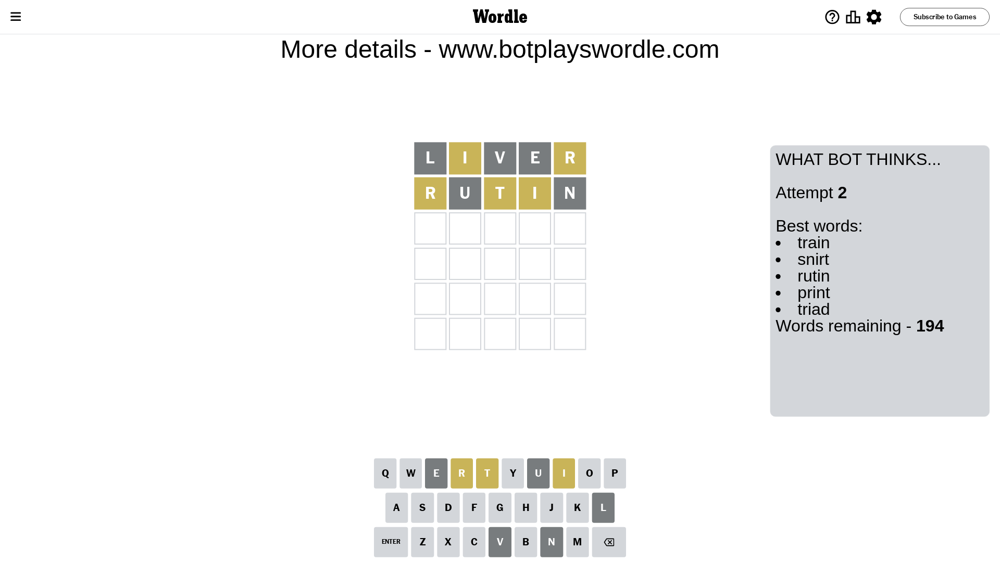
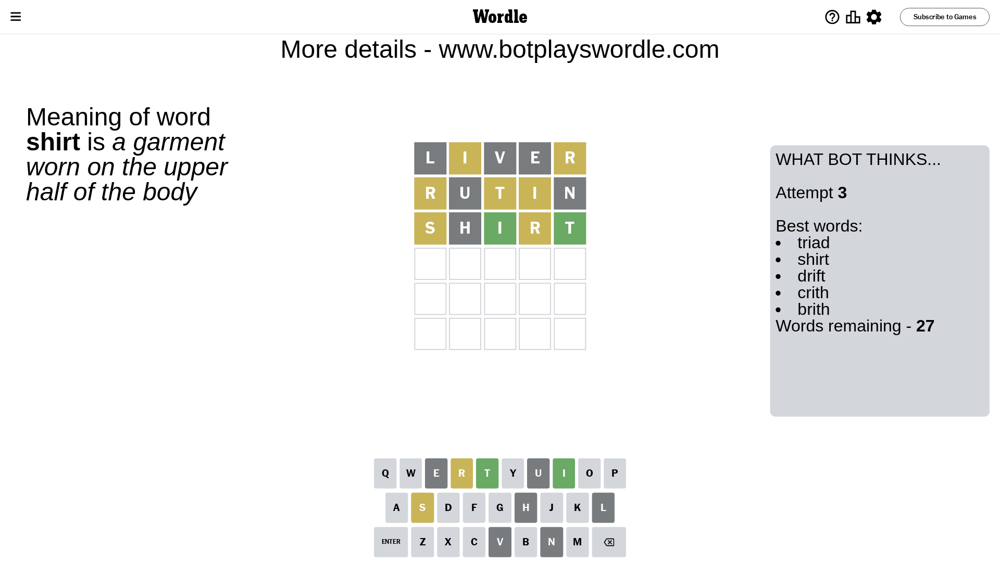
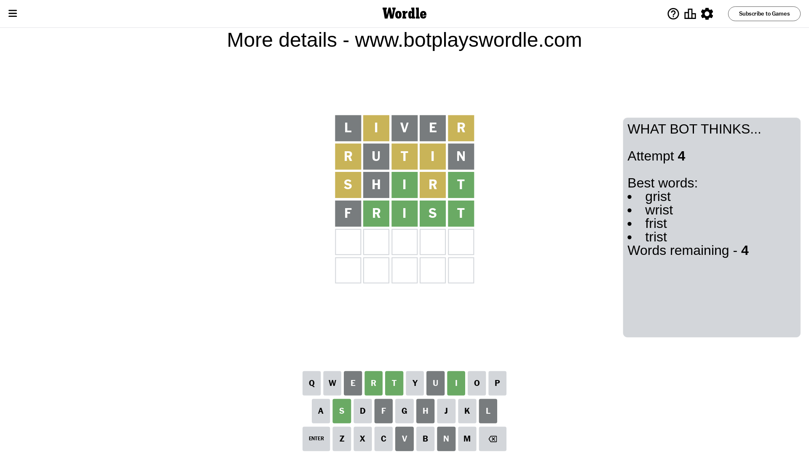
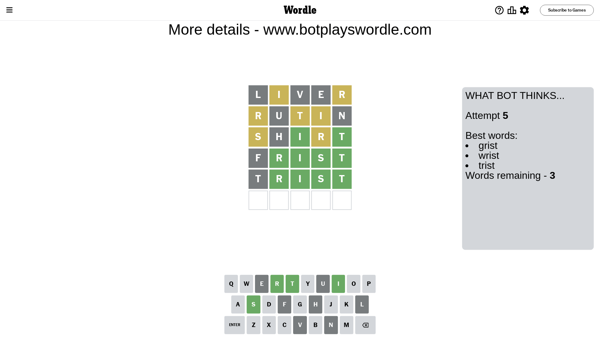
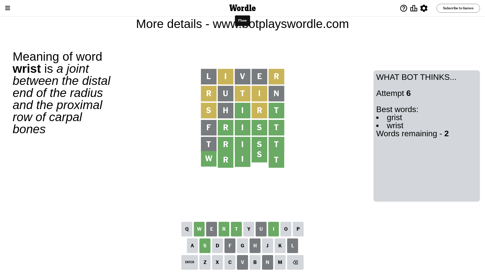

# Wordle for April 5, 2024 - \#1021

## Attempt 1

This is the first attempt and we'll choose a random word to start with.

Let's start with word `liver`

Attempt for `liver` gives us 0 correct letters, 2 present letters and 3 wrong letters.

If we look into details, we can see that:

Letter `l` is not present in the word and we will not use it any more

Letter `i` is on a different spot - this means that it cannot be at position 2

Letter `v` is not present in the word and we will not use it any more

Letter `e` is not present in the word and we will not use it any more

Letter `r` is on a different spot - this means that it cannot be at position 5

Some letters are missing (like `l`, `v`, `e`) but it's also important piece of information

Word should contain letters `[i r]`

That was a great guess that limited number of remaining words

## Attempt 2

Right now we have 194 words to choose from and best of them seem to be `[train snirt rutin print triad]`

So far we know that possible letters are:

At position 1: `[a b c d f g h i j k m n o p q r s t u w x y z]`

At position 2: `[a b c d f g h j k m n o p q r s t u w x y z]`

At position 3: `[a b c d f g h i j k m n o p q r s t u w x y z]`

At position 4: `[a b c d f g h i j k m n o p q r s t u w x y z]`

At position 5: `[a b c d f g h i j k m n o p q s t u w x y z]`

Next guess is `rutin`, let's see what it gives us

Attempt for `rutin` gives us 0 correct letters, 3 present letters and 2 wrong letters.

If we look into details, we can see that:

Letter `r` is on a different spot - this means that it cannot be at position 1

Letter `u` is not present in the word and we will not use it any more

Letter `t` is on a different spot - this means that it cannot be at position 3

Letter `i` is on a different spot - this means that it cannot be at position 4

Letter `n` is not present in the word and we will not use it any more

Some letters are missing (like `u`, `n`) but it's also important piece of information

Word should contain letters `[i r t]`

Not a bad guess in general

## Attempt 3

Right now we have 27 words to choose from and best of them seem to be `[triad shirt drift crith brith]`

So far we know that possible letters are:

At position 1: `[a b c d f g h i j k m o p q s t w x y z]`

At position 2: `[a b c d f g h j k m o p q r s t w x y z]`

At position 3: `[a b c d f g h i j k m o p q r s w x y z]`

At position 4: `[a b c d f g h j k m o p q r s t w x y z]`

At position 5: `[a b c d f g h i j k m o p q s t w x y z]`

Next guess is `shirt`, let's see what it gives us

Attempt for `shirt` gives us 2 correct letters, 2 present letters and 1 wrong letters.

If we look into details, we can see that:

Letter `s` is on a different spot - this means that it cannot be at position 1

Letter `h` is not present in the word and we will not use it any more

Letter `i` should be at position 3

Letter `r` is on a different spot - this means that it cannot be at position 4

Letter `t` should be at position 5

We got information about the correct letters and it should make next attempt easier

Some letters are missing (like `h`) but it's also important piece of information

Word should contain letters `[i r t s]`

Not a bad guess in general

## Attempt 4

Right now we have 4 words to choose from and best of them seem to be `[grist wrist frist trist]`

So far we know that possible letters are:

At position 1: `[a b c d f g i j k m o p q t w x y z]`

At position 2: `[a b c d f g j k m o p q r s t w x y z]`

At position 3: `[i]`

At position 4: `[a b c d f g j k m o p q s t w x y z]`

At position 5: `[t]`

Next guess is `frist`, let's see what it gives us

Attempt for `frist` gives us 4 correct letters, 0 present letters and 1 wrong letters.

If we look into details, we can see that:

Letter `f` is not present in the word and we will not use it any more

Letter `r` should be at position 2

Letter `s` should be at position 4

We got information about the correct letters and it should make next attempt easier

Some letters are missing (like `f`) but it's also important piece of information

Word should contain letters `[i r t s]`

This was a waste, almost no valuable information...

## Attempt 5

Right now we have 3 words to choose from and best of them seem to be `[grist wrist trist]`

So far we know that possible letters are:

At position 1: `[a b c d g i j k m o p q t w x y z]`

At position 2: `[r]`

At position 3: `[i]`

At position 4: `[s]`

At position 5: `[t]`

Next guess is `trist`, let's see what it gives us

Attempt for `trist` gives us 4 correct letters, 0 present letters and 1 wrong letters.

If we look into details, we can see that:

Letter `t` is not present in the word and we will not use it any more

Some letters are missing (like `t`) but it's also important piece of information

Word should contain letters `[i r t s]`

This was a waste, almost no valuable information...

## Attempt 6

Right now we have 2 words to choose from and best of them seem to be `[grist wrist]`

So far we know that possible letters are:

At position 1: `[a b c d g i j k m o p q w x y z]`

At position 2: `[r]`

At position 3: `[i]`

At position 4: `[s]`

At position 5: `[t]`

Next guess is `wrist`, let's see what it gives us

That's the correct answer! The word is `wrist`!

## Conclusion

Today's word is `wrist` and it took 6 attempts to guess it

