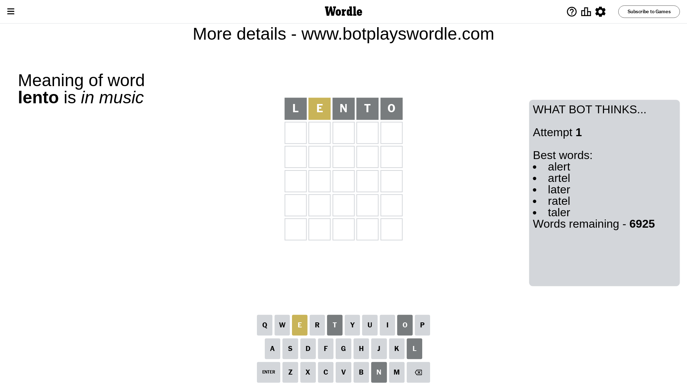
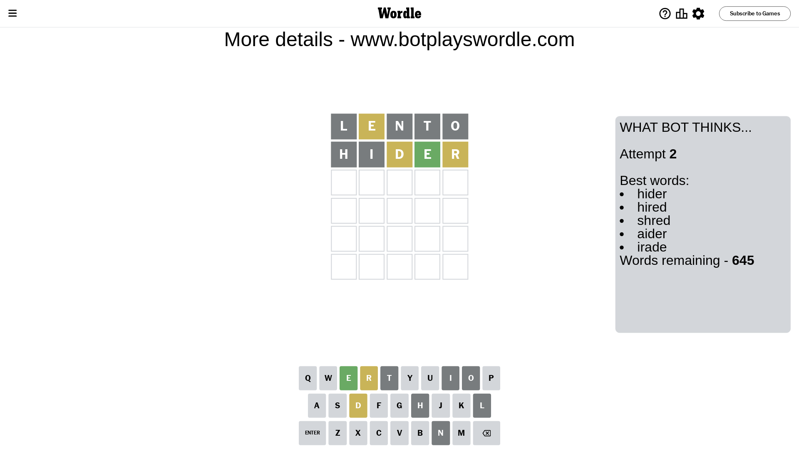
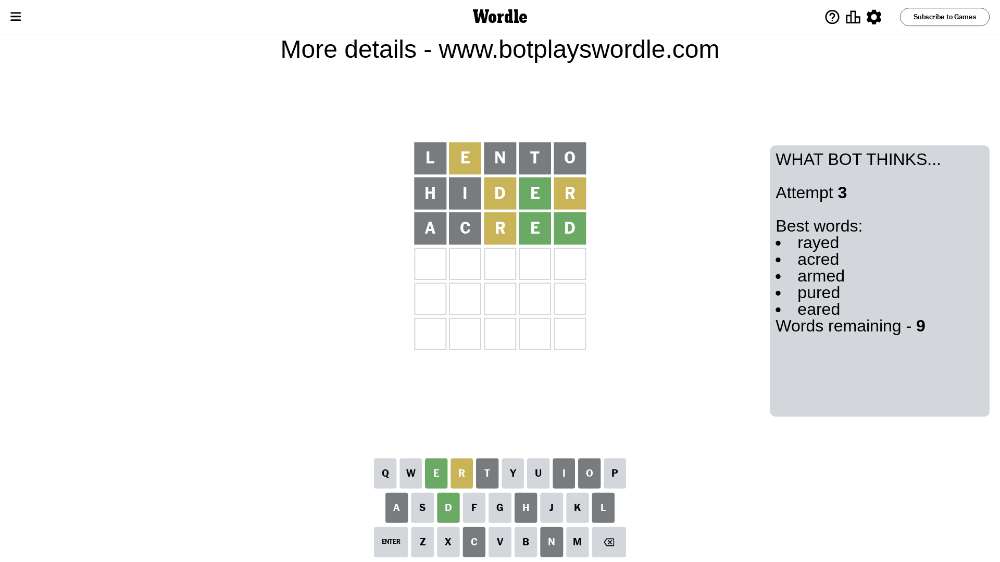
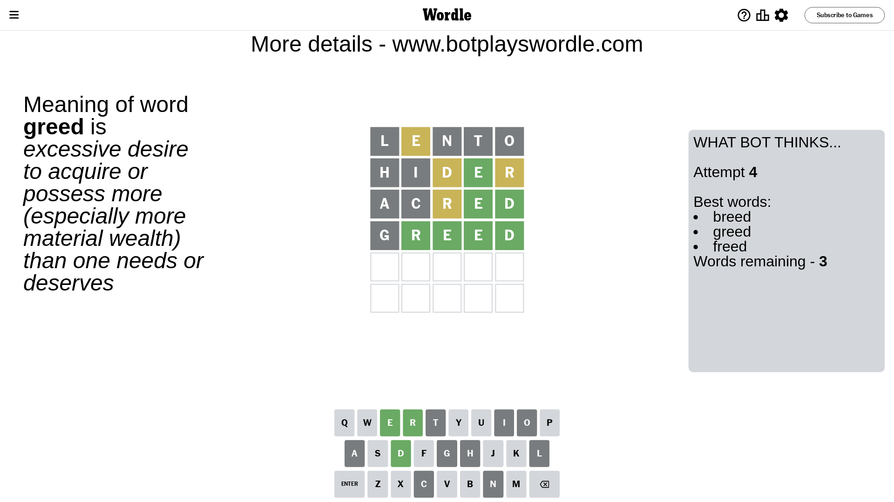
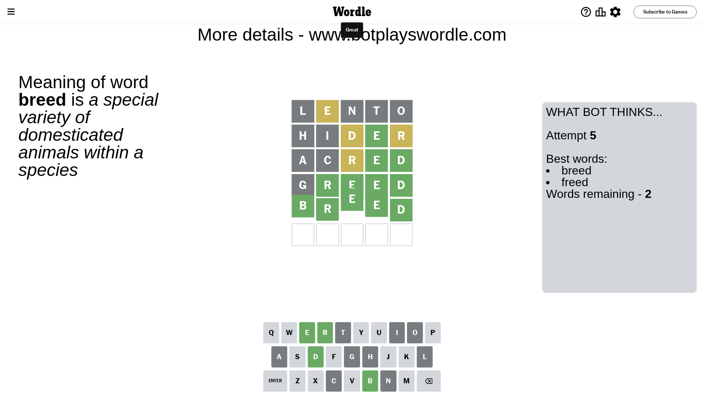

# Wordle for April 8, 2024 - \#1024

## Attempt 1

This is the first attempt and we'll choose a random word to start with.

Let's start with word `lento`

Attempt for `lento` gives us 0 correct letters, 1 present letters and 4 wrong letters.

If we look into details, we can see that:

Letter `l` is not present in the word and we will not use it any more

Letter `e` is on a different spot - this means that it cannot be at position 2

Letter `n` is not present in the word and we will not use it any more

Letter `t` is not present in the word and we will not use it any more

Letter `o` is not present in the word and we will not use it any more

Some letters are missing (like `l`, `n`, `t`, `o`) but it's also important piece of information

Word should contain letters `[e]`

That was a great guess that limited number of remaining words

## Attempt 2

Right now we have 645 words to choose from and best of them seem to be `[hider hired shred aider irade]`

So far we know that possible letters are:

At position 1: `[a b c d e f g h i j k m p q r s u v w x y z]`

At position 2: `[a b c d f g h i j k m p q r s u v w x y z]`

At position 3: `[a b c d e f g h i j k m p q r s u v w x y z]`

At position 4: `[a b c d e f g h i j k m p q r s u v w x y z]`

At position 5: `[a b c d e f g h i j k m p q r s u v w x y z]`

Next guess is `hider`, let's see what it gives us

Attempt for `hider` gives us 1 correct letters, 2 present letters and 2 wrong letters.

If we look into details, we can see that:

Letter `h` is not present in the word and we will not use it any more

Letter `i` is not present in the word and we will not use it any more

Letter `d` is on a different spot - this means that it cannot be at position 3

Letter `e` should be at position 4

Letter `r` is on a different spot - this means that it cannot be at position 5

We got information about the correct letters and it should make next attempt easier

Some letters are missing (like `h`, `i`) but it's also important piece of information

Word should contain letters `[e d r]`

That was a great guess that limited number of remaining words

## Attempt 3

Right now we have 9 words to choose from and best of them seem to be `[rayed acred armed pured eared]`

So far we know that possible letters are:

At position 1: `[a b c d e f g j k m p q r s u v w x y z]`

At position 2: `[a b c d f g j k m p q r s u v w x y z]`

At position 3: `[a b c e f g j k m p q r s u v w x y z]`

At position 4: `[e]`

At position 5: `[a b c d e f g j k m p q s u v w x y z]`

Next guess is `acred`, let's see what it gives us

Attempt for `acred` gives us 2 correct letters, 1 present letters and 2 wrong letters.

If we look into details, we can see that:

Letter `a` is not present in the word and we will not use it any more

Letter `c` is not present in the word and we will not use it any more

Letter `r` is on a different spot - this means that it cannot be at position 3

Letter `d` should be at position 5

We got information about the correct letters and it should make next attempt easier

Some letters are missing (like `a`, `c`) but it's also important piece of information

Word should contain letters `[e d r]`

Could be a better guess

## Attempt 4

Right now we have 3 words to choose from and best of them seem to be `[breed greed freed]`

So far we know that possible letters are:

At position 1: `[b d e f g j k m p q r s u v w x y z]`

At position 2: `[b d f g j k m p q r s u v w x y z]`

At position 3: `[b e f g j k m p q s u v w x y z]`

At position 4: `[e]`

At position 5: `[d]`

Next guess is `greed`, let's see what it gives us

Attempt for `greed` gives us 4 correct letters, 0 present letters and 1 wrong letters.

If we look into details, we can see that:

Letter `g` is not present in the word and we will not use it any more

Letter `r` should be at position 2

Letter `e` should be at position 3

We got information about the correct letters and it should make next attempt easier

Some letters are missing (like `g`) but it's also important piece of information

Word should contain letters `[e d r]`

This was a waste, almost no valuable information...

## Attempt 5

Right now we have 2 words to choose from and best of them seem to be `[breed freed]`

So far we know that possible letters are:

At position 1: `[b d e f j k m p q r s u v w x y z]`

At position 2: `[r]`

At position 3: `[e]`

At position 4: `[e]`

At position 5: `[d]`

Next guess is `breed`, let's see what it gives us

That's the correct answer! The word is `breed`!

## Conclusion

Today's word is `breed` and it took 5 attempts to guess it

