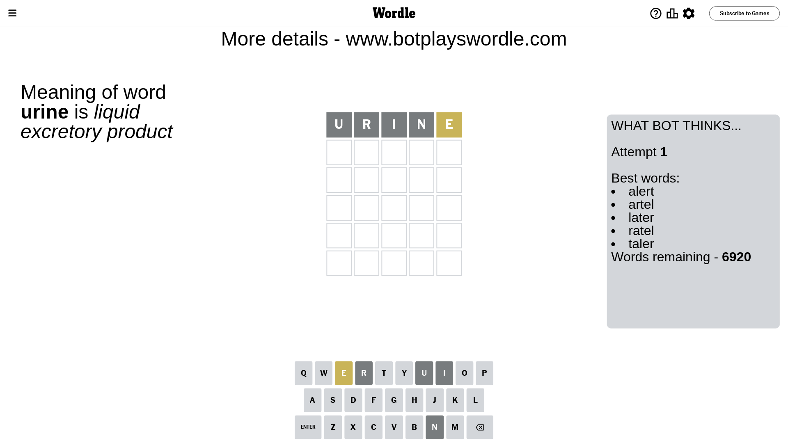
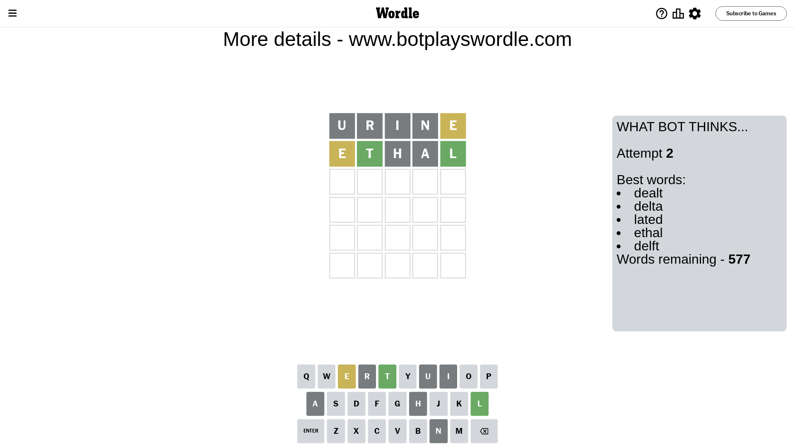
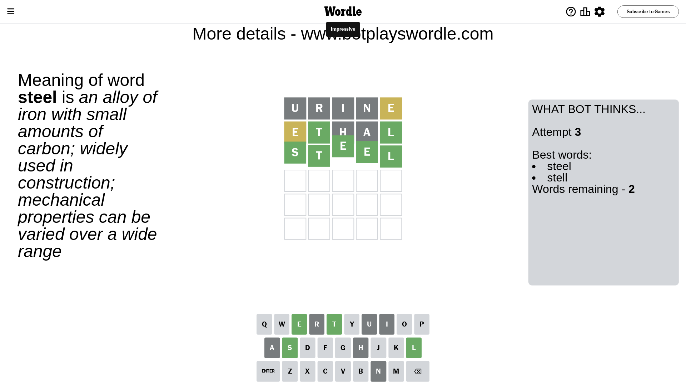

# Wordle for April 13, 2024 - \#1029

## Attempt 1

This is the first attempt and we'll choose a random word to start with.

Let's start with word `urine`

Attempt for `urine` gives us 0 correct letters, 1 present letters and 4 wrong letters.

If we look into details, we can see that:

Letter `u` is not present in the word and we will not use it any more

Letter `r` is not present in the word and we will not use it any more

Letter `i` is not present in the word and we will not use it any more

Letter `n` is not present in the word and we will not use it any more

Letter `e` is on a different spot - this means that it cannot be at position 5

Some letters are missing (like `u`, `r`, `i`, `n`) but it's also important piece of information

Word should contain letters `[e]`

That was a great guess that limited number of remaining words

## Attempt 2

Right now we have 577 words to choose from and best of them seem to be `[dealt delta lated ethal delft]`

So far we know that possible letters are:

At position 1: `[a b c d e f g h j k l m o p q s t v w x y z]`

At position 2: `[a b c d e f g h j k l m o p q s t v w x y z]`

At position 3: `[a b c d e f g h j k l m o p q s t v w x y z]`

At position 4: `[a b c d e f g h j k l m o p q s t v w x y z]`

At position 5: `[a b c d f g h j k l m o p q s t v w x y z]`

Next guess is `ethal`, let's see what it gives us

Attempt for `ethal` gives us 2 correct letters, 1 present letters and 2 wrong letters.

If we look into details, we can see that:

Letter `e` is on a different spot - this means that it cannot be at position 1

Letter `t` should be at position 2

Letter `h` is not present in the word and we will not use it any more

Letter `a` is not present in the word and we will not use it any more

Letter `l` should be at position 5

We got information about the correct letters and it should make next attempt easier

Some letters are missing (like `h`, `a`) but it's also important piece of information

Word should contain letters `[e t l]`

That was a great guess that limited number of remaining words

## Attempt 3

Right now we have 2 words to choose from and best of them seem to be `[steel stell]`

So far we know that possible letters are:

At position 1: `[b c d f g j k l m o p q s t v w x y z]`

At position 2: `[t]`

At position 3: `[b c d e f g j k l m o p q s t v w x y z]`

At position 4: `[b c d e f g j k l m o p q s t v w x y z]`

At position 5: `[l]`

Next guess is `steel`, let's see what it gives us

That's the correct answer! The word is `steel`!

## Conclusion

Today's word is `steel` and it took 3 attempts to guess it

