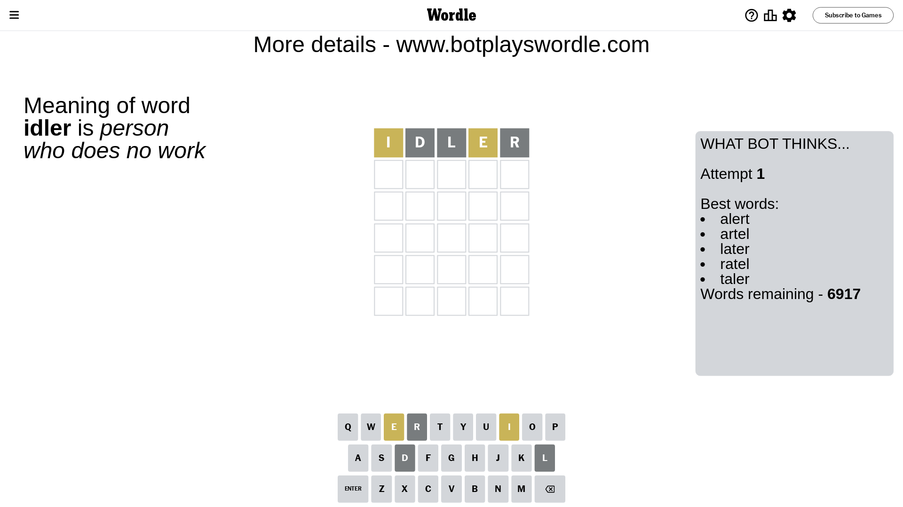
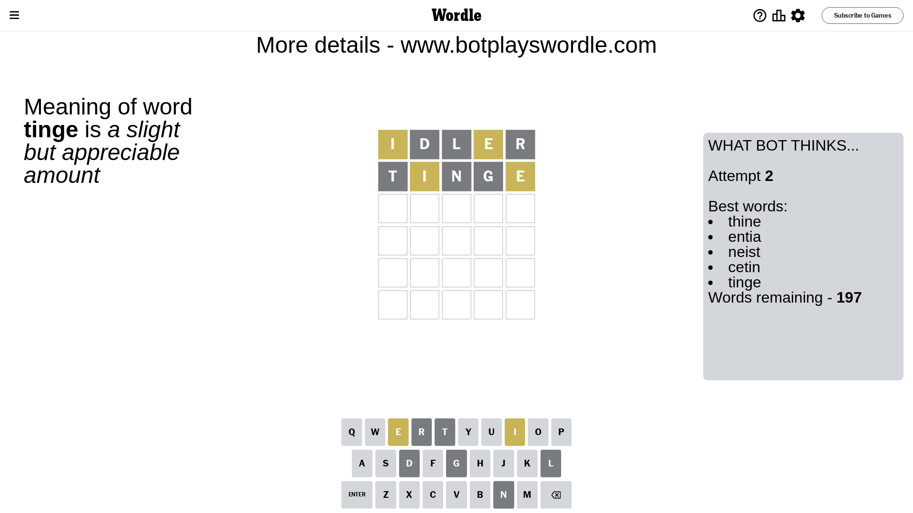
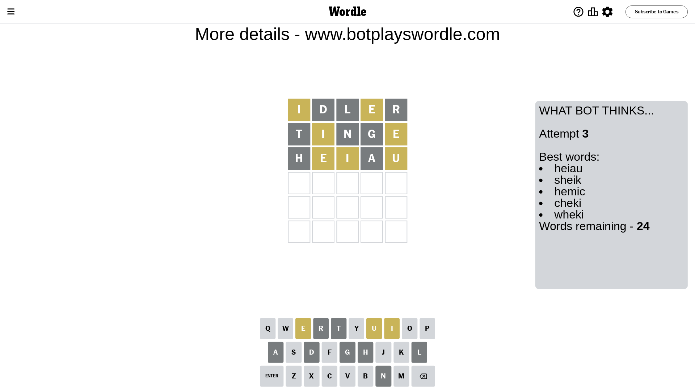
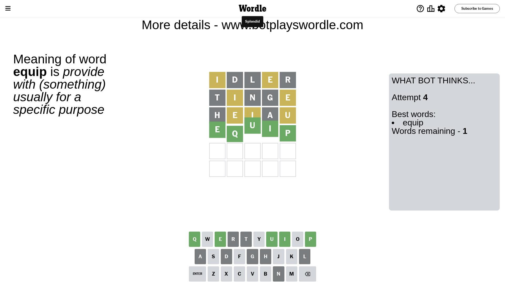

# Wordle for April 15, 2024 - \#1031

## Attempt 1

This is the first attempt and we'll choose a random word to start with.

Let's start with word `idler`

Attempt for `idler` gives us 0 correct letters, 2 present letters and 3 wrong letters.

If we look into details, we can see that:

Letter `i` is on a different spot - this means that it cannot be at position 1

Letter `d` is not present in the word and we will not use it any more

Letter `l` is not present in the word and we will not use it any more

Letter `e` is on a different spot - this means that it cannot be at position 4

Letter `r` is not present in the word and we will not use it any more

Some letters are missing (like `d`, `l`, `r`) but it's also important piece of information

Word should contain letters `[i e]`

That was a great guess that limited number of remaining words

## Attempt 2

Right now we have 197 words to choose from and best of them seem to be `[thine entia neist cetin tinge]`

So far we know that possible letters are:

At position 1: `[a b c e f g h j k m n o p q s t u v w x y z]`

At position 2: `[a b c e f g h i j k m n o p q s t u v w x y z]`

At position 3: `[a b c e f g h i j k m n o p q s t u v w x y z]`

At position 4: `[a b c f g h i j k m n o p q s t u v w x y z]`

At position 5: `[a b c e f g h i j k m n o p q s t u v w x y z]`

Next guess is `tinge`, let's see what it gives us

Attempt for `tinge` gives us 0 correct letters, 2 present letters and 3 wrong letters.

If we look into details, we can see that:

Letter `t` is not present in the word and we will not use it any more

Letter `i` is on a different spot - this means that it cannot be at position 2

Letter `n` is not present in the word and we will not use it any more

Letter `g` is not present in the word and we will not use it any more

Letter `e` is on a different spot - this means that it cannot be at position 5

Some letters are missing (like `t`, `n`, `g`) but it's also important piece of information

Word should contain letters `[i e]`

That was a great guess that limited number of remaining words

## Attempt 3

Right now we have 24 words to choose from and best of them seem to be `[heiau sheik hemic cheki wheki]`

So far we know that possible letters are:

At position 1: `[a b c e f h j k m o p q s u v w x y z]`

At position 2: `[a b c e f h j k m o p q s u v w x y z]`

At position 3: `[a b c e f h i j k m o p q s u v w x y z]`

At position 4: `[a b c f h i j k m o p q s u v w x y z]`

At position 5: `[a b c f h i j k m o p q s u v w x y z]`

Next guess is `heiau`, let's see what it gives us

Attempt for `heiau` gives us 0 correct letters, 3 present letters and 2 wrong letters.

If we look into details, we can see that:

Letter `h` is not present in the word and we will not use it any more

Letter `e` is on a different spot - this means that it cannot be at position 2

Letter `i` is on a different spot - this means that it cannot be at position 3

Letter `a` is not present in the word and we will not use it any more

Letter `u` is on a different spot - this means that it cannot be at position 5

Some letters are missing (like `h`, `a`) but it's also important piece of information

Word should contain letters `[i e u]`

That was a great guess that limited number of remaining words

## Attempt 4

Right now we have 1 words to choose from and best of them seem to be `[equip]`

So far we know that possible letters are:

At position 1: `[b c e f j k m o p q s u v w x y z]`

At position 2: `[b c f j k m o p q s u v w x y z]`

At position 3: `[b c e f j k m o p q s u v w x y z]`

At position 4: `[b c f i j k m o p q s u v w x y z]`

At position 5: `[b c f i j k m o p q s v w x y z]`

It must be `equip`

That's the correct answer! The word is `equip`!

## Conclusion

Today's word is `equip` and it took 4 attempts to guess it

