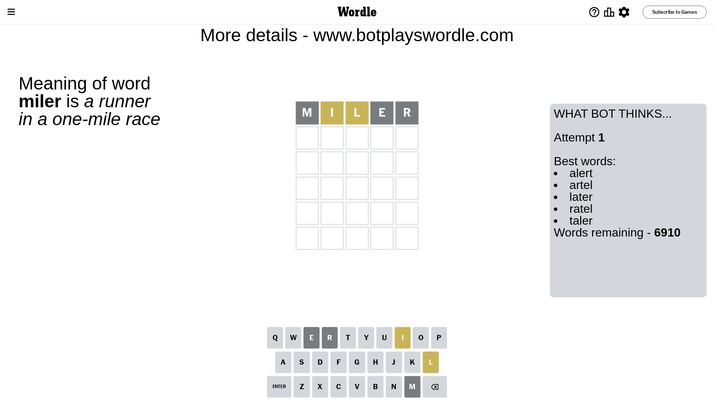
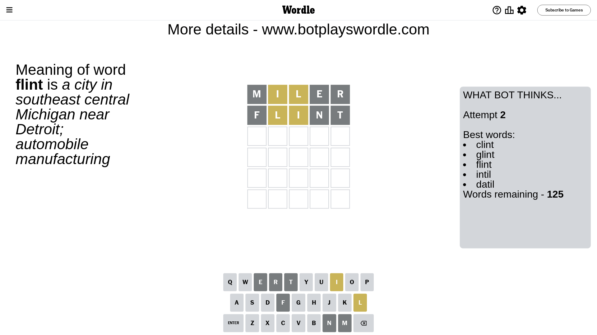
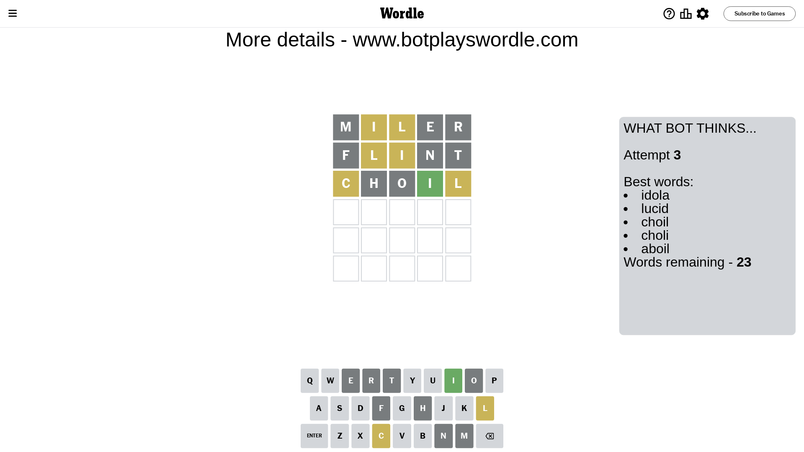
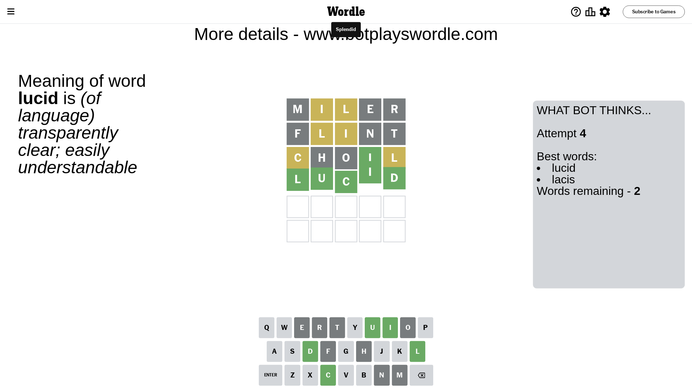

# Wordle for April 20, 2024 - \#1036

## Attempt 1

This is the first attempt and we'll choose a random word to start with.

Let's start with word `miler`

Attempt for `miler` gives us 0 correct letters, 2 present letters and 3 wrong letters.

If we look into details, we can see that:

Letter `m` is not present in the word and we will not use it any more

Letter `i` is on a different spot - this means that it cannot be at position 2

Letter `l` is on a different spot - this means that it cannot be at position 3

Letter `e` is not present in the word and we will not use it any more

Letter `r` is not present in the word and we will not use it any more

Some letters are missing (like `m`, `e`, `r`) but it's also important piece of information

Word should contain letters `[i l]`

That was a great guess that limited number of remaining words

## Attempt 2

Right now we have 125 words to choose from and best of them seem to be `[clint glint flint intil datil]`

So far we know that possible letters are:

At position 1: `[a b c d f g h i j k l n o p q s t u v w x y z]`

At position 2: `[a b c d f g h j k l n o p q s t u v w x y z]`

At position 3: `[a b c d f g h i j k n o p q s t u v w x y z]`

At position 4: `[a b c d f g h i j k l n o p q s t u v w x y z]`

At position 5: `[a b c d f g h i j k l n o p q s t u v w x y z]`

Next guess is `flint`, let's see what it gives us

Attempt for `flint` gives us 0 correct letters, 2 present letters and 3 wrong letters.

If we look into details, we can see that:

Letter `f` is not present in the word and we will not use it any more

Letter `l` is on a different spot - this means that it cannot be at position 2

Letter `i` is on a different spot - this means that it cannot be at position 3

Letter `n` is not present in the word and we will not use it any more

Letter `t` is not present in the word and we will not use it any more

Some letters are missing (like `f`, `n`, `t`) but it's also important piece of information

Word should contain letters `[i l]`

Not a bad guess in general

## Attempt 3

Right now we have 23 words to choose from and best of them seem to be `[idola lucid choil choli aboil]`

So far we know that possible letters are:

At position 1: `[a b c d g h i j k l o p q s u v w x y z]`

At position 2: `[a b c d g h j k o p q s u v w x y z]`

At position 3: `[a b c d g h j k o p q s u v w x y z]`

At position 4: `[a b c d g h i j k l o p q s u v w x y z]`

At position 5: `[a b c d g h i j k l o p q s u v w x y z]`

Next guess is `choil`, let's see what it gives us

Attempt for `choil` gives us 1 correct letters, 2 present letters and 2 wrong letters.

If we look into details, we can see that:

Letter `c` is on a different spot - this means that it cannot be at position 1

Letter `h` is not present in the word and we will not use it any more

Letter `o` is not present in the word and we will not use it any more

Letter `i` should be at position 4

Letter `l` is on a different spot - this means that it cannot be at position 5

We got information about the correct letters and it should make next attempt easier

Some letters are missing (like `h`, `o`) but it's also important piece of information

Word should contain letters `[i l c]`

That was a great guess that limited number of remaining words

## Attempt 4

Right now we have 2 words to choose from and best of them seem to be `[lucid lacis]`

So far we know that possible letters are:

At position 1: `[a b d g i j k l p q s u v w x y z]`

At position 2: `[a b c d g j k p q s u v w x y z]`

At position 3: `[a b c d g j k p q s u v w x y z]`

At position 4: `[i]`

At position 5: `[a b c d g i j k p q s u v w x y z]`

Next guess is `lucid`, let's see what it gives us

That's the correct answer! The word is `lucid`!

## Conclusion

Today's word is `lucid` and it took 4 attempts to guess it

