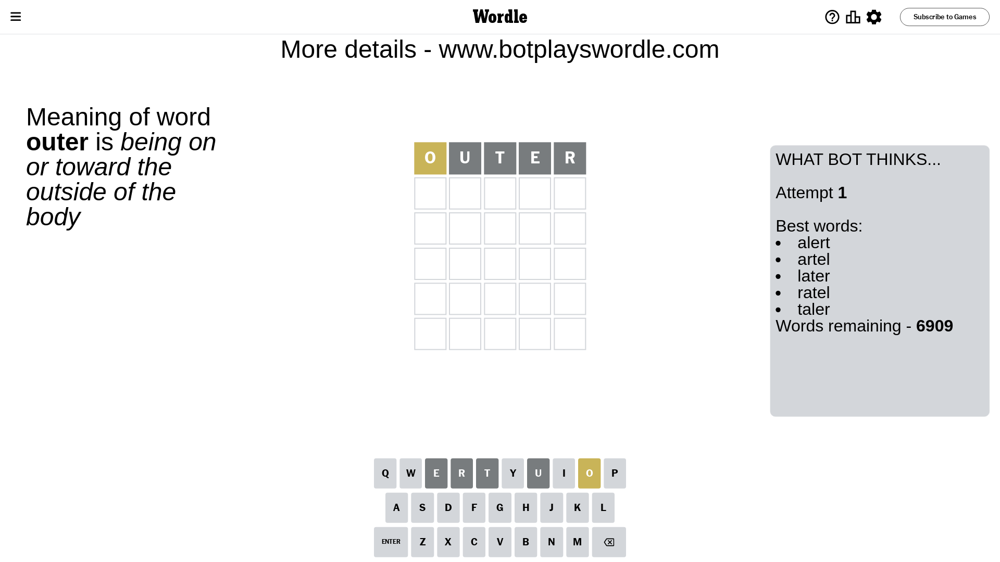
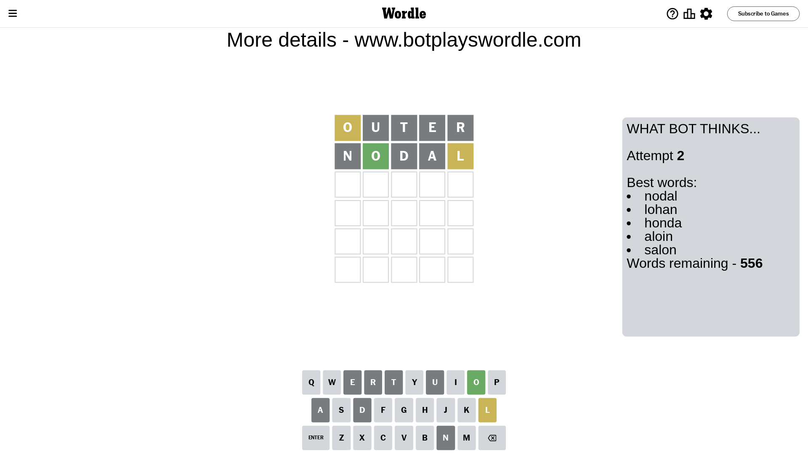
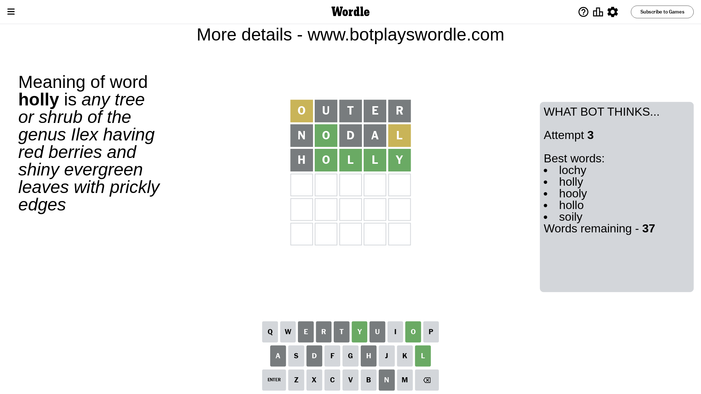
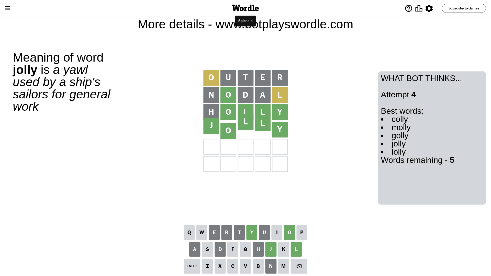

# Wordle for April 21, 2024 - \#1037

## Attempt 1

This is the first attempt and we'll choose a random word to start with.

Let's start with word `outer`

Attempt for `outer` gives us 0 correct letters, 1 present letters and 4 wrong letters.

If we look into details, we can see that:

Letter `o` is on a different spot - this means that it cannot be at position 1

Letter `u` is not present in the word and we will not use it any more

Letter `t` is not present in the word and we will not use it any more

Letter `e` is not present in the word and we will not use it any more

Letter `r` is not present in the word and we will not use it any more

Some letters are missing (like `u`, `t`, `e`, `r`) but it's also important piece of information

Word should contain letters `[o]`

That was a great guess that limited number of remaining words

## Attempt 2

Right now we have 556 words to choose from and best of them seem to be `[nodal lohan honda aloin salon]`

So far we know that possible letters are:

At position 1: `[a b c d f g h i j k l m n p q s v w x y z]`

At position 2: `[a b c d f g h i j k l m n o p q s v w x y z]`

At position 3: `[a b c d f g h i j k l m n o p q s v w x y z]`

At position 4: `[a b c d f g h i j k l m n o p q s v w x y z]`

At position 5: `[a b c d f g h i j k l m n o p q s v w x y z]`

Next guess is `nodal`, let's see what it gives us

Attempt for `nodal` gives us 1 correct letters, 1 present letters and 3 wrong letters.

If we look into details, we can see that:

Letter `n` is not present in the word and we will not use it any more

Letter `o` should be at position 2

Letter `d` is not present in the word and we will not use it any more

Letter `a` is not present in the word and we will not use it any more

Letter `l` is on a different spot - this means that it cannot be at position 5

We got information about the correct letters and it should make next attempt easier

Some letters are missing (like `n`, `d`, `a`) but it's also important piece of information

Word should contain letters `[o l]`

That was a great guess that limited number of remaining words

## Attempt 3

Right now we have 37 words to choose from and best of them seem to be `[lochy holly hooly hollo soily]`

So far we know that possible letters are:

At position 1: `[b c f g h i j k l m p q s v w x y z]`

At position 2: `[o]`

At position 3: `[b c f g h i j k l m o p q s v w x y z]`

At position 4: `[b c f g h i j k l m o p q s v w x y z]`

At position 5: `[b c f g h i j k m o p q s v w x y z]`

Next guess is `holly`, let's see what it gives us

Attempt for `holly` gives us 4 correct letters, 0 present letters and 1 wrong letters.

If we look into details, we can see that:

Letter `h` is not present in the word and we will not use it any more

Letter `l` should be at position 3

Letter `l` should be at position 4

Letter `y` should be at position 5

We got information about the correct letters and it should make next attempt easier

Some letters are missing (like `h`) but it's also important piece of information

Word should contain letters `[o l y]`

Not a bad guess in general

## Attempt 4

Right now we have 5 words to choose from and best of them seem to be `[colly molly golly jolly lolly]`

So far we know that possible letters are:

At position 1: `[b c f g i j k l m p q s v w x y z]`

At position 2: `[o]`

At position 3: `[l]`

At position 4: `[l]`

At position 5: `[y]`

Next guess is `jolly`, let's see what it gives us

That's the correct answer! The word is `jolly`!

## Conclusion

Today's word is `jolly` and it took 4 attempts to guess it

