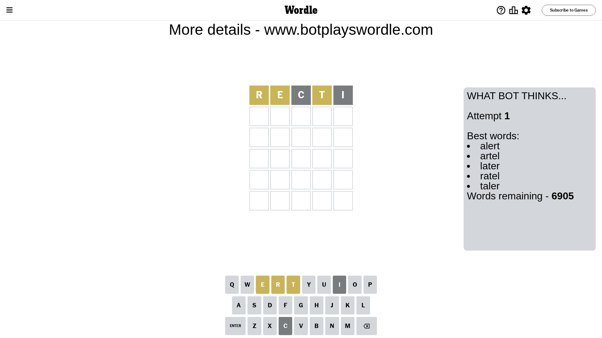
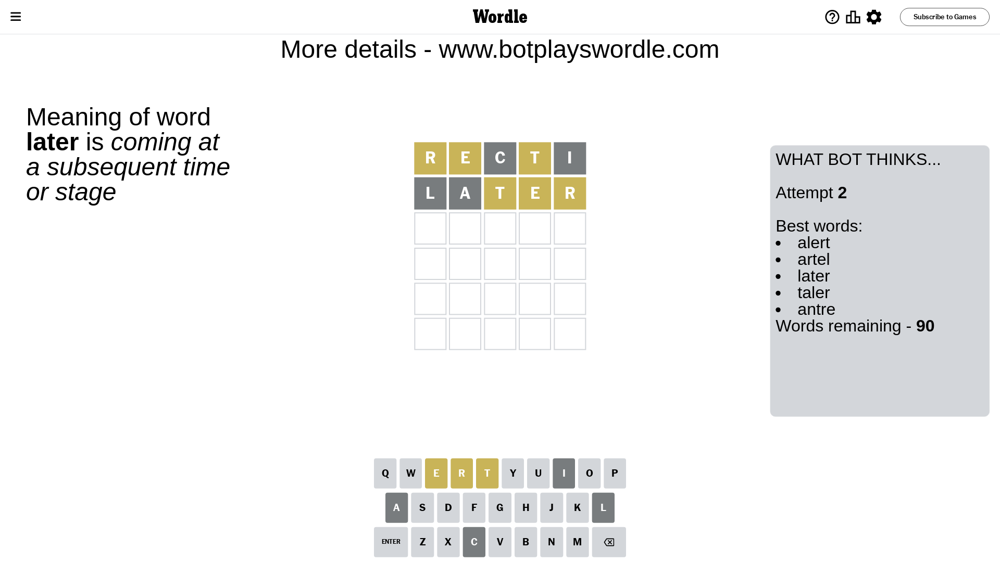
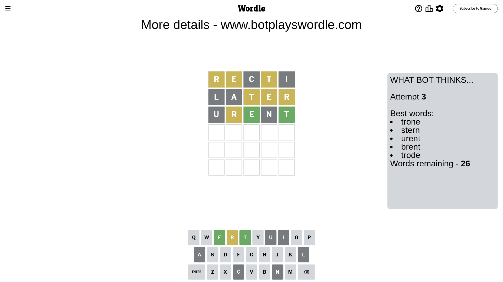
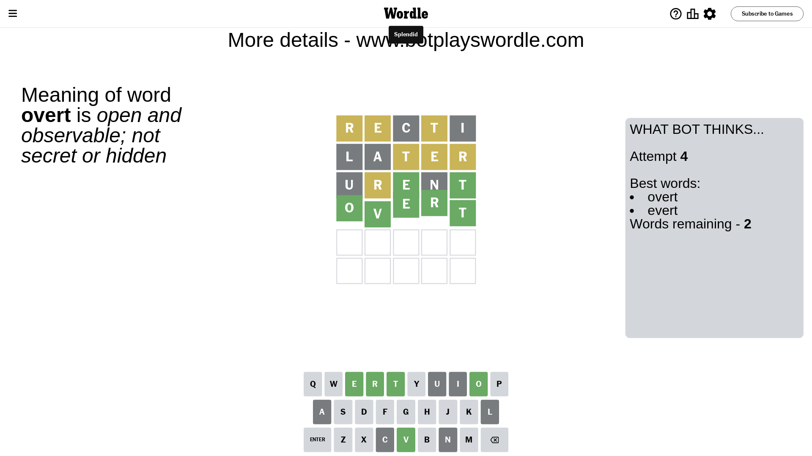

# Wordle for April 24, 2024 - \#1040

## Attempt 1

This is the first attempt and we'll choose a random word to start with.

Let's start with word `recti`

Attempt for `recti` gives us 0 correct letters, 3 present letters and 2 wrong letters.

If we look into details, we can see that:

Letter `r` is on a different spot - this means that it cannot be at position 1

Letter `e` is on a different spot - this means that it cannot be at position 2

Letter `c` is not present in the word and we will not use it any more

Letter `t` is on a different spot - this means that it cannot be at position 4

Letter `i` is not present in the word and we will not use it any more

Some letters are missing (like `c`, `i`) but it's also important piece of information

Word should contain letters `[r e t]`

That was a great guess that limited number of remaining words

## Attempt 2

Right now we have 90 words to choose from and best of them seem to be `[alert artel later taler antre]`

So far we know that possible letters are:

At position 1: `[a b d e f g h j k l m n o p q s t u v w x y z]`

At position 2: `[a b d f g h j k l m n o p q r s t u v w x y z]`

At position 3: `[a b d e f g h j k l m n o p q r s t u v w x y z]`

At position 4: `[a b d e f g h j k l m n o p q r s u v w x y z]`

At position 5: `[a b d e f g h j k l m n o p q r s t u v w x y z]`

Next guess is `later`, let's see what it gives us

Attempt for `later` gives us 0 correct letters, 3 present letters and 2 wrong letters.

If we look into details, we can see that:

Letter `l` is not present in the word and we will not use it any more

Letter `a` is not present in the word and we will not use it any more

Letter `t` is on a different spot - this means that it cannot be at position 3

Letter `e` is on a different spot - this means that it cannot be at position 4

Letter `r` is on a different spot - this means that it cannot be at position 5

Some letters are missing (like `l`, `a`) but it's also important piece of information

Word should contain letters `[r e t]`

Could be a better guess

## Attempt 3

Right now we have 26 words to choose from and best of them seem to be `[trone stern urent brent trode]`

So far we know that possible letters are:

At position 1: `[b d e f g h j k m n o p q s t u v w x y z]`

At position 2: `[b d f g h j k m n o p q r s t u v w x y z]`

At position 3: `[b d e f g h j k m n o p q r s u v w x y z]`

At position 4: `[b d f g h j k m n o p q r s u v w x y z]`

At position 5: `[b d e f g h j k m n o p q s t u v w x y z]`

Next guess is `urent`, let's see what it gives us

Attempt for `urent` gives us 2 correct letters, 1 present letters and 2 wrong letters.

If we look into details, we can see that:

Letter `u` is not present in the word and we will not use it any more

Letter `r` is on a different spot - this means that it cannot be at position 2

Letter `e` should be at position 3

Letter `n` is not present in the word and we will not use it any more

Letter `t` should be at position 5

We got information about the correct letters and it should make next attempt easier

Some letters are missing (like `u`, `n`) but it's also important piece of information

Word should contain letters `[r e t]`

That was a great guess that limited number of remaining words

## Attempt 4

Right now we have 2 words to choose from and best of them seem to be `[overt evert]`

So far we know that possible letters are:

At position 1: `[b d e f g h j k m o p q s t v w x y z]`

At position 2: `[b d f g h j k m o p q s t v w x y z]`

At position 3: `[e]`

At position 4: `[b d f g h j k m o p q r s v w x y z]`

At position 5: `[t]`

Next guess is `overt`, let's see what it gives us

That's the correct answer! The word is `overt`!

## Conclusion

Today's word is `overt` and it took 4 attempts to guess it

