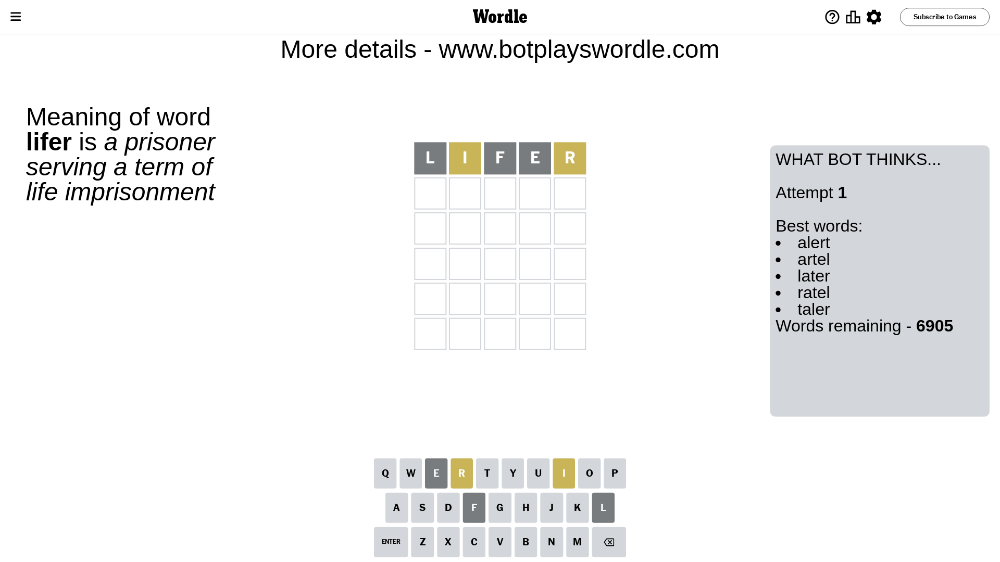

# Wordle for April 25, 2024 - \#1041

## Attempt 1

This is the first attempt and we'll choose a random word to start with.

Let's start with word `lifer`

Attempt for `lifer` gives us 0 correct letters, 2 present letters and 3 wrong letters.

If we look into details, we can see that:

Letter `l` is not present in the word and we will not use it any more

Letter `i` is on a different spot - this means that it cannot be at position 2

Letter `f` is not present in the word and we will not use it any more

Letter `e` is not present in the word and we will not use it any more

Letter `r` is on a different spot - this means that it cannot be at position 5

Some letters are missing (like `l`, `f`, `e`) but it's also important piece of information

Word should contain letters `[i r]`

That was a great guess that limited number of remaining words

## Attempt 2

Right now we have 186 words to choose from and best of them seem to be `[train intro snirt rutin print]`

So far we know that possible letters are:

At position 1: `[a b c d g h i j k m n o p q r s t u v w x y z]`

At position 2: `[a b c d g h j k m n o p q r s t u v w x y z]`

At position 3: `[a b c d g h i j k m n o p q r s t u v w x y z]`

At position 4: `[a b c d g h i j k m n o p q r s t u v w x y z]`

At position 5: `[a b c d g h i j k m n o p q s t u v w x y z]`

Next guess is `train`, let's see what it gives us

Attempt for `train` gives us 0 correct letters, 4 present letters and 1 wrong letters.

If we look into details, we can see that:

Letter `t` is on a different spot - this means that it cannot be at position 1

Letter `r` is on a different spot - this means that it cannot be at position 2

Letter `a` is not present in the word and we will not use it any more

Letter `i` is on a different spot - this means that it cannot be at position 4

Letter `n` is on a different spot - this means that it cannot be at position 5

Some letters are missing (like `a`) but it's also important piece of information

Word should contain letters `[i r t n]`

That was a great guess that limited number of remaining words

## Attempt 3

Right now we have 2 words to choose from and best of them seem to be `[intro snirt]`

So far we know that possible letters are:

At position 1: `[b c d g h i j k m n o p q r s u v w x y z]`

At position 2: `[b c d g h j k m n o p q s t u v w x y z]`

At position 3: `[b c d g h i j k m n o p q r s t u v w x y z]`

At position 4: `[b c d g h j k m n o p q r s t u v w x y z]`

At position 5: `[b c d g h i j k m o p q s t u v w x y z]`

Next guess is `snirt`, let's see what it gives us

Attempt for `snirt` gives us 2 correct letters, 2 present letters and 1 wrong letters.

If we look into details, we can see that:

Letter `s` is not present in the word and we will not use it any more

Letter `n` should be at position 2

Letter `i` is on a different spot - this means that it cannot be at position 3

Letter `r` should be at position 4

Letter `t` is on a different spot - this means that it cannot be at position 5

We got information about the correct letters and it should make next attempt easier

Some letters are missing (like `s`) but it's also important piece of information

Word should contain letters `[i r t n]`

This was a waste, almost no valuable information...

## Attempt 4

Right now we have 1 words to choose from and best of them seem to be `[intro]`

So far we know that possible letters are:

At position 1: `[b c d g h i j k m n o p q r u v w x y z]`

At position 2: `[n]`

At position 3: `[b c d g h j k m n o p q r t u v w x y z]`

At position 4: `[r]`

At position 5: `[b c d g h i j k m o p q u v w x y z]`

It must be `intro`

That's the correct answer! The word is `intro`!

## Conclusion

Today's word is `intro` and it took 4 attempts to guess it

