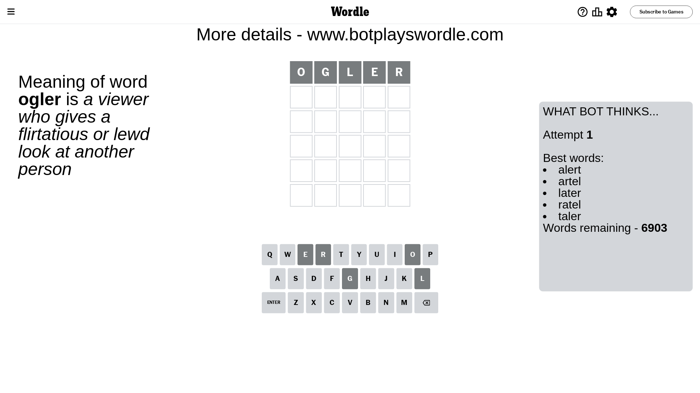
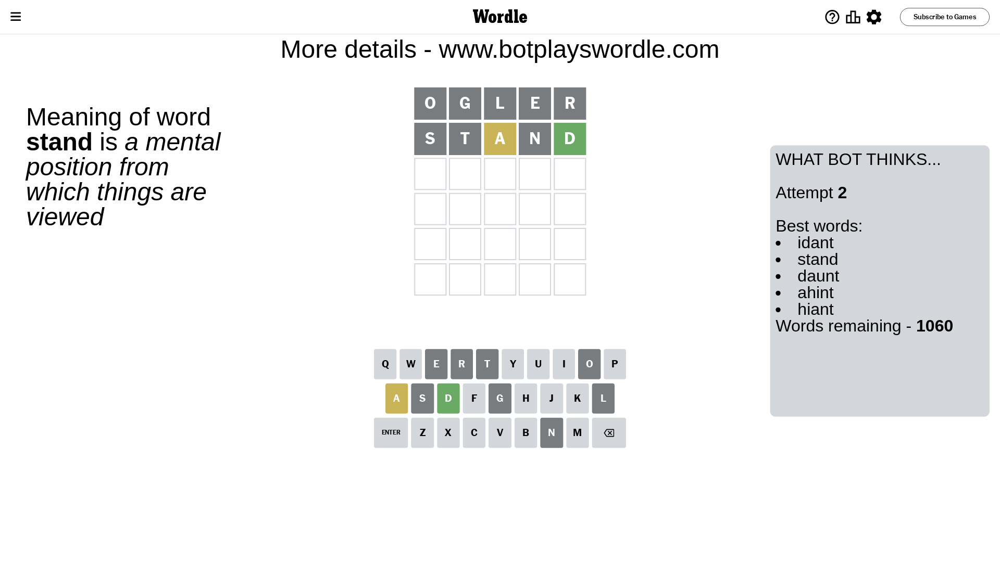
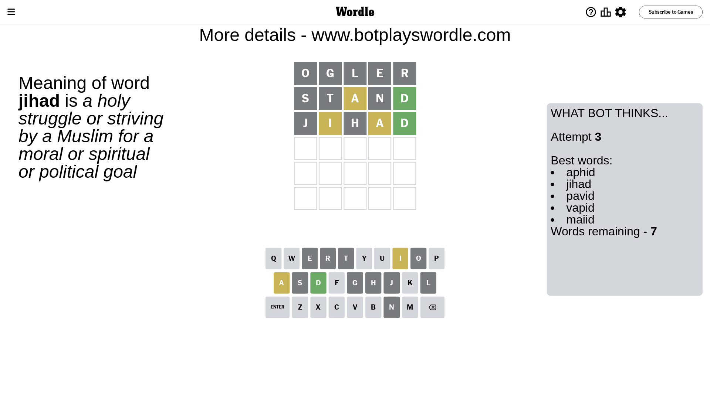
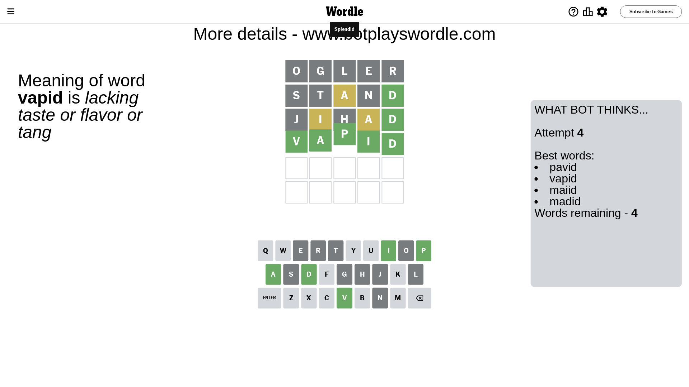

# Wordle for April 26, 2024 - \#1042

## Attempt 1

This is the first attempt and we'll choose a random word to start with.

Let's start with word `ogler`

Attempt for `ogler` gives us 0 correct letters, 0 present letters and 5 wrong letters.

If we look into details, we can see that:

Letter `o` is not present in the word and we will not use it any more

Letter `g` is not present in the word and we will not use it any more

Letter `l` is not present in the word and we will not use it any more

Letter `e` is not present in the word and we will not use it any more

Letter `r` is not present in the word and we will not use it any more

Some letters are missing (like `o`, `g`, `l`, `e`, `r`) but it's also important piece of information

So far we don't know any of the letters!

Not a bad guess in general

## Attempt 2

Right now we have 1060 words to choose from and best of them seem to be `[idant stand daunt ahint hiant]`

So far we know that possible letters are:

At position 1: `[a b c d f h i j k m n p q s t u v w x y z]`

At position 2: `[a b c d f h i j k m n p q s t u v w x y z]`

At position 3: `[a b c d f h i j k m n p q s t u v w x y z]`

At position 4: `[a b c d f h i j k m n p q s t u v w x y z]`

At position 5: `[a b c d f h i j k m n p q s t u v w x y z]`

Next guess is `stand`, let's see what it gives us

Attempt for `stand` gives us 1 correct letters, 1 present letters and 3 wrong letters.

If we look into details, we can see that:

Letter `s` is not present in the word and we will not use it any more

Letter `t` is not present in the word and we will not use it any more

Letter `a` is on a different spot - this means that it cannot be at position 3

Letter `n` is not present in the word and we will not use it any more

Letter `d` should be at position 5

We got information about the correct letters and it should make next attempt easier

Some letters are missing (like `s`, `t`, `n`) but it's also important piece of information

Word should contain letters `[a d]`

That was a great guess that limited number of remaining words

## Attempt 3

Right now we have 7 words to choose from and best of them seem to be `[aphid jihad pavid vapid maiid]`

So far we know that possible letters are:

At position 1: `[a b c d f h i j k m p q u v w x y z]`

At position 2: `[a b c d f h i j k m p q u v w x y z]`

At position 3: `[b c d f h i j k m p q u v w x y z]`

At position 4: `[a b c d f h i j k m p q u v w x y z]`

At position 5: `[d]`

Next guess is `jihad`, let's see what it gives us

Attempt for `jihad` gives us 1 correct letters, 2 present letters and 2 wrong letters.

If we look into details, we can see that:

Letter `j` is not present in the word and we will not use it any more

Letter `i` is on a different spot - this means that it cannot be at position 2

Letter `h` is not present in the word and we will not use it any more

Letter `a` is on a different spot - this means that it cannot be at position 4

Some letters are missing (like `j`, `h`) but it's also important piece of information

Word should contain letters `[a d i]`

This was a waste, almost no valuable information...

## Attempt 4

Right now we have 4 words to choose from and best of them seem to be `[pavid vapid maiid madid]`

So far we know that possible letters are:

At position 1: `[a b c d f i k m p q u v w x y z]`

At position 2: `[a b c d f k m p q u v w x y z]`

At position 3: `[b c d f i k m p q u v w x y z]`

At position 4: `[b c d f i k m p q u v w x y z]`

At position 5: `[d]`

Next guess is `vapid`, let's see what it gives us

That's the correct answer! The word is `vapid`!

## Conclusion

Today's word is `vapid` and it took 4 attempts to guess it

