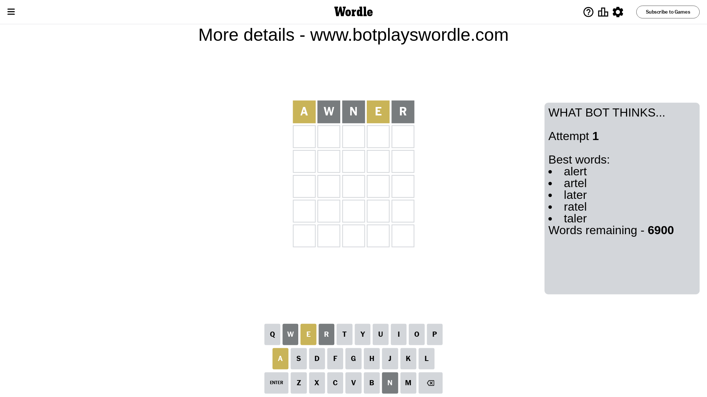
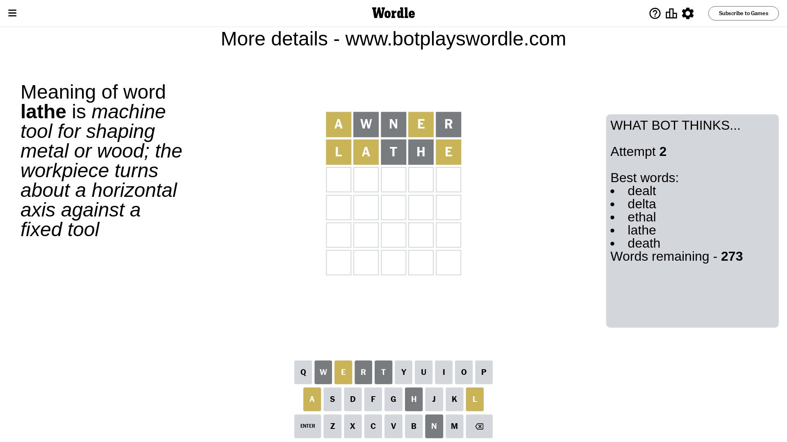
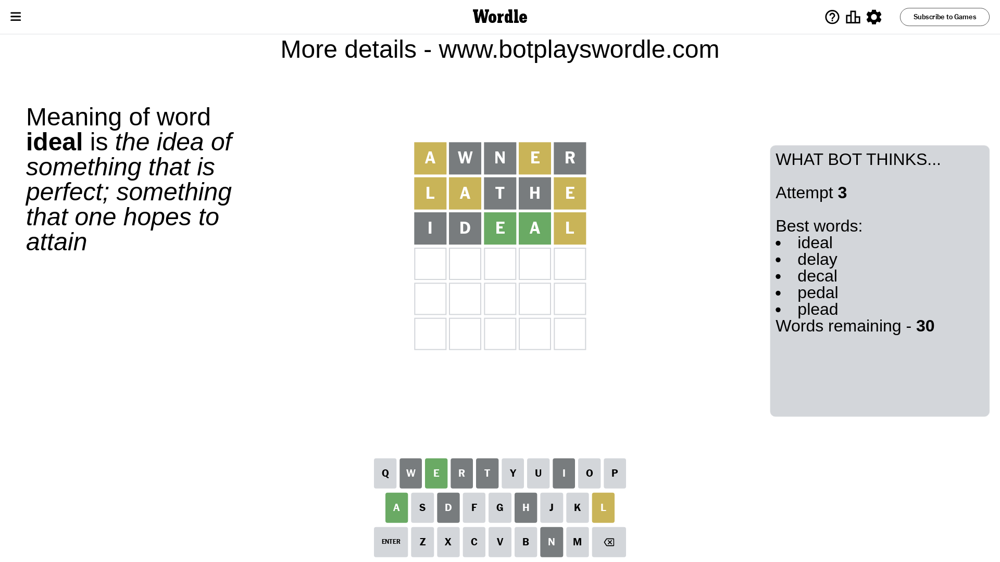
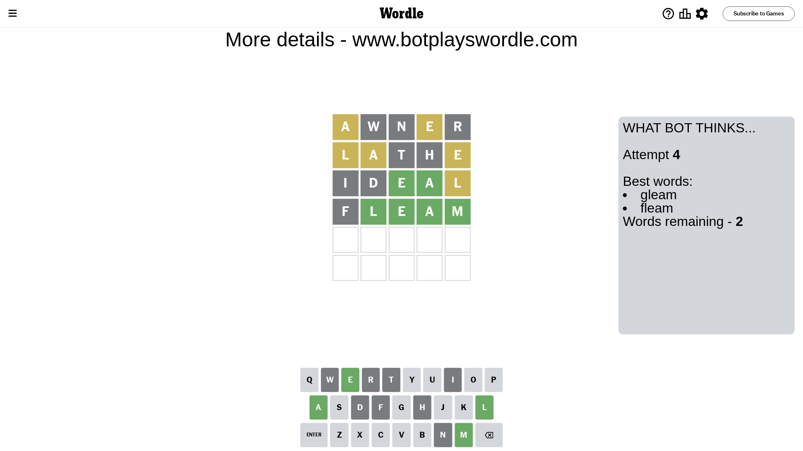
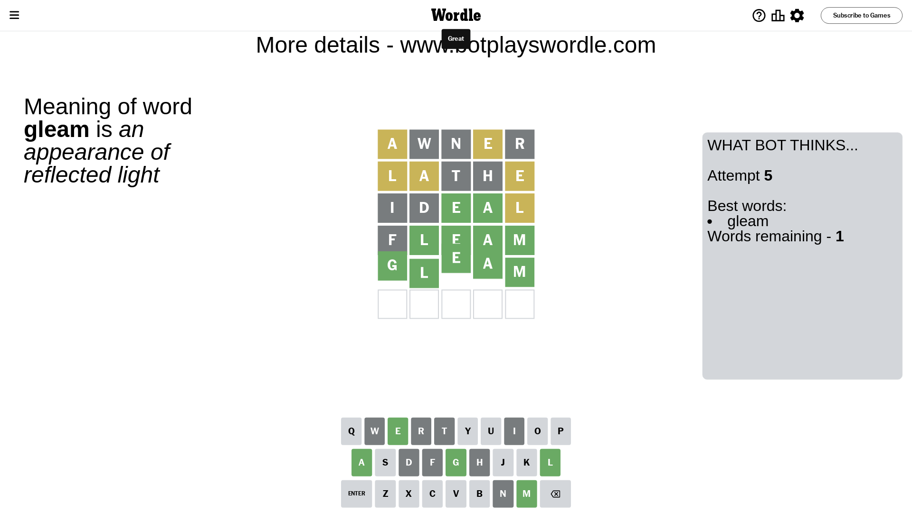

# Wordle for April 27, 2024 - \#1043

## Attempt 1

This is the first attempt and we'll choose a random word to start with.

Let's start with word `awner`

Attempt for `awner` gives us 0 correct letters, 2 present letters and 3 wrong letters.

If we look into details, we can see that:

Letter `a` is on a different spot - this means that it cannot be at position 1

Letter `w` is not present in the word and we will not use it any more

Letter `n` is not present in the word and we will not use it any more

Letter `e` is on a different spot - this means that it cannot be at position 4

Letter `r` is not present in the word and we will not use it any more

Some letters are missing (like `w`, `n`, `r`) but it's also important piece of information

Word should contain letters `[a e]`

That was a great guess that limited number of remaining words

## Attempt 2

Right now we have 273 words to choose from and best of them seem to be `[dealt delta ethal lathe death]`

So far we know that possible letters are:

At position 1: `[b c d e f g h i j k l m o p q s t u v x y z]`

At position 2: `[a b c d e f g h i j k l m o p q s t u v x y z]`

At position 3: `[a b c d e f g h i j k l m o p q s t u v x y z]`

At position 4: `[a b c d f g h i j k l m o p q s t u v x y z]`

At position 5: `[a b c d e f g h i j k l m o p q s t u v x y z]`

Next guess is `lathe`, let's see what it gives us

Attempt for `lathe` gives us 0 correct letters, 3 present letters and 2 wrong letters.

If we look into details, we can see that:

Letter `l` is on a different spot - this means that it cannot be at position 1

Letter `a` is on a different spot - this means that it cannot be at position 2

Letter `t` is not present in the word and we will not use it any more

Letter `h` is not present in the word and we will not use it any more

Letter `e` is on a different spot - this means that it cannot be at position 5

Some letters are missing (like `t`, `h`) but it's also important piece of information

Word should contain letters `[a e l]`

That was a great guess that limited number of remaining words

## Attempt 3

Right now we have 30 words to choose from and best of them seem to be `[ideal delay decal pedal plead]`

So far we know that possible letters are:

At position 1: `[b c d e f g i j k m o p q s u v x y z]`

At position 2: `[b c d e f g i j k l m o p q s u v x y z]`

At position 3: `[a b c d e f g i j k l m o p q s u v x y z]`

At position 4: `[a b c d f g i j k l m o p q s u v x y z]`

At position 5: `[a b c d f g i j k l m o p q s u v x y z]`

Next guess is `ideal`, let's see what it gives us

Attempt for `ideal` gives us 2 correct letters, 1 present letters and 2 wrong letters.

If we look into details, we can see that:

Letter `i` is not present in the word and we will not use it any more

Letter `d` is not present in the word and we will not use it any more

Letter `e` should be at position 3

Letter `a` should be at position 4

Letter `l` is on a different spot - this means that it cannot be at position 5

We got information about the correct letters and it should make next attempt easier

Some letters are missing (like `i`, `d`) but it's also important piece of information

Word should contain letters `[a e l]`

That was a great guess that limited number of remaining words

## Attempt 4

Right now we have 2 words to choose from and best of them seem to be `[gleam fleam]`

So far we know that possible letters are:

At position 1: `[b c e f g j k m o p q s u v x y z]`

At position 2: `[b c e f g j k l m o p q s u v x y z]`

At position 3: `[e]`

At position 4: `[a]`

At position 5: `[a b c f g j k m o p q s u v x y z]`

Next guess is `fleam`, let's see what it gives us

Attempt for `fleam` gives us 4 correct letters, 0 present letters and 1 wrong letters.

If we look into details, we can see that:

Letter `f` is not present in the word and we will not use it any more

Letter `l` should be at position 2

Letter `m` should be at position 5

We got information about the correct letters and it should make next attempt easier

Some letters are missing (like `f`) but it's also important piece of information

Word should contain letters `[a e l m]`

This was a waste, almost no valuable information...

## Attempt 5

Right now we have 1 words to choose from and best of them seem to be `[gleam]`

So far we know that possible letters are:

At position 1: `[b c e g j k m o p q s u v x y z]`

At position 2: `[l]`

At position 3: `[e]`

At position 4: `[a]`

At position 5: `[m]`

It must be `gleam`

That's the correct answer! The word is `gleam`!

## Conclusion

Today's word is `gleam` and it took 5 attempts to guess it

