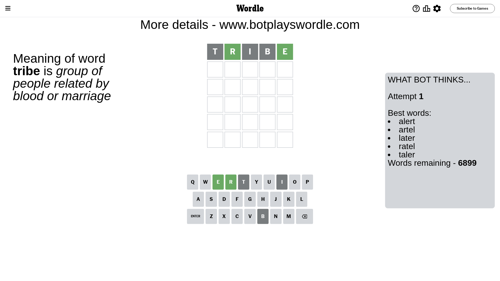
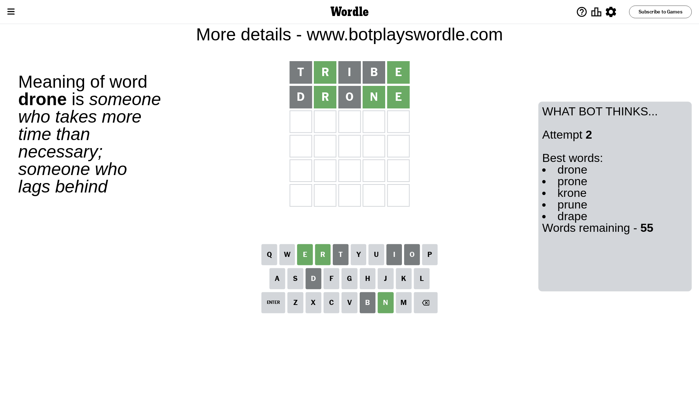
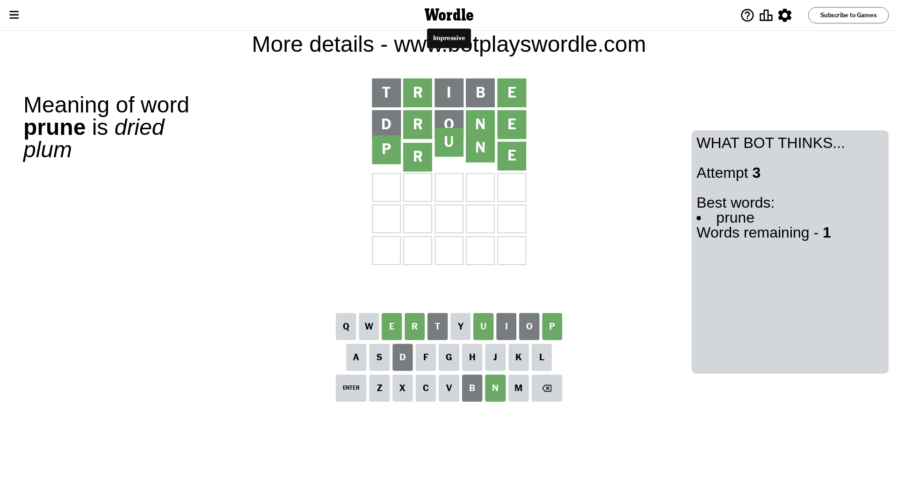

# Wordle for April 28, 2024 - \#1044

## Attempt 1

This is the first attempt and we'll choose a random word to start with.

Let's start with word `tribe`

Attempt for `tribe` gives us 2 correct letters, 0 present letters and 3 wrong letters.

If we look into details, we can see that:

Letter `t` is not present in the word and we will not use it any more

Letter `r` should be at position 2

Letter `i` is not present in the word and we will not use it any more

Letter `b` is not present in the word and we will not use it any more

Letter `e` should be at position 5

We got information about the correct letters and it should make next attempt easier

Some letters are missing (like `t`, `i`, `b`) but it's also important piece of information

Word should contain letters `[r e]`

That was a great guess that limited number of remaining words

## Attempt 2

Right now we have 55 words to choose from and best of them seem to be `[drone prone krone prune drape]`

So far we know that possible letters are:

At position 1: `[a c d e f g h j k l m n o p q r s u v w x y z]`

At position 2: `[r]`

At position 3: `[a c d e f g h j k l m n o p q r s u v w x y z]`

At position 4: `[a c d e f g h j k l m n o p q r s u v w x y z]`

At position 5: `[e]`

Next guess is `drone`, let's see what it gives us

Attempt for `drone` gives us 3 correct letters, 0 present letters and 2 wrong letters.

If we look into details, we can see that:

Letter `d` is not present in the word and we will not use it any more

Letter `o` is not present in the word and we will not use it any more

Letter `n` should be at position 4

We got information about the correct letters and it should make next attempt easier

Some letters are missing (like `d`, `o`) but it's also important piece of information

Word should contain letters `[r e n]`

That was a great guess that limited number of remaining words

## Attempt 3

Right now we have 1 words to choose from and best of them seem to be `[prune]`

So far we know that possible letters are:

At position 1: `[a c e f g h j k l m n p q r s u v w x y z]`

At position 2: `[r]`

At position 3: `[a c e f g h j k l m n p q r s u v w x y z]`

At position 4: `[n]`

At position 5: `[e]`

It must be `prune`

That's the correct answer! The word is `prune`!

## Conclusion

Today's word is `prune` and it took 3 attempts to guess it

