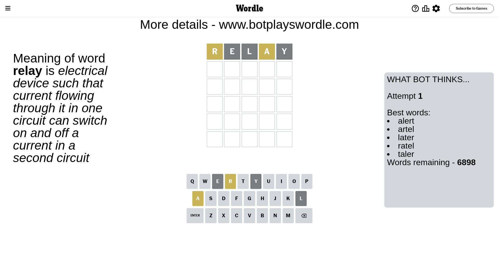
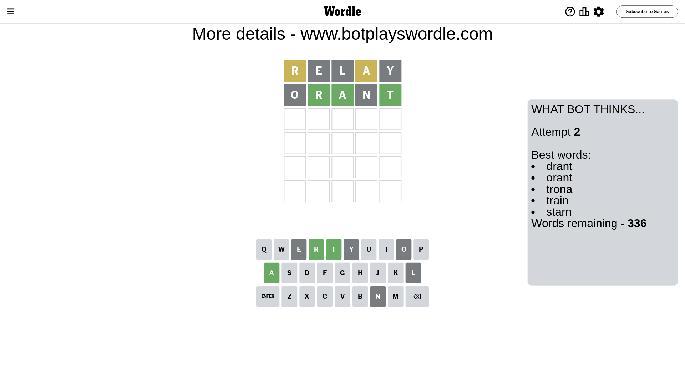
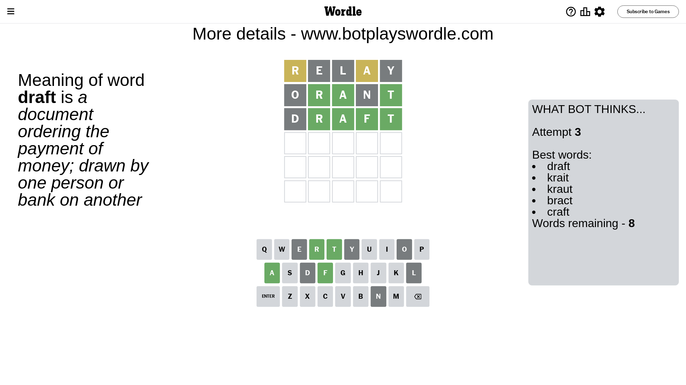
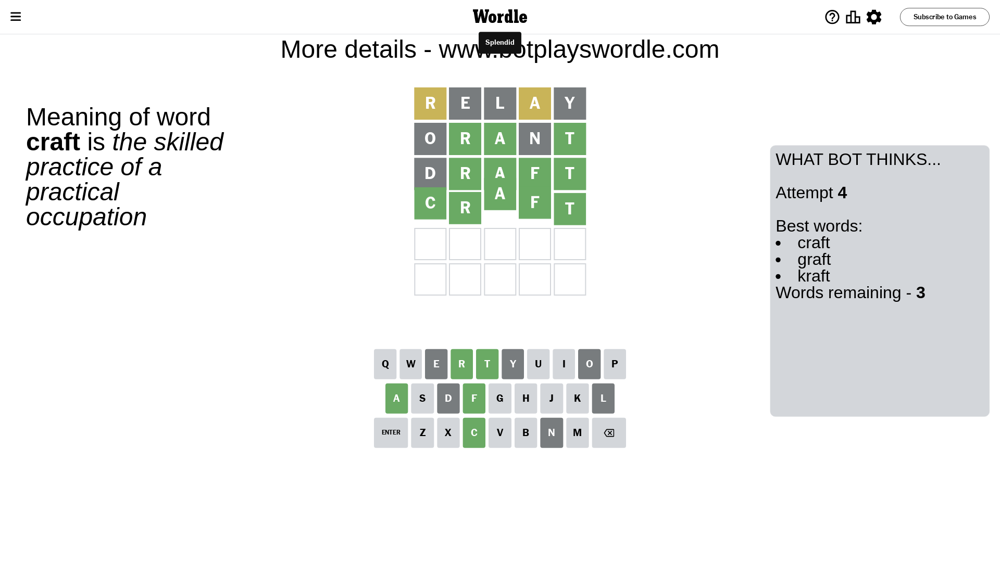

# Wordle for April 29, 2024 - \#1045

## Attempt 1

This is the first attempt and we'll choose a random word to start with.

Let's start with word `relay`

Attempt for `relay` gives us 0 correct letters, 2 present letters and 3 wrong letters.

If we look into details, we can see that:

Letter `r` is on a different spot - this means that it cannot be at position 1

Letter `e` is not present in the word and we will not use it any more

Letter `l` is not present in the word and we will not use it any more

Letter `a` is on a different spot - this means that it cannot be at position 4

Letter `y` is not present in the word and we will not use it any more

Some letters are missing (like `e`, `l`, `y`) but it's also important piece of information

Word should contain letters `[r a]`

That was a great guess that limited number of remaining words

## Attempt 2

Right now we have 336 words to choose from and best of them seem to be `[drant orant trona train starn]`

So far we know that possible letters are:

At position 1: `[a b c d f g h i j k m n o p q s t u v w x z]`

At position 2: `[a b c d f g h i j k m n o p q r s t u v w x z]`

At position 3: `[a b c d f g h i j k m n o p q r s t u v w x z]`

At position 4: `[b c d f g h i j k m n o p q r s t u v w x z]`

At position 5: `[a b c d f g h i j k m n o p q r s t u v w x z]`

Next guess is `orant`, let's see what it gives us

Attempt for `orant` gives us 3 correct letters, 0 present letters and 2 wrong letters.

If we look into details, we can see that:

Letter `o` is not present in the word and we will not use it any more

Letter `r` should be at position 2

Letter `a` should be at position 3

Letter `n` is not present in the word and we will not use it any more

Letter `t` should be at position 5

We got information about the correct letters and it should make next attempt easier

Some letters are missing (like `o`, `n`) but it's also important piece of information

Word should contain letters `[r a t]`

That was a great guess that limited number of remaining words

## Attempt 3

Right now we have 8 words to choose from and best of them seem to be `[draft krait kraut bract craft]`

So far we know that possible letters are:

At position 1: `[a b c d f g h i j k m p q s t u v w x z]`

At position 2: `[r]`

At position 3: `[a]`

At position 4: `[b c d f g h i j k m p q r s t u v w x z]`

At position 5: `[t]`

Next guess is `draft`, let's see what it gives us

Attempt for `draft` gives us 4 correct letters, 0 present letters and 1 wrong letters.

If we look into details, we can see that:

Letter `d` is not present in the word and we will not use it any more

Letter `f` should be at position 4

We got information about the correct letters and it should make next attempt easier

Some letters are missing (like `d`) but it's also important piece of information

Word should contain letters `[r a t f]`

Could be a better guess

## Attempt 4

Right now we have 3 words to choose from and best of them seem to be `[craft graft kraft]`

So far we know that possible letters are:

At position 1: `[a b c f g h i j k m p q s t u v w x z]`

At position 2: `[r]`

At position 3: `[a]`

At position 4: `[f]`

At position 5: `[t]`

Next guess is `craft`, let's see what it gives us

That's the correct answer! The word is `craft`!

## Conclusion

Today's word is `craft` and it took 4 attempts to guess it

