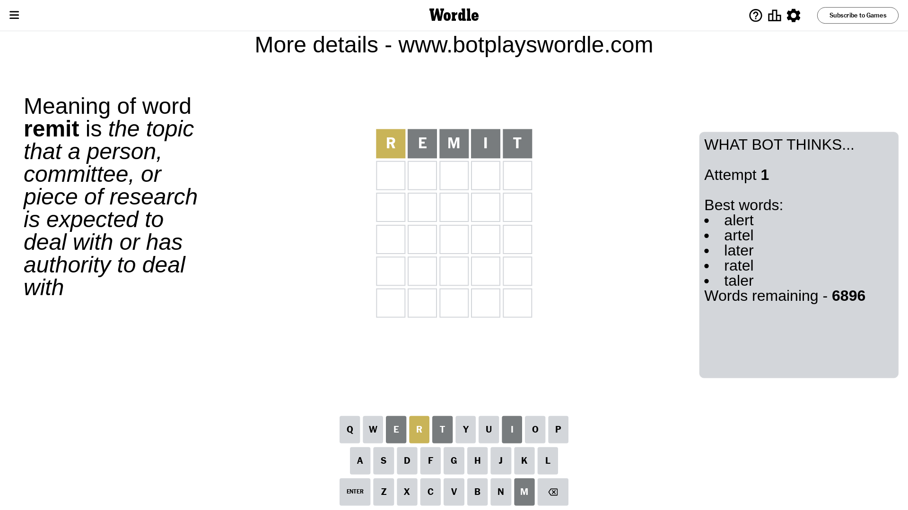
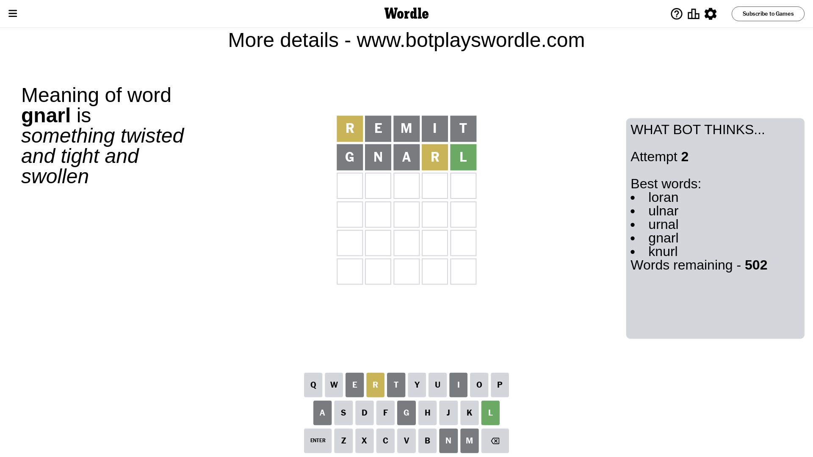
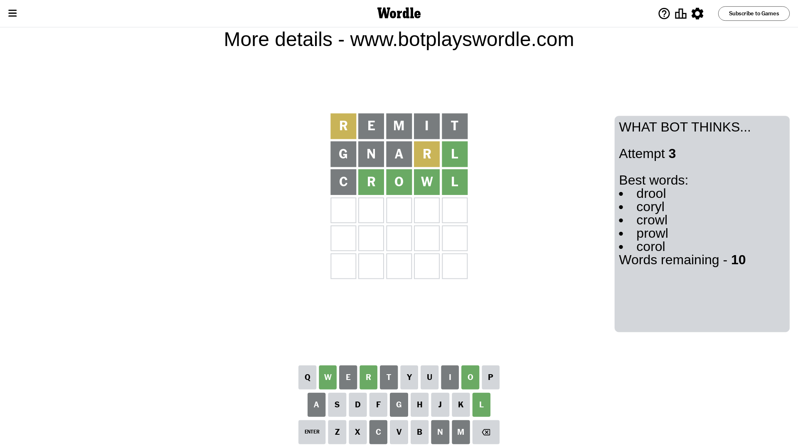
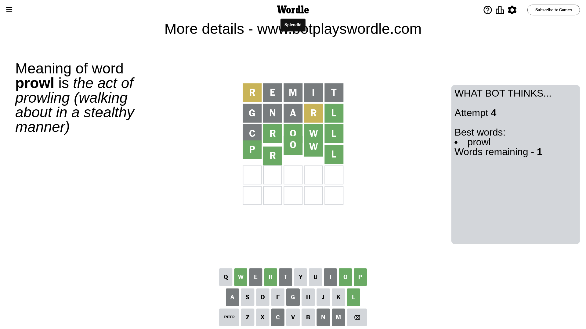

# Wordle for April 30, 2024 - \#1046

## Attempt 1

This is the first attempt and we'll choose a random word to start with.

Let's start with word `remit`

Attempt for `remit` gives us 0 correct letters, 1 present letters and 4 wrong letters.

If we look into details, we can see that:

Letter `r` is on a different spot - this means that it cannot be at position 1

Letter `e` is not present in the word and we will not use it any more

Letter `m` is not present in the word and we will not use it any more

Letter `i` is not present in the word and we will not use it any more

Letter `t` is not present in the word and we will not use it any more

Some letters are missing (like `e`, `m`, `i`, `t`) but it's also important piece of information

Word should contain letters `[r]`

That was a great guess that limited number of remaining words

## Attempt 2

Right now we have 502 words to choose from and best of them seem to be `[loran ulnar urnal gnarl knurl]`

So far we know that possible letters are:

At position 1: `[a b c d f g h j k l n o p q s u v w x y z]`

At position 2: `[a b c d f g h j k l n o p q r s u v w x y z]`

At position 3: `[a b c d f g h j k l n o p q r s u v w x y z]`

At position 4: `[a b c d f g h j k l n o p q r s u v w x y z]`

At position 5: `[a b c d f g h j k l n o p q r s u v w x y z]`

Next guess is `gnarl`, let's see what it gives us

Attempt for `gnarl` gives us 1 correct letters, 1 present letters and 3 wrong letters.

If we look into details, we can see that:

Letter `g` is not present in the word and we will not use it any more

Letter `n` is not present in the word and we will not use it any more

Letter `a` is not present in the word and we will not use it any more

Letter `r` is on a different spot - this means that it cannot be at position 4

Letter `l` should be at position 5

We got information about the correct letters and it should make next attempt easier

Some letters are missing (like `g`, `n`, `a`) but it's also important piece of information

Word should contain letters `[r l]`

That was a great guess that limited number of remaining words

## Attempt 3

Right now we have 10 words to choose from and best of them seem to be `[drool coryl crowl prowl corol]`

So far we know that possible letters are:

At position 1: `[b c d f h j k l o p q s u v w x y z]`

At position 2: `[b c d f h j k l o p q r s u v w x y z]`

At position 3: `[b c d f h j k l o p q r s u v w x y z]`

At position 4: `[b c d f h j k l o p q s u v w x y z]`

At position 5: `[l]`

Next guess is `crowl`, let's see what it gives us

Attempt for `crowl` gives us 4 correct letters, 0 present letters and 1 wrong letters.

If we look into details, we can see that:

Letter `c` is not present in the word and we will not use it any more

Letter `r` should be at position 2

Letter `o` should be at position 3

Letter `w` should be at position 4

We got information about the correct letters and it should make next attempt easier

Some letters are missing (like `c`) but it's also important piece of information

Word should contain letters `[r l o w]`

That was a great guess that limited number of remaining words

## Attempt 4

Right now we have 1 words to choose from and best of them seem to be `[prowl]`

So far we know that possible letters are:

At position 1: `[b d f h j k l o p q s u v w x y z]`

At position 2: `[r]`

At position 3: `[o]`

At position 4: `[w]`

At position 5: `[l]`

It must be `prowl`

That's the correct answer! The word is `prowl`!

## Conclusion

Today's word is `prowl` and it took 4 attempts to guess it

