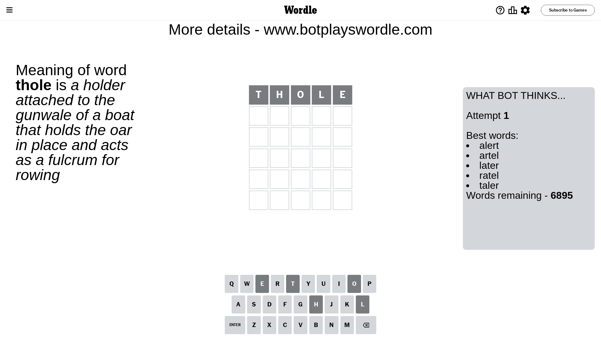
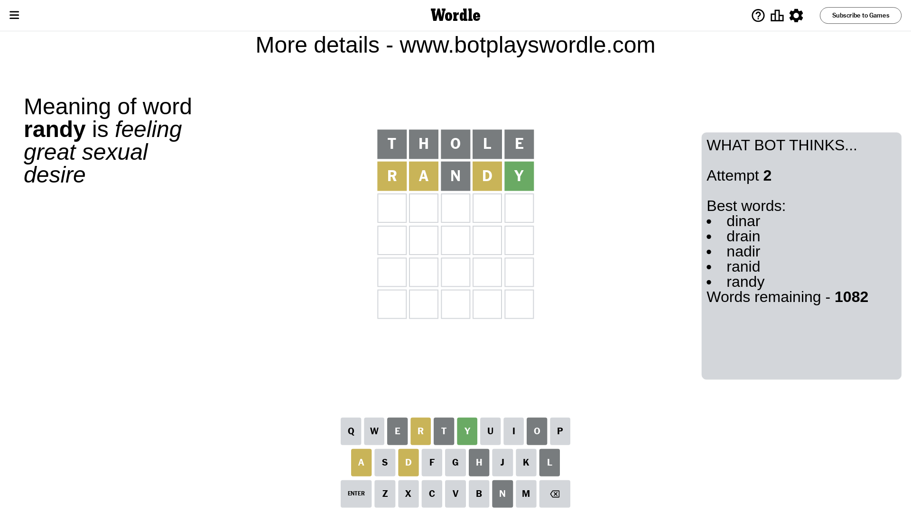
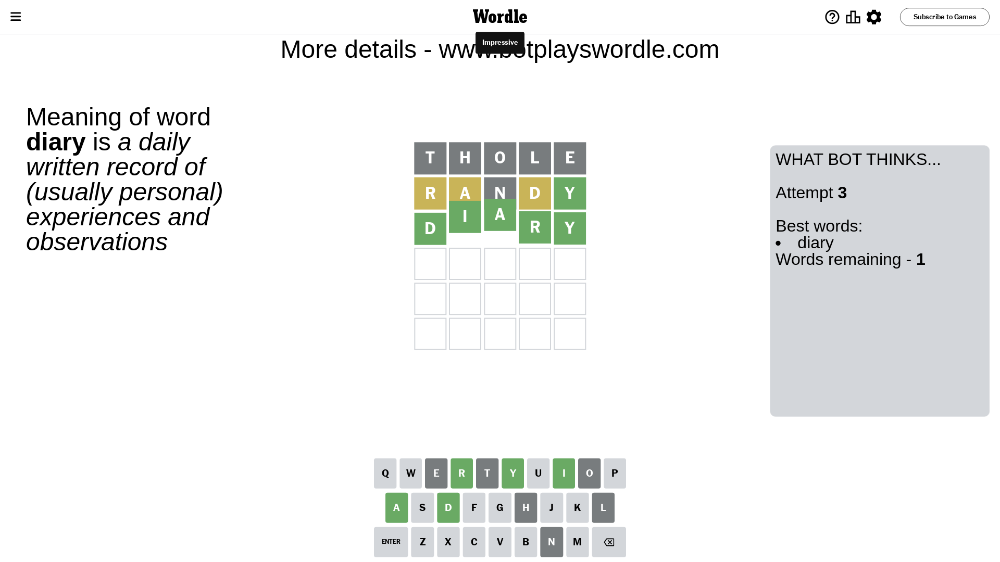

# Wordle for May 1, 2024 - \#1047

## Attempt 1

This is the first attempt and we'll choose a random word to start with.

Let's start with word `thole`

Attempt for `thole` gives us 0 correct letters, 0 present letters and 5 wrong letters.

If we look into details, we can see that:

Letter `t` is not present in the word and we will not use it any more

Letter `h` is not present in the word and we will not use it any more

Letter `o` is not present in the word and we will not use it any more

Letter `l` is not present in the word and we will not use it any more

Letter `e` is not present in the word and we will not use it any more

Some letters are missing (like `t`, `h`, `o`, `l`, `e`) but it's also important piece of information

So far we don't know any of the letters!

Not a bad guess in general

## Attempt 2

Right now we have 1082 words to choose from and best of them seem to be `[dinar drain nadir ranid randy]`

So far we know that possible letters are:

At position 1: `[a b c d f g i j k m n p q r s u v w x y z]`

At position 2: `[a b c d f g i j k m n p q r s u v w x y z]`

At position 3: `[a b c d f g i j k m n p q r s u v w x y z]`

At position 4: `[a b c d f g i j k m n p q r s u v w x y z]`

At position 5: `[a b c d f g i j k m n p q r s u v w x y z]`

Next guess is `randy`, let's see what it gives us

Attempt for `randy` gives us 1 correct letters, 3 present letters and 1 wrong letters.

If we look into details, we can see that:

Letter `r` is on a different spot - this means that it cannot be at position 1

Letter `a` is on a different spot - this means that it cannot be at position 2

Letter `n` is not present in the word and we will not use it any more

Letter `d` is on a different spot - this means that it cannot be at position 4

Letter `y` should be at position 5

We got information about the correct letters and it should make next attempt easier

Some letters are missing (like `n`) but it's also important piece of information

Word should contain letters `[r a d y]`

That was a great guess that limited number of remaining words

## Attempt 3

Right now we have 1 words to choose from and best of them seem to be `[diary]`

So far we know that possible letters are:

At position 1: `[a b c d f g i j k m p q s u v w x y z]`

At position 2: `[b c d f g i j k m p q r s u v w x y z]`

At position 3: `[a b c d f g i j k m p q r s u v w x y z]`

At position 4: `[a b c f g i j k m p q r s u v w x y z]`

At position 5: `[y]`

It must be `diary`

That's the correct answer! The word is `diary`!

## Conclusion

Today's word is `diary` and it took 3 attempts to guess it

