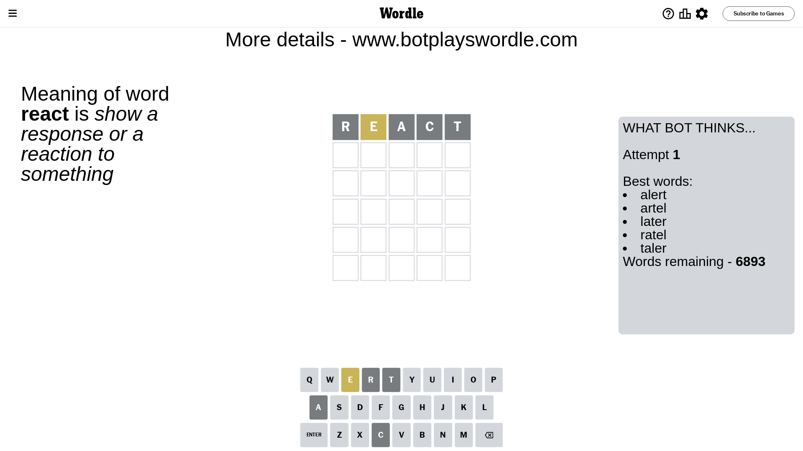
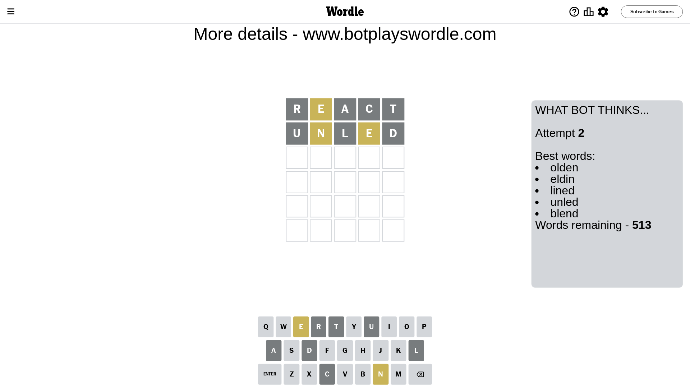
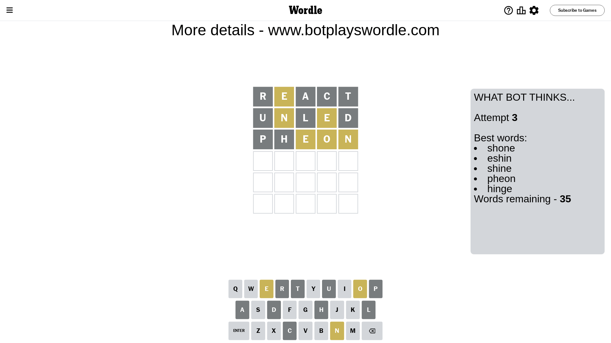
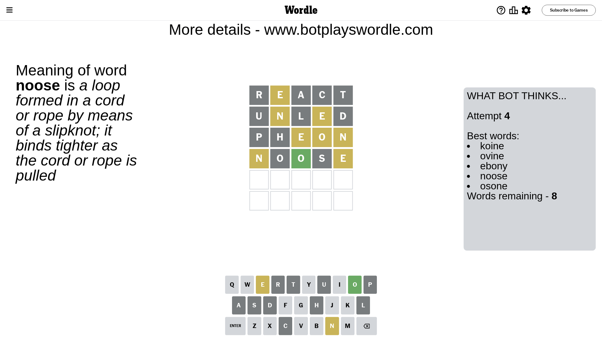
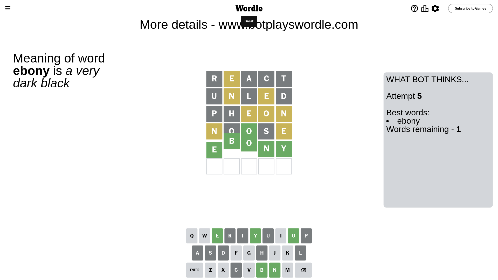

# Wordle for May 3, 2024 - \#1049

## Attempt 1

This is the first attempt and we'll choose a random word to start with.

Let's start with word `react`

Attempt for `react` gives us 0 correct letters, 1 present letters and 4 wrong letters.

If we look into details, we can see that:

Letter `r` is not present in the word and we will not use it any more

Letter `e` is on a different spot - this means that it cannot be at position 2

Letter `a` is not present in the word and we will not use it any more

Letter `c` is not present in the word and we will not use it any more

Letter `t` is not present in the word and we will not use it any more

Some letters are missing (like `r`, `a`, `c`, `t`) but it's also important piece of information

Word should contain letters `[e]`

That was a great guess that limited number of remaining words

## Attempt 2

Right now we have 513 words to choose from and best of them seem to be `[olden eldin lined unled blend]`

So far we know that possible letters are:

At position 1: `[b d e f g h i j k l m n o p q s u v w x y z]`

At position 2: `[b d f g h i j k l m n o p q s u v w x y z]`

At position 3: `[b d e f g h i j k l m n o p q s u v w x y z]`

At position 4: `[b d e f g h i j k l m n o p q s u v w x y z]`

At position 5: `[b d e f g h i j k l m n o p q s u v w x y z]`

Next guess is `unled`, let's see what it gives us

Attempt for `unled` gives us 0 correct letters, 2 present letters and 3 wrong letters.

If we look into details, we can see that:

Letter `u` is not present in the word and we will not use it any more

Letter `n` is on a different spot - this means that it cannot be at position 2

Letter `l` is not present in the word and we will not use it any more

Letter `e` is on a different spot - this means that it cannot be at position 4

Letter `d` is not present in the word and we will not use it any more

Some letters are missing (like `u`, `l`, `d`) but it's also important piece of information

Word should contain letters `[e n]`

That was a great guess that limited number of remaining words

## Attempt 3

Right now we have 35 words to choose from and best of them seem to be `[shone eshin shine pheon hinge]`

So far we know that possible letters are:

At position 1: `[b e f g h i j k m n o p q s v w x y z]`

At position 2: `[b f g h i j k m o p q s v w x y z]`

At position 3: `[b e f g h i j k m n o p q s v w x y z]`

At position 4: `[b f g h i j k m n o p q s v w x y z]`

At position 5: `[b e f g h i j k m n o p q s v w x y z]`

Next guess is `pheon`, let's see what it gives us

Attempt for `pheon` gives us 0 correct letters, 3 present letters and 2 wrong letters.

If we look into details, we can see that:

Letter `p` is not present in the word and we will not use it any more

Letter `h` is not present in the word and we will not use it any more

Letter `e` is on a different spot - this means that it cannot be at position 3

Letter `o` is on a different spot - this means that it cannot be at position 4

Letter `n` is on a different spot - this means that it cannot be at position 5

Some letters are missing (like `p`, `h`) but it's also important piece of information

Word should contain letters `[e n o]`

Not a bad guess in general

## Attempt 4

Right now we have 8 words to choose from and best of them seem to be `[koine ovine ebony noose osone]`

So far we know that possible letters are:

At position 1: `[b e f g i j k m n o q s v w x y z]`

At position 2: `[b f g i j k m o q s v w x y z]`

At position 3: `[b f g i j k m n o q s v w x y z]`

At position 4: `[b f g i j k m n q s v w x y z]`

At position 5: `[b e f g i j k m o q s v w x y z]`

Next guess is `noose`, let's see what it gives us

Attempt for `noose` gives us 1 correct letters, 2 present letters and 2 wrong letters.

If we look into details, we can see that:

Letter `n` is on a different spot - this means that it cannot be at position 1

Letter `o` is not present in the word and we will not use it any more

Letter `o` should be at position 3

Letter `s` is not present in the word and we will not use it any more

Letter `e` is on a different spot - this means that it cannot be at position 5

We got information about the correct letters and it should make next attempt easier

Some letters are missing (like `o`, `s`) but it's also important piece of information

Word should contain letters `[e n o]`

Not a bad guess in general

## Attempt 5

Right now we have 1 words to choose from and best of them seem to be `[ebony]`

So far we know that possible letters are:

At position 1: `[b e f g i j k m q v w x y z]`

At position 2: `[b f g i j k m q v w x y z]`

At position 3: `[o]`

At position 4: `[b f g i j k m n q v w x y z]`

At position 5: `[b f g i j k m q v w x y z]`

It must be `ebony`

That's the correct answer! The word is `ebony`!

## Conclusion

Today's word is `ebony` and it took 5 attempts to guess it

