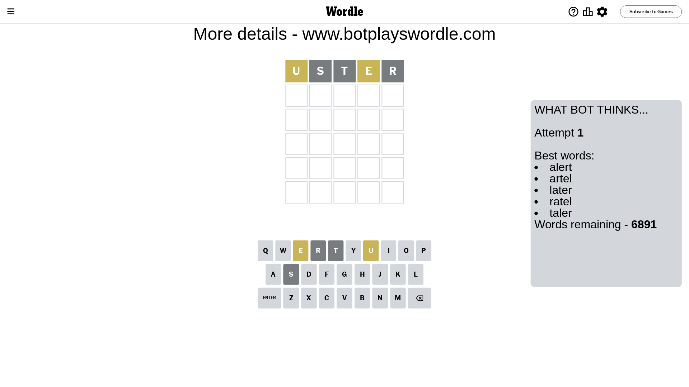
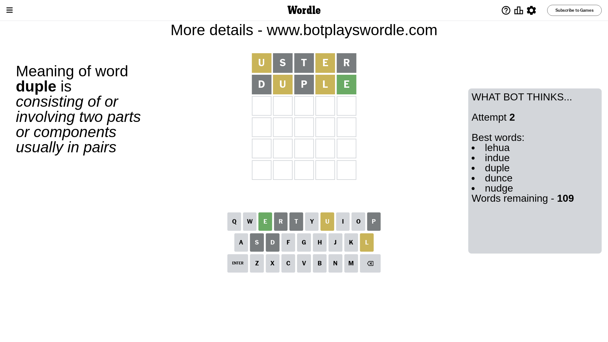
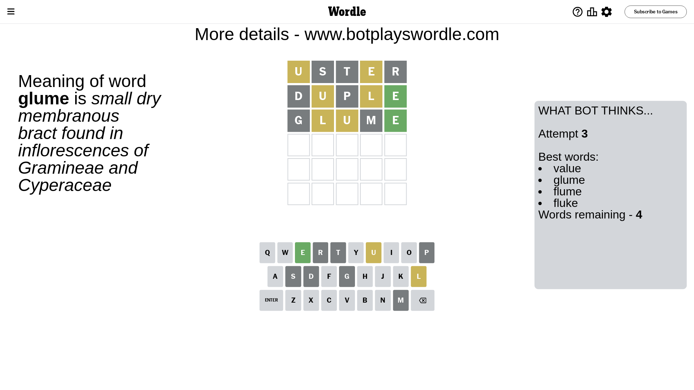
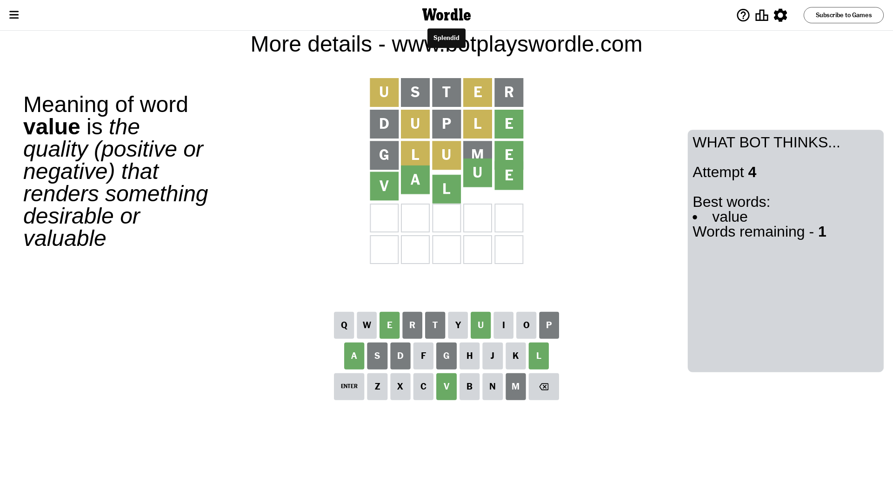

# Wordle for May 4, 2024 - \#1050

## Attempt 1

This is the first attempt and we'll choose a random word to start with.

Let's start with word `uster`

Attempt for `uster` gives us 0 correct letters, 2 present letters and 3 wrong letters.

If we look into details, we can see that:

Letter `u` is on a different spot - this means that it cannot be at position 1

Letter `s` is not present in the word and we will not use it any more

Letter `t` is not present in the word and we will not use it any more

Letter `e` is on a different spot - this means that it cannot be at position 4

Letter `r` is not present in the word and we will not use it any more

Some letters are missing (like `s`, `t`, `r`) but it's also important piece of information

Word should contain letters `[u e]`

That was a great guess that limited number of remaining words

## Attempt 2

Right now we have 109 words to choose from and best of them seem to be `[lehua indue duple dunce nudge]`

So far we know that possible letters are:

At position 1: `[a b c d e f g h i j k l m n o p q v w x y z]`

At position 2: `[a b c d e f g h i j k l m n o p q u v w x y z]`

At position 3: `[a b c d e f g h i j k l m n o p q u v w x y z]`

At position 4: `[a b c d f g h i j k l m n o p q u v w x y z]`

At position 5: `[a b c d e f g h i j k l m n o p q u v w x y z]`

Next guess is `duple`, let's see what it gives us

Attempt for `duple` gives us 1 correct letters, 2 present letters and 2 wrong letters.

If we look into details, we can see that:

Letter `d` is not present in the word and we will not use it any more

Letter `u` is on a different spot - this means that it cannot be at position 2

Letter `p` is not present in the word and we will not use it any more

Letter `l` is on a different spot - this means that it cannot be at position 4

Letter `e` should be at position 5

We got information about the correct letters and it should make next attempt easier

Some letters are missing (like `d`, `p`) but it's also important piece of information

Word should contain letters `[u e l]`

That was a great guess that limited number of remaining words

## Attempt 3

Right now we have 4 words to choose from and best of them seem to be `[value glume flume fluke]`

So far we know that possible letters are:

At position 1: `[a b c e f g h i j k l m n o q v w x y z]`

At position 2: `[a b c e f g h i j k l m n o q v w x y z]`

At position 3: `[a b c e f g h i j k l m n o q u v w x y z]`

At position 4: `[a b c f g h i j k m n o q u v w x y z]`

At position 5: `[e]`

Next guess is `glume`, let's see what it gives us

Attempt for `glume` gives us 1 correct letters, 2 present letters and 2 wrong letters.

If we look into details, we can see that:

Letter `g` is not present in the word and we will not use it any more

Letter `l` is on a different spot - this means that it cannot be at position 2

Letter `u` is on a different spot - this means that it cannot be at position 3

Letter `m` is not present in the word and we will not use it any more

Some letters are missing (like `g`, `m`) but it's also important piece of information

Word should contain letters `[u e l]`

Could be a better guess

## Attempt 4

Right now we have 1 words to choose from and best of them seem to be `[value]`

So far we know that possible letters are:

At position 1: `[a b c e f h i j k l n o q v w x y z]`

At position 2: `[a b c e f h i j k n o q v w x y z]`

At position 3: `[a b c e f h i j k l n o q v w x y z]`

At position 4: `[a b c f h i j k n o q u v w x y z]`

At position 5: `[e]`

It must be `value`

That's the correct answer! The word is `value`!

## Conclusion

Today's word is `value` and it took 4 attempts to guess it

