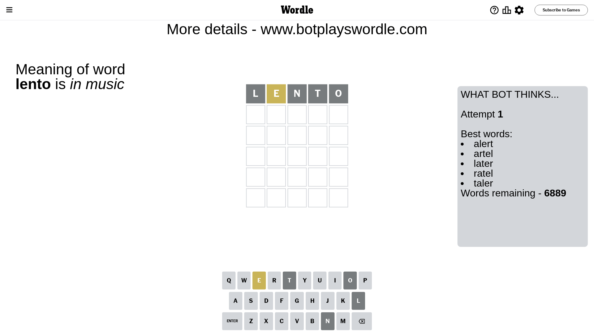

# Wordle for May 6, 2024 - \#1052

## Attempt 1

This is the first attempt and we'll choose a random word to start with.

Let's start with word `lento`

Attempt for `lento` gives us 0 correct letters, 1 present letters and 4 wrong letters.

If we look into details, we can see that:

Letter `l` is not present in the word and we will not use it any more

Letter `e` is on a different spot - this means that it cannot be at position 2

Letter `n` is not present in the word and we will not use it any more

Letter `t` is not present in the word and we will not use it any more

Letter `o` is not present in the word and we will not use it any more

Some letters are missing (like `l`, `n`, `t`, `o`) but it's also important piece of information

Word should contain letters `[e]`

That was a great guess that limited number of remaining words

## Attempt 2

Right now we have 642 words to choose from and best of them seem to be `[hider hired shred aider irade]`

So far we know that possible letters are:

At position 1: `[a b c d e f g h i j k m p q r s u v w x y z]`

At position 2: `[a b c d f g h i j k m p q r s u v w x y z]`

At position 3: `[a b c d e f g h i j k m p q r s u v w x y z]`

At position 4: `[a b c d e f g h i j k m p q r s u v w x y z]`

At position 5: `[a b c d e f g h i j k m p q r s u v w x y z]`

Next guess is `hider`, let's see what it gives us

Attempt for `hider` gives us 0 correct letters, 2 present letters and 3 wrong letters.

If we look into details, we can see that:

Letter `h` is on a different spot - this means that it cannot be at position 1

Letter `i` is not present in the word and we will not use it any more

Letter `d` is not present in the word and we will not use it any more

Letter `e` is on a different spot - this means that it cannot be at position 4

Letter `r` is not present in the word and we will not use it any more

Some letters are missing (like `i`, `d`, `r`) but it's also important piece of information

Word should contain letters `[e h]`

That was a great guess that limited number of remaining words

## Attempt 3

Right now we have 25 words to choose from and best of them seem to be `[chase shame phase shape shake]`

So far we know that possible letters are:

At position 1: `[a b c e f g j k m p q s u v w x y z]`

At position 2: `[a b c f g h j k m p q s u v w x y z]`

At position 3: `[a b c e f g h j k m p q s u v w x y z]`

At position 4: `[a b c f g h j k m p q s u v w x y z]`

At position 5: `[a b c e f g h j k m p q s u v w x y z]`

Next guess is `shake`, let's see what it gives us

Attempt for `shake` gives us 4 correct letters, 0 present letters and 1 wrong letters.

If we look into details, we can see that:

Letter `s` should be at position 1

Letter `h` should be at position 2

Letter `a` should be at position 3

Letter `k` is not present in the word and we will not use it any more

Letter `e` should be at position 5

We got information about the correct letters and it should make next attempt easier

Some letters are missing (like `k`) but it's also important piece of information

Word should contain letters `[e h s a]`

That was a great guess that limited number of remaining words

## Attempt 4

Right now we have 3 words to choose from and best of them seem to be `[shame shape shave]`

So far we know that possible letters are:

At position 1: `[s]`

At position 2: `[h]`

At position 3: `[a]`

At position 4: `[a b c f g h j m p q s u v w x y z]`

At position 5: `[e]`

Next guess is `shame`, let's see what it gives us

Attempt for `shame` gives us 4 correct letters, 0 present letters and 1 wrong letters.

If we look into details, we can see that:

Letter `m` is not present in the word and we will not use it any more

Some letters are missing (like `m`) but it's also important piece of information

Word should contain letters `[e h s a]`

This was a waste, almost no valuable information...

## Attempt 5

Right now we have 2 words to choose from and best of them seem to be `[shape shave]`

So far we know that possible letters are:

At position 1: `[s]`

At position 2: `[h]`

At position 3: `[a]`

At position 4: `[a b c f g h j p q s u v w x y z]`

At position 5: `[e]`

Next guess is `shave`, let's see what it gives us

That's the correct answer! The word is `shave`!

## Conclusion

Today's word is `shave` and it took 5 attempts to guess it

