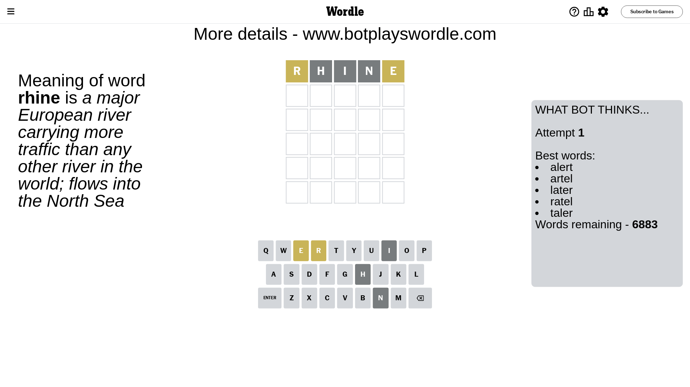
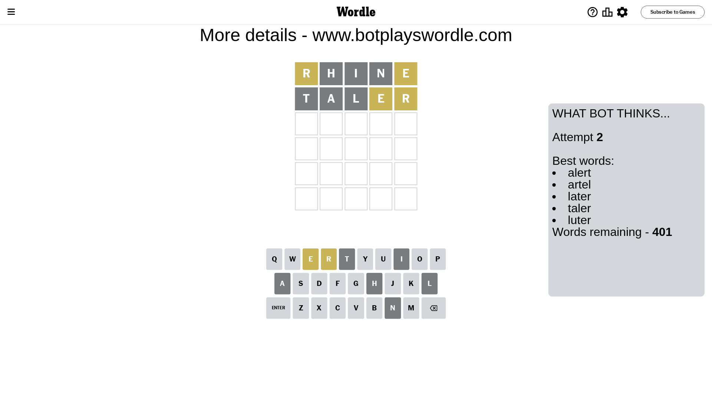
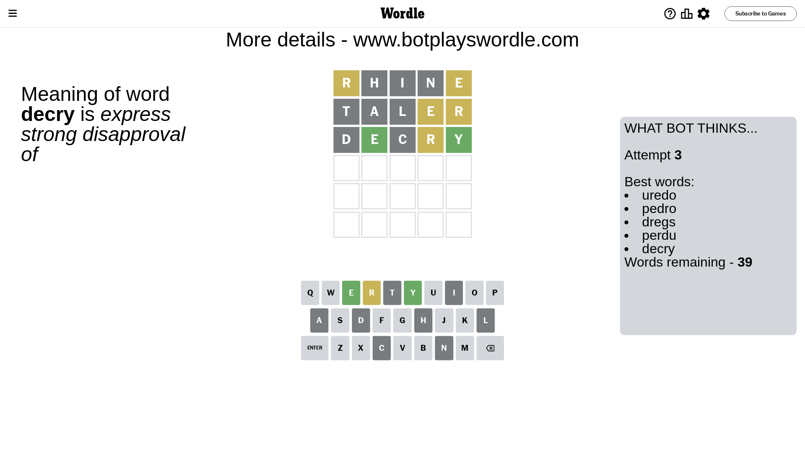
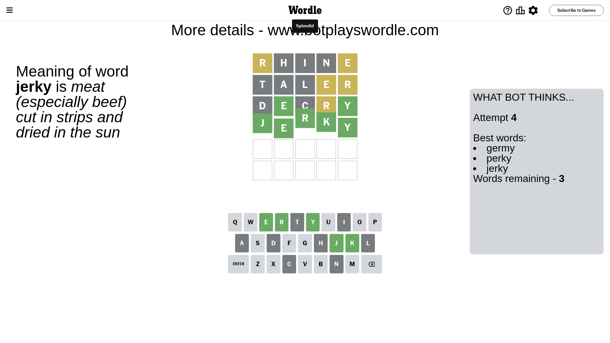

# Wordle for May 9, 2024 - \#1055

## Attempt 1

This is the first attempt and we'll choose a random word to start with.

Let's start with word `rhine`

Attempt for `rhine` gives us 0 correct letters, 2 present letters and 3 wrong letters.

If we look into details, we can see that:

Letter `r` is on a different spot - this means that it cannot be at position 1

Letter `h` is not present in the word and we will not use it any more

Letter `i` is not present in the word and we will not use it any more

Letter `n` is not present in the word and we will not use it any more

Letter `e` is on a different spot - this means that it cannot be at position 5

Some letters are missing (like `h`, `i`, `n`) but it's also important piece of information

Word should contain letters `[r e]`

That was a great guess that limited number of remaining words

## Attempt 2

Right now we have 401 words to choose from and best of them seem to be `[alert artel later taler luter]`

So far we know that possible letters are:

At position 1: `[a b c d e f g j k l m o p q s t u v w x y z]`

At position 2: `[a b c d e f g j k l m o p q r s t u v w x y z]`

At position 3: `[a b c d e f g j k l m o p q r s t u v w x y z]`

At position 4: `[a b c d e f g j k l m o p q r s t u v w x y z]`

At position 5: `[a b c d f g j k l m o p q r s t u v w x y z]`

Next guess is `taler`, let's see what it gives us

Attempt for `taler` gives us 0 correct letters, 2 present letters and 3 wrong letters.

If we look into details, we can see that:

Letter `t` is not present in the word and we will not use it any more

Letter `a` is not present in the word and we will not use it any more

Letter `l` is not present in the word and we will not use it any more

Letter `e` is on a different spot - this means that it cannot be at position 4

Letter `r` is on a different spot - this means that it cannot be at position 5

Some letters are missing (like `t`, `a`, `l`) but it's also important piece of information

Word should contain letters `[r e]`

That was a great guess that limited number of remaining words

## Attempt 3

Right now we have 39 words to choose from and best of them seem to be `[uredo pedro dregs perdu decry]`

So far we know that possible letters are:

At position 1: `[b c d e f g j k m o p q s u v w x y z]`

At position 2: `[b c d e f g j k m o p q r s u v w x y z]`

At position 3: `[b c d e f g j k m o p q r s u v w x y z]`

At position 4: `[b c d f g j k m o p q r s u v w x y z]`

At position 5: `[b c d f g j k m o p q s u v w x y z]`

Next guess is `decry`, let's see what it gives us

Attempt for `decry` gives us 2 correct letters, 1 present letters and 2 wrong letters.

If we look into details, we can see that:

Letter `d` is not present in the word and we will not use it any more

Letter `e` should be at position 2

Letter `c` is not present in the word and we will not use it any more

Letter `r` is on a different spot - this means that it cannot be at position 4

Letter `y` should be at position 5

We got information about the correct letters and it should make next attempt easier

Some letters are missing (like `d`, `c`) but it's also important piece of information

Word should contain letters `[r e y]`

That was a great guess that limited number of remaining words

## Attempt 4

Right now we have 3 words to choose from and best of them seem to be `[germy perky jerky]`

So far we know that possible letters are:

At position 1: `[b e f g j k m o p q s u v w x y z]`

At position 2: `[e]`

At position 3: `[b e f g j k m o p q r s u v w x y z]`

At position 4: `[b f g j k m o p q s u v w x y z]`

At position 5: `[y]`

Next guess is `jerky`, let's see what it gives us

That's the correct answer! The word is `jerky`!

## Conclusion

Today's word is `jerky` and it took 4 attempts to guess it

