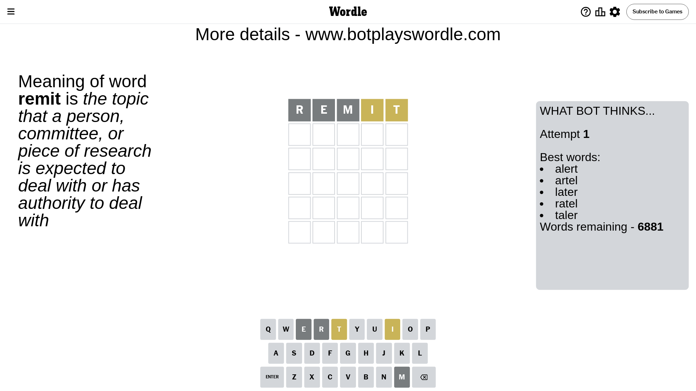
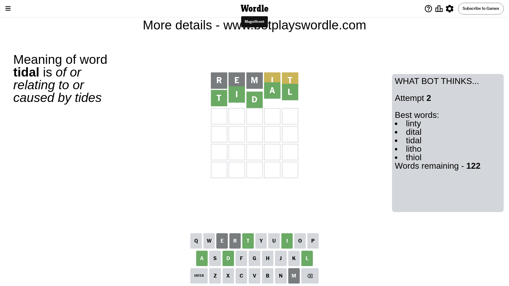

# Wordle for May 11, 2024 - \#1057

## Attempt 1

This is the first attempt and we'll choose a random word to start with.

Let's start with word `remit`

Attempt for `remit` gives us 0 correct letters, 2 present letters and 3 wrong letters.

If we look into details, we can see that:

Letter `r` is not present in the word and we will not use it any more

Letter `e` is not present in the word and we will not use it any more

Letter `m` is not present in the word and we will not use it any more

Letter `i` is on a different spot - this means that it cannot be at position 4

Letter `t` is on a different spot - this means that it cannot be at position 5

Some letters are missing (like `r`, `e`, `m`) but it's also important piece of information

Word should contain letters `[i t]`

That was a great guess that limited number of remaining words

## Attempt 2

Right now we have 122 words to choose from and best of them seem to be `[linty dital tidal litho thiol]`

So far we know that possible letters are:

At position 1: `[a b c d f g h i j k l n o p q s t u v w x y z]`

At position 2: `[a b c d f g h i j k l n o p q s t u v w x y z]`

At position 3: `[a b c d f g h i j k l n o p q s t u v w x y z]`

At position 4: `[a b c d f g h j k l n o p q s t u v w x y z]`

At position 5: `[a b c d f g h i j k l n o p q s u v w x y z]`

Next guess is `tidal`, let's see what it gives us

That's the correct answer! The word is `tidal`!

To be honest that was a pretty lucky guess, but it worked out well.

## Conclusion

Today's word is `tidal` and it took 2 attempts to guess it

