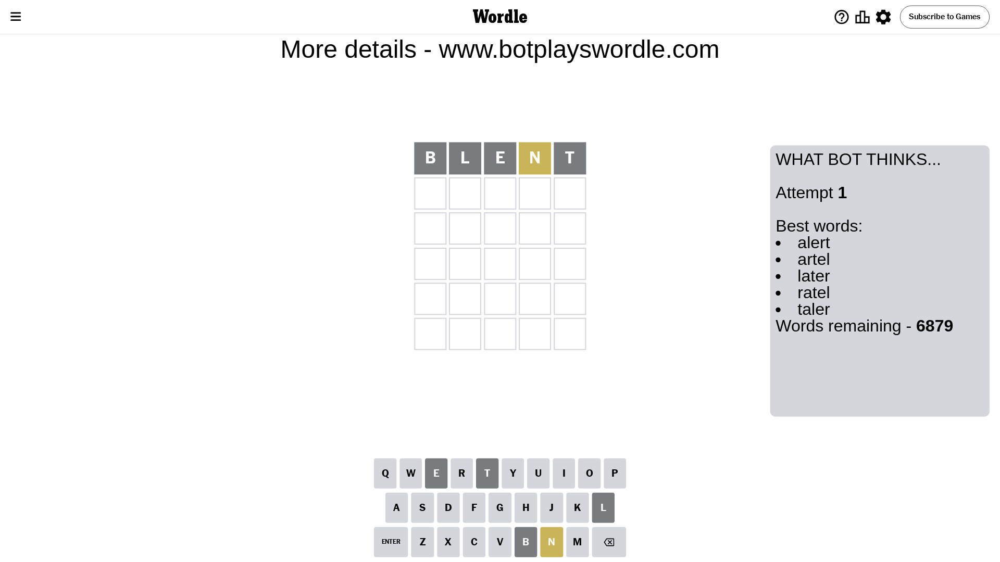
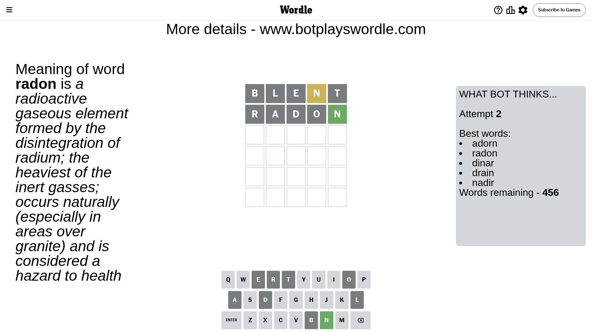
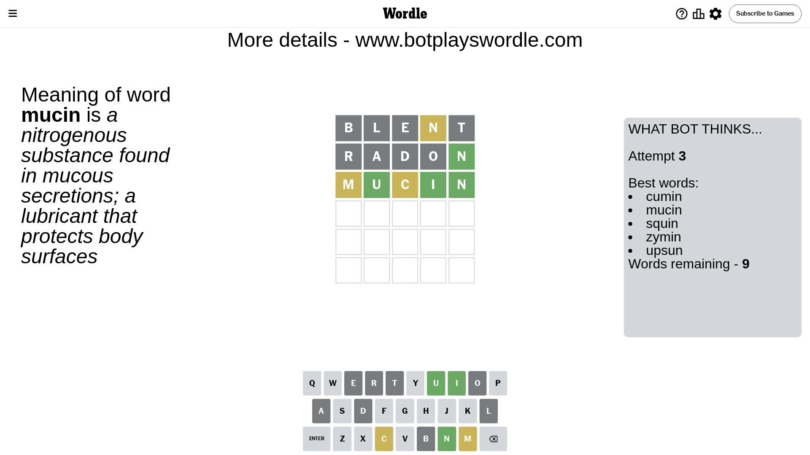
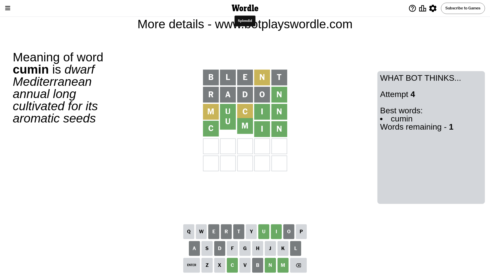

# Wordle for May 13, 2024 - \#1059

## Attempt 1

This is the first attempt and we'll choose a random word to start with.

Let's start with word `blent`

Attempt for `blent` gives us 0 correct letters, 1 present letters and 4 wrong letters.

If we look into details, we can see that:

Letter `b` is not present in the word and we will not use it any more

Letter `l` is not present in the word and we will not use it any more

Letter `e` is not present in the word and we will not use it any more

Letter `n` is on a different spot - this means that it cannot be at position 4

Letter `t` is not present in the word and we will not use it any more

Some letters are missing (like `b`, `l`, `e`, `t`) but it's also important piece of information

Word should contain letters `[n]`

That was a great guess that limited number of remaining words

## Attempt 2

Right now we have 456 words to choose from and best of them seem to be `[adorn radon dinar drain nadir]`

So far we know that possible letters are:

At position 1: `[a c d f g h i j k m n o p q r s u v w x y z]`

At position 2: `[a c d f g h i j k m n o p q r s u v w x y z]`

At position 3: `[a c d f g h i j k m n o p q r s u v w x y z]`

At position 4: `[a c d f g h i j k m o p q r s u v w x y z]`

At position 5: `[a c d f g h i j k m n o p q r s u v w x y z]`

Next guess is `radon`, let's see what it gives us

Attempt for `radon` gives us 1 correct letters, 0 present letters and 4 wrong letters.

If we look into details, we can see that:

Letter `r` is not present in the word and we will not use it any more

Letter `a` is not present in the word and we will not use it any more

Letter `d` is not present in the word and we will not use it any more

Letter `o` is not present in the word and we will not use it any more

Letter `n` should be at position 5

We got information about the correct letters and it should make next attempt easier

Some letters are missing (like `r`, `a`, `d`, `o`) but it's also important piece of information

Word should contain letters `[n]`

That was a great guess that limited number of remaining words

## Attempt 3

Right now we have 9 words to choose from and best of them seem to be `[cumin mucin squin zymin upsun]`

So far we know that possible letters are:

At position 1: `[c f g h i j k m n p q s u v w x y z]`

At position 2: `[c f g h i j k m n p q s u v w x y z]`

At position 3: `[c f g h i j k m n p q s u v w x y z]`

At position 4: `[c f g h i j k m p q s u v w x y z]`

At position 5: `[n]`

Next guess is `mucin`, let's see what it gives us

Attempt for `mucin` gives us 3 correct letters, 2 present letters and 0 wrong letters.

If we look into details, we can see that:

Letter `m` is on a different spot - this means that it cannot be at position 1

Letter `u` should be at position 2

Letter `c` is on a different spot - this means that it cannot be at position 3

Letter `i` should be at position 4

We got information about the correct letters and it should make next attempt easier

Word should contain letters `[n m u c i]`

That was a great guess that limited number of remaining words

## Attempt 4

Right now we have 1 words to choose from and best of them seem to be `[cumin]`

So far we know that possible letters are:

At position 1: `[c f g h i j k n p q s u v w x y z]`

At position 2: `[u]`

At position 3: `[f g h i j k m n p q s u v w x y z]`

At position 4: `[i]`

At position 5: `[n]`

It must be `cumin`

That's the correct answer! The word is `cumin`!

## Conclusion

Today's word is `cumin` and it took 4 attempts to guess it

