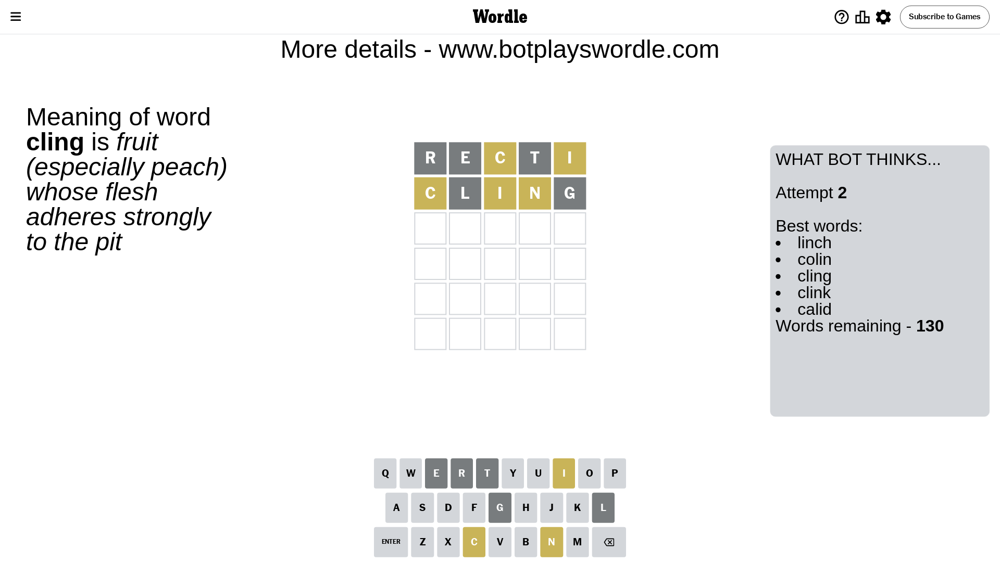

# Wordle for May 15, 2024 - \#1061

## Attempt 1

This is the first attempt and we'll choose a random word to start with.

Let's start with word `recti`

Attempt for `recti` gives us 0 correct letters, 2 present letters and 3 wrong letters.

If we look into details, we can see that:

Letter `r` is not present in the word and we will not use it any more

Letter `e` is not present in the word and we will not use it any more

Letter `c` is on a different spot - this means that it cannot be at position 3

Letter `t` is not present in the word and we will not use it any more

Letter `i` is on a different spot - this means that it cannot be at position 5

Some letters are missing (like `r`, `e`, `t`) but it's also important piece of information

Word should contain letters `[c i]`

That was a great guess that limited number of remaining words

## Attempt 2

Right now we have 130 words to choose from and best of them seem to be `[linch colin cling clink calid]`

So far we know that possible letters are:

At position 1: `[a b c d f g h i j k l m n o p q s u v w x y z]`

At position 2: `[a b c d f g h i j k l m n o p q s u v w x y z]`

At position 3: `[a b d f g h i j k l m n o p q s u v w x y z]`

At position 4: `[a b c d f g h i j k l m n o p q s u v w x y z]`

At position 5: `[a b c d f g h j k l m n o p q s u v w x y z]`

Next guess is `cling`, let's see what it gives us

Attempt for `cling` gives us 0 correct letters, 3 present letters and 2 wrong letters.

If we look into details, we can see that:

Letter `c` is on a different spot - this means that it cannot be at position 1

Letter `l` is not present in the word and we will not use it any more

Letter `i` is on a different spot - this means that it cannot be at position 3

Letter `n` is on a different spot - this means that it cannot be at position 4

Letter `g` is not present in the word and we will not use it any more

Some letters are missing (like `l`, `g`) but it's also important piece of information

Word should contain letters `[c i n]`

That was a great guess that limited number of remaining words

## Attempt 3

Right now we have 16 words to choose from and best of them seem to be `[dinic indic pinch winch hinch]`

So far we know that possible letters are:

At position 1: `[a b d f h i j k m n o p q s u v w x y z]`

At position 2: `[a b c d f h i j k m n o p q s u v w x y z]`

At position 3: `[a b d f h j k m n o p q s u v w x y z]`

At position 4: `[a b c d f h i j k m o p q s u v w x y z]`

At position 5: `[a b c d f h j k m n o p q s u v w x y z]`

Next guess is `pinch`, let's see what it gives us

That's the correct answer! The word is `pinch`!

To be honest that was a pretty lucky guess, but it worked out well.

## Conclusion

Today's word is `pinch` and it took 3 attempts to guess it

