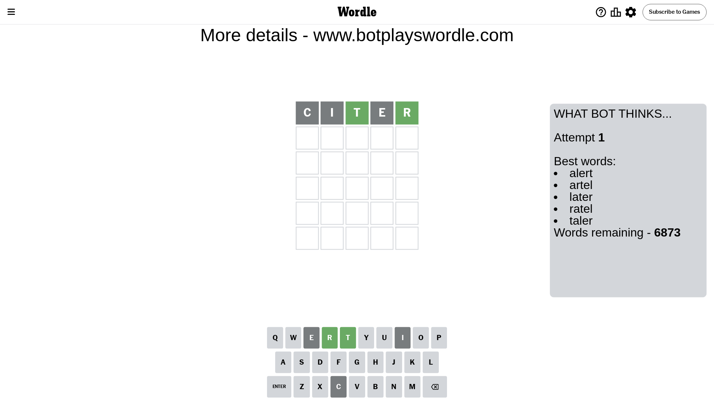
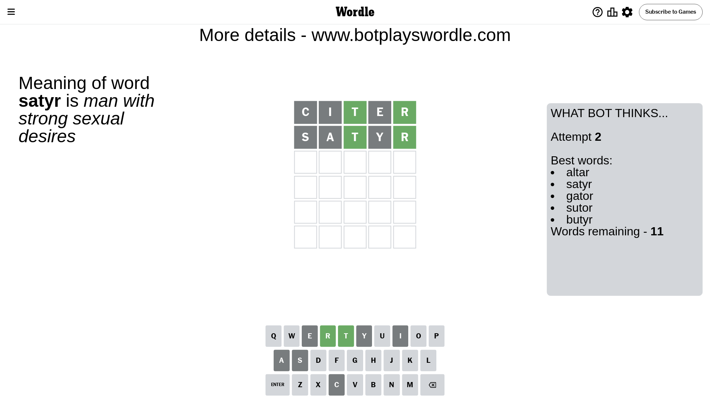
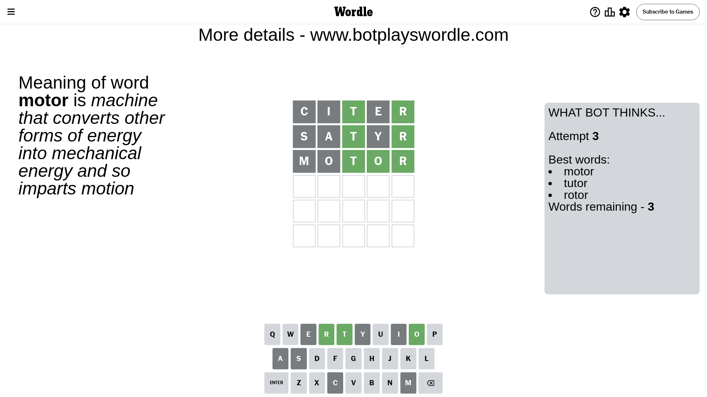
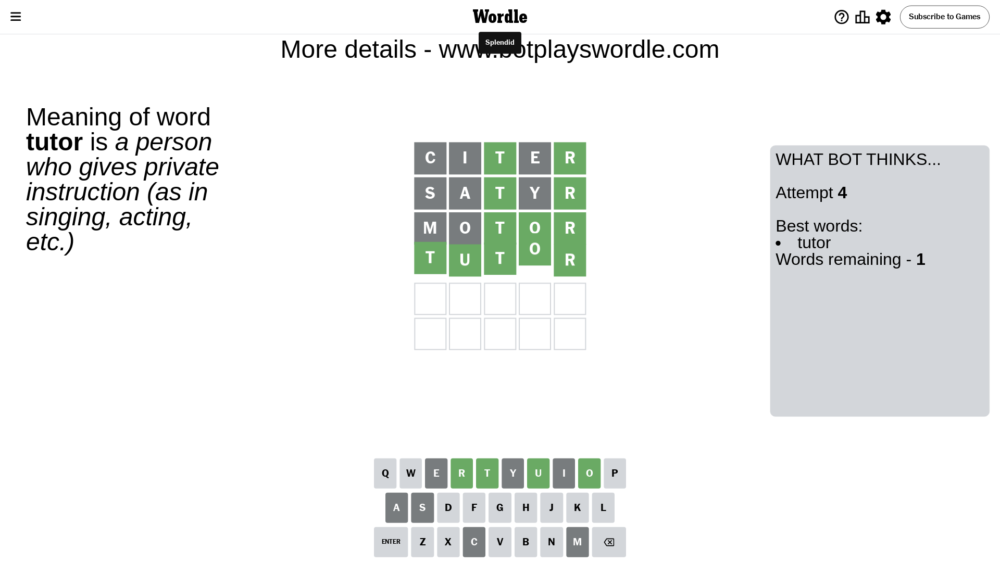

# Wordle for May 17, 2024 - \#1063

## Attempt 1

This is the first attempt and we'll choose a random word to start with.

Let's start with word `citer`

Attempt for `citer` gives us 2 correct letters, 0 present letters and 3 wrong letters.

If we look into details, we can see that:

Letter `c` is not present in the word and we will not use it any more

Letter `i` is not present in the word and we will not use it any more

Letter `t` should be at position 3

Letter `e` is not present in the word and we will not use it any more

Letter `r` should be at position 5

We got information about the correct letters and it should make next attempt easier

Some letters are missing (like `c`, `i`, `e`) but it's also important piece of information

Word should contain letters `[t r]`

That was a great guess that limited number of remaining words

## Attempt 2

Right now we have 11 words to choose from and best of them seem to be `[altar satyr gator sutor butyr]`

So far we know that possible letters are:

At position 1: `[a b d f g h j k l m n o p q r s t u v w x y z]`

At position 2: `[a b d f g h j k l m n o p q r s t u v w x y z]`

At position 3: `[t]`

At position 4: `[a b d f g h j k l m n o p q r s t u v w x y z]`

At position 5: `[r]`

Next guess is `satyr`, let's see what it gives us

Attempt for `satyr` gives us 2 correct letters, 0 present letters and 3 wrong letters.

If we look into details, we can see that:

Letter `s` is not present in the word and we will not use it any more

Letter `a` is not present in the word and we will not use it any more

Letter `y` is not present in the word and we will not use it any more

Some letters are missing (like `s`, `a`, `y`) but it's also important piece of information

Word should contain letters `[t r]`

Could be a better guess

## Attempt 3

Right now we have 3 words to choose from and best of them seem to be `[motor tutor rotor]`

So far we know that possible letters are:

At position 1: `[b d f g h j k l m n o p q r t u v w x z]`

At position 2: `[b d f g h j k l m n o p q r t u v w x z]`

At position 3: `[t]`

At position 4: `[b d f g h j k l m n o p q r t u v w x z]`

At position 5: `[r]`

Next guess is `motor`, let's see what it gives us

Attempt for `motor` gives us 3 correct letters, 0 present letters and 2 wrong letters.

If we look into details, we can see that:

Letter `m` is not present in the word and we will not use it any more

Letter `o` is not present in the word and we will not use it any more

Letter `o` should be at position 4

We got information about the correct letters and it should make next attempt easier

Some letters are missing (like `m`, `o`) but it's also important piece of information

Word should contain letters `[t r o]`

Could be a better guess

## Attempt 4

Right now we have 1 words to choose from and best of them seem to be `[tutor]`

So far we know that possible letters are:

At position 1: `[b d f g h j k l n p q r t u v w x z]`

At position 2: `[b d f g h j k l n p q r t u v w x z]`

At position 3: `[t]`

At position 4: `[o]`

At position 5: `[r]`

It must be `tutor`

That's the correct answer! The word is `tutor`!

## Conclusion

Today's word is `tutor` and it took 4 attempts to guess it

