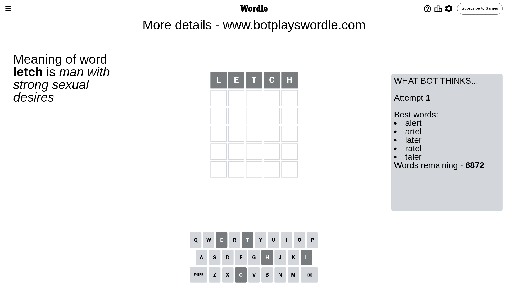
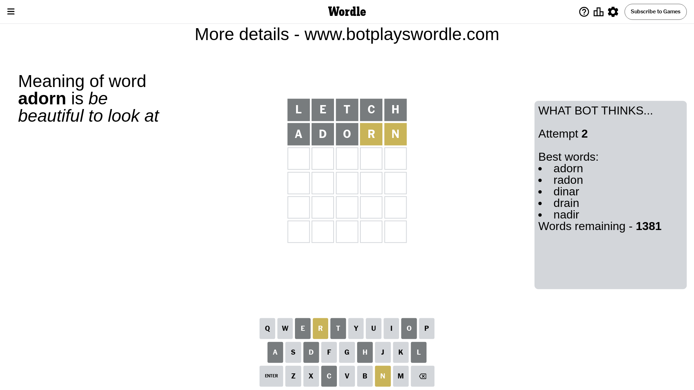
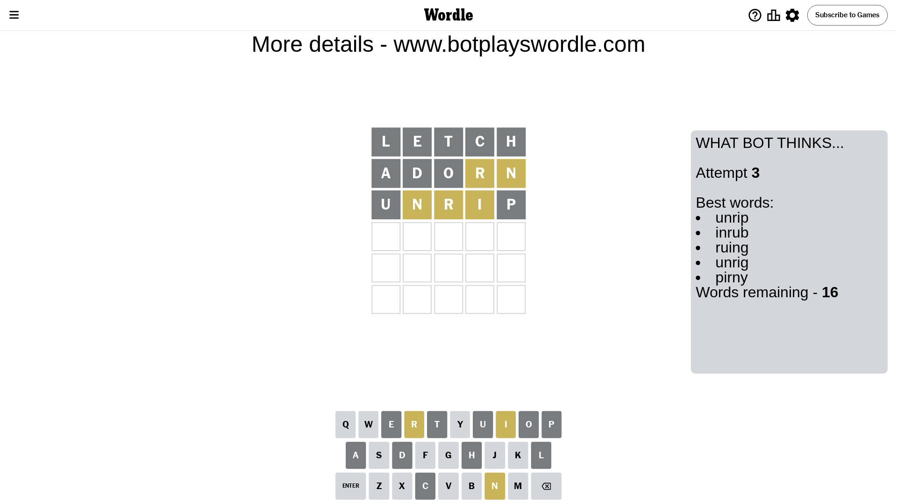
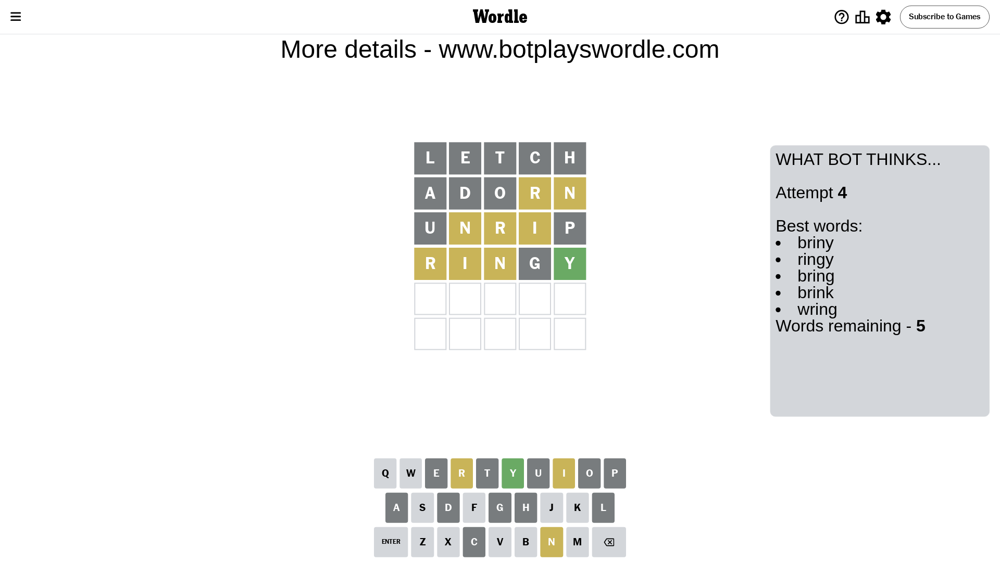
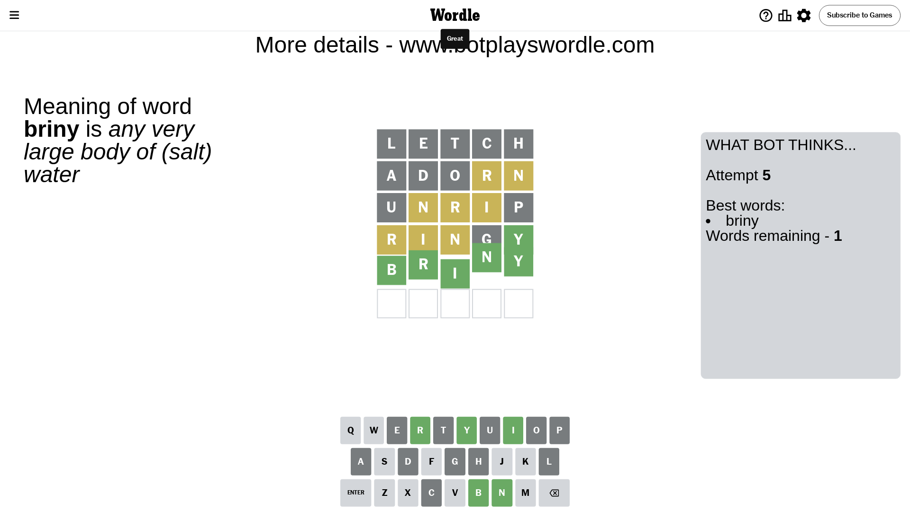

# Wordle for May 18, 2024 - \#1064

## Attempt 1

This is the first attempt and we'll choose a random word to start with.

Let's start with word `letch`

Attempt for `letch` gives us 0 correct letters, 0 present letters and 5 wrong letters.

If we look into details, we can see that:

Letter `l` is not present in the word and we will not use it any more

Letter `e` is not present in the word and we will not use it any more

Letter `t` is not present in the word and we will not use it any more

Letter `c` is not present in the word and we will not use it any more

Letter `h` is not present in the word and we will not use it any more

Some letters are missing (like `l`, `e`, `t`, `c`, `h`) but it's also important piece of information

So far we don't know any of the letters!

Not a bad guess in general

## Attempt 2

Right now we have 1381 words to choose from and best of them seem to be `[adorn radon dinar drain nadir]`

So far we know that possible letters are:

At position 1: `[a b d f g i j k m n o p q r s u v w x y z]`

At position 2: `[a b d f g i j k m n o p q r s u v w x y z]`

At position 3: `[a b d f g i j k m n o p q r s u v w x y z]`

At position 4: `[a b d f g i j k m n o p q r s u v w x y z]`

At position 5: `[a b d f g i j k m n o p q r s u v w x y z]`

Next guess is `adorn`, let's see what it gives us

Attempt for `adorn` gives us 0 correct letters, 2 present letters and 3 wrong letters.

If we look into details, we can see that:

Letter `a` is not present in the word and we will not use it any more

Letter `d` is not present in the word and we will not use it any more

Letter `o` is not present in the word and we will not use it any more

Letter `r` is on a different spot - this means that it cannot be at position 4

Letter `n` is on a different spot - this means that it cannot be at position 5

Some letters are missing (like `a`, `d`, `o`) but it's also important piece of information

Word should contain letters `[r n]`

That was a great guess that limited number of remaining words

## Attempt 3

Right now we have 16 words to choose from and best of them seem to be `[unrip inrub ruing unrig pirny]`

So far we know that possible letters are:

At position 1: `[b f g i j k m n p q r s u v w x y z]`

At position 2: `[b f g i j k m n p q r s u v w x y z]`

At position 3: `[b f g i j k m n p q r s u v w x y z]`

At position 4: `[b f g i j k m n p q s u v w x y z]`

At position 5: `[b f g i j k m p q r s u v w x y z]`

Next guess is `unrip`, let's see what it gives us

Attempt for `unrip` gives us 0 correct letters, 3 present letters and 2 wrong letters.

If we look into details, we can see that:

Letter `u` is not present in the word and we will not use it any more

Letter `n` is on a different spot - this means that it cannot be at position 2

Letter `r` is on a different spot - this means that it cannot be at position 3

Letter `i` is on a different spot - this means that it cannot be at position 4

Letter `p` is not present in the word and we will not use it any more

Some letters are missing (like `u`, `p`) but it's also important piece of information

Word should contain letters `[r n i]`

Could be a better guess

## Attempt 4

Right now we have 5 words to choose from and best of them seem to be `[briny ringy bring brink wring]`

So far we know that possible letters are:

At position 1: `[b f g i j k m n q r s v w x y z]`

At position 2: `[b f g i j k m q r s v w x y z]`

At position 3: `[b f g i j k m n q s v w x y z]`

At position 4: `[b f g j k m n q s v w x y z]`

At position 5: `[b f g i j k m q r s v w x y z]`

Next guess is `ringy`, let's see what it gives us

Attempt for `ringy` gives us 1 correct letters, 3 present letters and 1 wrong letters.

If we look into details, we can see that:

Letter `r` is on a different spot - this means that it cannot be at position 1

Letter `i` is on a different spot - this means that it cannot be at position 2

Letter `n` is on a different spot - this means that it cannot be at position 3

Letter `g` is not present in the word and we will not use it any more

Letter `y` should be at position 5

We got information about the correct letters and it should make next attempt easier

Some letters are missing (like `g`) but it's also important piece of information

Word should contain letters `[r n i y]`

Not a bad guess in general

## Attempt 5

Right now we have 1 words to choose from and best of them seem to be `[briny]`

So far we know that possible letters are:

At position 1: `[b f i j k m n q s v w x y z]`

At position 2: `[b f j k m q r s v w x y z]`

At position 3: `[b f i j k m q s v w x y z]`

At position 4: `[b f j k m n q s v w x y z]`

At position 5: `[y]`

It must be `briny`

That's the correct answer! The word is `briny`!

## Conclusion

Today's word is `briny` and it took 5 attempts to guess it

