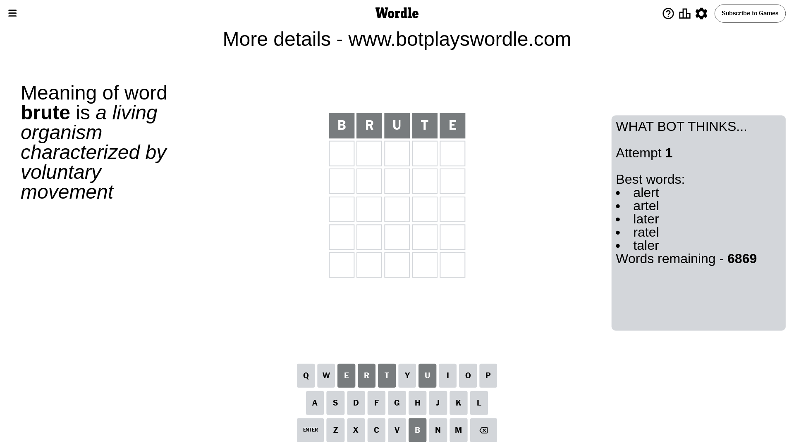
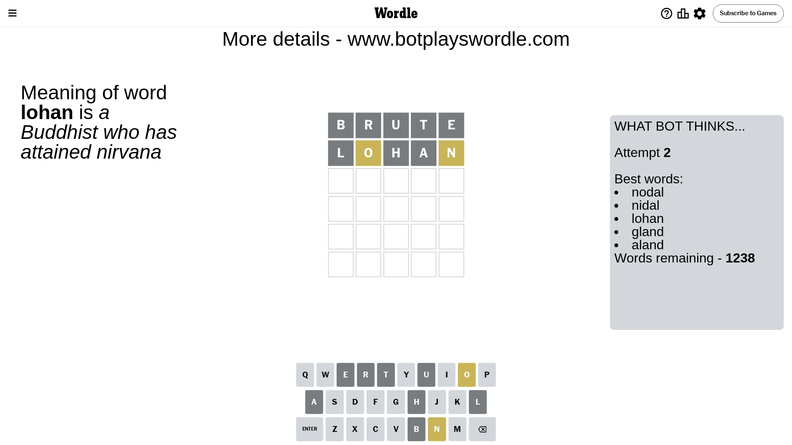
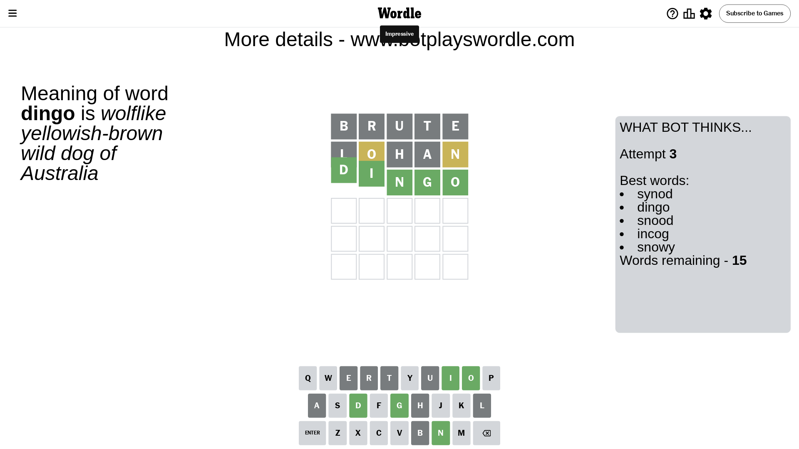

# Wordle for May 21, 2024 - \#1067

## Attempt 1

This is the first attempt and we'll choose a random word to start with.

Let's start with word `brute`

Attempt for `brute` gives us 0 correct letters, 0 present letters and 5 wrong letters.

If we look into details, we can see that:

Letter `b` is not present in the word and we will not use it any more

Letter `r` is not present in the word and we will not use it any more

Letter `u` is not present in the word and we will not use it any more

Letter `t` is not present in the word and we will not use it any more

Letter `e` is not present in the word and we will not use it any more

Some letters are missing (like `b`, `r`, `u`, `t`, `e`) but it's also important piece of information

So far we don't know any of the letters!

Not a bad guess in general

## Attempt 2

Right now we have 1238 words to choose from and best of them seem to be `[nodal nidal lohan gland aland]`

So far we know that possible letters are:

At position 1: `[a c d f g h i j k l m n o p q s v w x y z]`

At position 2: `[a c d f g h i j k l m n o p q s v w x y z]`

At position 3: `[a c d f g h i j k l m n o p q s v w x y z]`

At position 4: `[a c d f g h i j k l m n o p q s v w x y z]`

At position 5: `[a c d f g h i j k l m n o p q s v w x y z]`

Next guess is `lohan`, let's see what it gives us

Attempt for `lohan` gives us 0 correct letters, 2 present letters and 3 wrong letters.

If we look into details, we can see that:

Letter `l` is not present in the word and we will not use it any more

Letter `o` is on a different spot - this means that it cannot be at position 2

Letter `h` is not present in the word and we will not use it any more

Letter `a` is not present in the word and we will not use it any more

Letter `n` is on a different spot - this means that it cannot be at position 5

Some letters are missing (like `l`, `h`, `a`) but it's also important piece of information

Word should contain letters `[o n]`

That was a great guess that limited number of remaining words

## Attempt 3

Right now we have 15 words to choose from and best of them seem to be `[synod dingo snood incog snowy]`

So far we know that possible letters are:

At position 1: `[c d f g i j k m n o p q s v w x y z]`

At position 2: `[c d f g i j k m n p q s v w x y z]`

At position 3: `[c d f g i j k m n o p q s v w x y z]`

At position 4: `[c d f g i j k m n o p q s v w x y z]`

At position 5: `[c d f g i j k m o p q s v w x y z]`

Next guess is `dingo`, let's see what it gives us

That's the correct answer! The word is `dingo`!

To be honest that was a pretty lucky guess, but it worked out well.

## Conclusion

Today's word is `dingo` and it took 3 attempts to guess it

