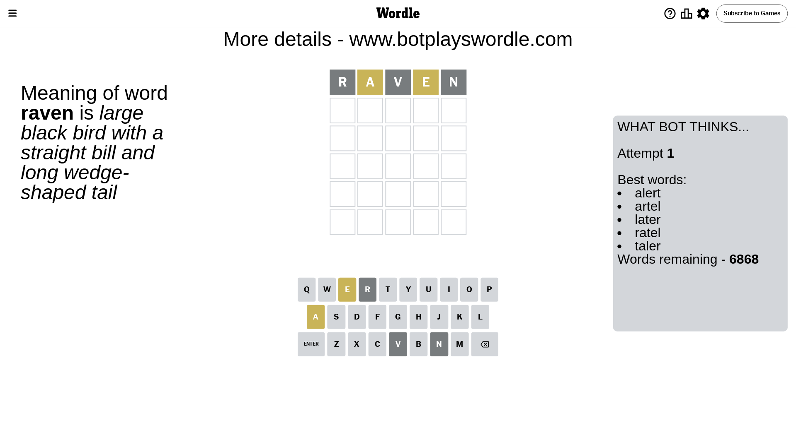
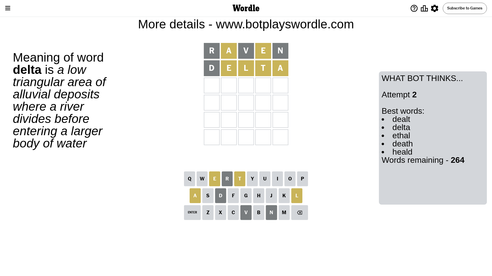
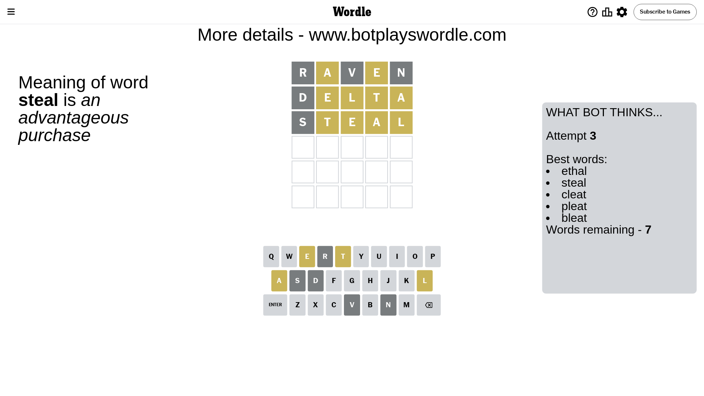
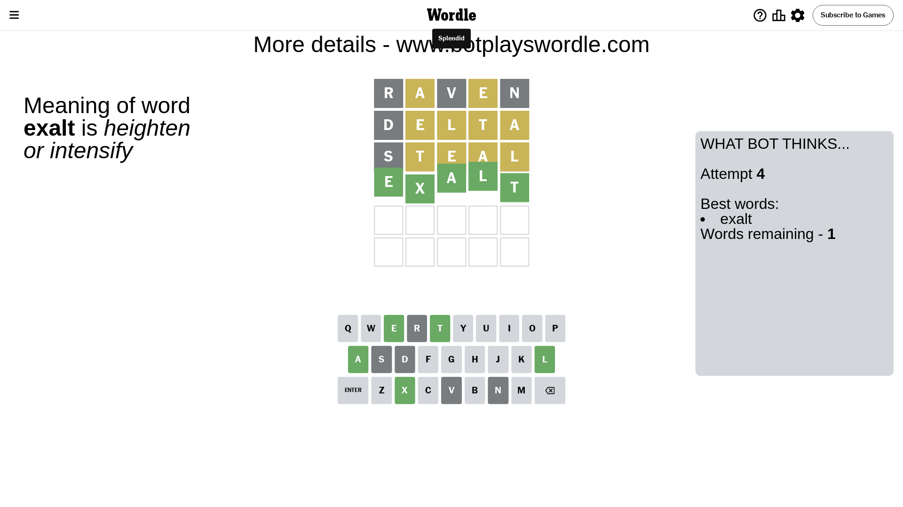

# Wordle for May 22, 2024 - \#1068

## Attempt 1

This is the first attempt and we'll choose a random word to start with.

Let's start with word `raven`

Attempt for `raven` gives us 0 correct letters, 2 present letters and 3 wrong letters.

If we look into details, we can see that:

Letter `r` is not present in the word and we will not use it any more

Letter `a` is on a different spot - this means that it cannot be at position 2

Letter `v` is not present in the word and we will not use it any more

Letter `e` is on a different spot - this means that it cannot be at position 4

Letter `n` is not present in the word and we will not use it any more

Some letters are missing (like `r`, `v`, `n`) but it's also important piece of information

Word should contain letters `[a e]`

That was a great guess that limited number of remaining words

## Attempt 2

Right now we have 264 words to choose from and best of them seem to be `[dealt delta ethal death heald]`

So far we know that possible letters are:

At position 1: `[a b c d e f g h i j k l m o p q s t u w x y z]`

At position 2: `[b c d e f g h i j k l m o p q s t u w x y z]`

At position 3: `[a b c d e f g h i j k l m o p q s t u w x y z]`

At position 4: `[a b c d f g h i j k l m o p q s t u w x y z]`

At position 5: `[a b c d e f g h i j k l m o p q s t u w x y z]`

Next guess is `delta`, let's see what it gives us

Attempt for `delta` gives us 0 correct letters, 4 present letters and 1 wrong letters.

If we look into details, we can see that:

Letter `d` is not present in the word and we will not use it any more

Letter `e` is on a different spot - this means that it cannot be at position 2

Letter `l` is on a different spot - this means that it cannot be at position 3

Letter `t` is on a different spot - this means that it cannot be at position 4

Letter `a` is on a different spot - this means that it cannot be at position 5

Some letters are missing (like `d`) but it's also important piece of information

Word should contain letters `[a e l t]`

That was a great guess that limited number of remaining words

## Attempt 3

Right now we have 7 words to choose from and best of them seem to be `[ethal steal cleat pleat bleat]`

So far we know that possible letters are:

At position 1: `[a b c e f g h i j k l m o p q s t u w x y z]`

At position 2: `[b c f g h i j k l m o p q s t u w x y z]`

At position 3: `[a b c e f g h i j k m o p q s t u w x y z]`

At position 4: `[a b c f g h i j k l m o p q s u w x y z]`

At position 5: `[b c e f g h i j k l m o p q s t u w x y z]`

Next guess is `steal`, let's see what it gives us

Attempt for `steal` gives us 0 correct letters, 4 present letters and 1 wrong letters.

If we look into details, we can see that:

Letter `s` is not present in the word and we will not use it any more

Letter `t` is on a different spot - this means that it cannot be at position 2

Letter `e` is on a different spot - this means that it cannot be at position 3

Letter `a` is on a different spot - this means that it cannot be at position 4

Letter `l` is on a different spot - this means that it cannot be at position 5

Some letters are missing (like `s`) but it's also important piece of information

Word should contain letters `[a e l t]`

Not a bad guess in general

## Attempt 4

Right now we have 1 words to choose from and best of them seem to be `[exalt]`

So far we know that possible letters are:

At position 1: `[a b c e f g h i j k l m o p q t u w x y z]`

At position 2: `[b c f g h i j k l m o p q u w x y z]`

At position 3: `[a b c f g h i j k m o p q t u w x y z]`

At position 4: `[b c f g h i j k l m o p q u w x y z]`

At position 5: `[b c e f g h i j k m o p q t u w x y z]`

It must be `exalt`

That's the correct answer! The word is `exalt`!

## Conclusion

Today's word is `exalt` and it took 4 attempts to guess it

