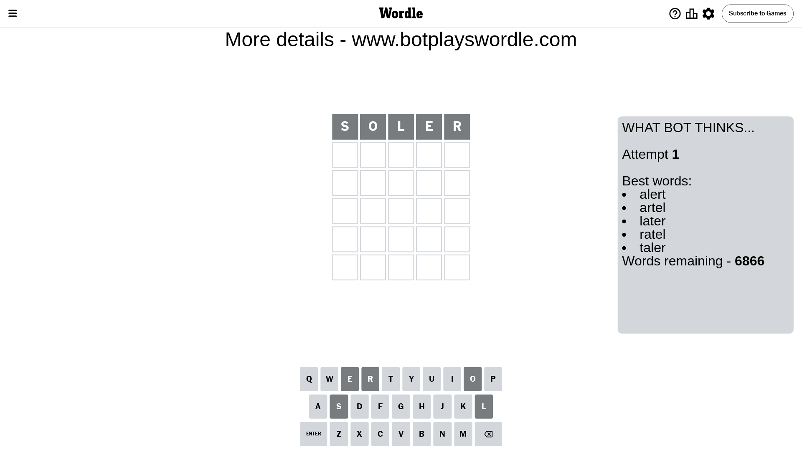
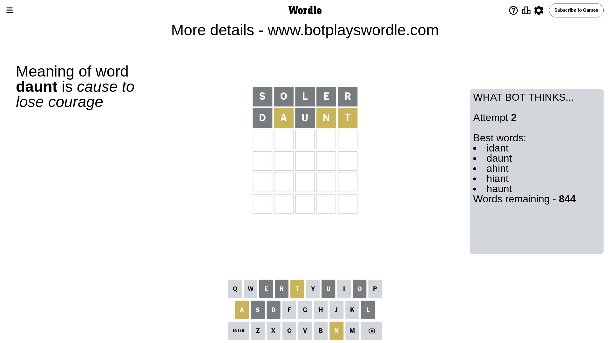
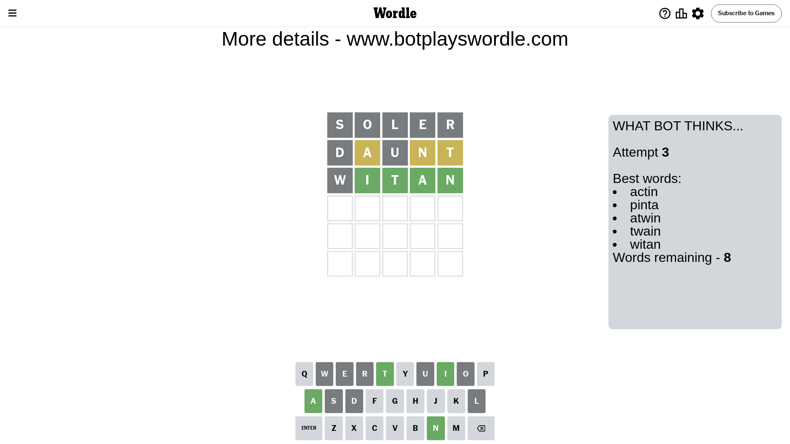
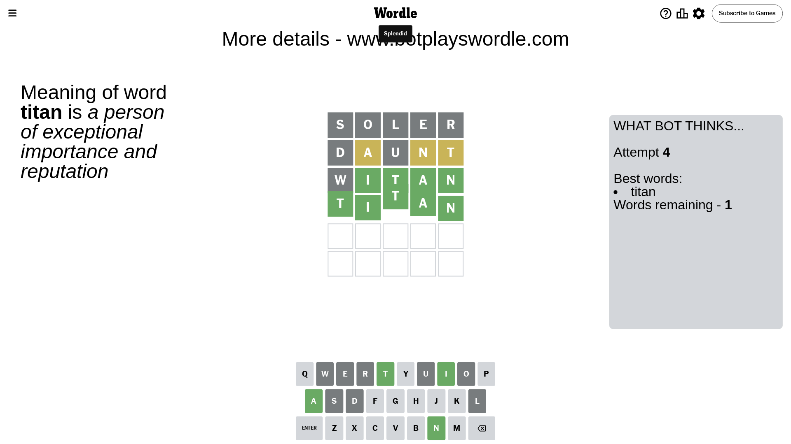

# Wordle for May 25, 2024 - \#1071

## Attempt 1

This is the first attempt and we'll choose a random word to start with.

Let's start with word `soler`

Attempt for `soler` gives us 0 correct letters, 0 present letters and 5 wrong letters.

If we look into details, we can see that:

Letter `s` is not present in the word and we will not use it any more

Letter `o` is not present in the word and we will not use it any more

Letter `l` is not present in the word and we will not use it any more

Letter `e` is not present in the word and we will not use it any more

Letter `r` is not present in the word and we will not use it any more

Some letters are missing (like `s`, `o`, `l`, `e`, `r`) but it's also important piece of information

So far we don't know any of the letters!

That was a great guess that limited number of remaining words

## Attempt 2

Right now we have 844 words to choose from and best of them seem to be `[idant daunt ahint hiant haunt]`

So far we know that possible letters are:

At position 1: `[a b c d f g h i j k m n p q t u v w x y z]`

At position 2: `[a b c d f g h i j k m n p q t u v w x y z]`

At position 3: `[a b c d f g h i j k m n p q t u v w x y z]`

At position 4: `[a b c d f g h i j k m n p q t u v w x y z]`

At position 5: `[a b c d f g h i j k m n p q t u v w x y z]`

Next guess is `daunt`, let's see what it gives us

Attempt for `daunt` gives us 0 correct letters, 3 present letters and 2 wrong letters.

If we look into details, we can see that:

Letter `d` is not present in the word and we will not use it any more

Letter `a` is on a different spot - this means that it cannot be at position 2

Letter `u` is not present in the word and we will not use it any more

Letter `n` is on a different spot - this means that it cannot be at position 4

Letter `t` is on a different spot - this means that it cannot be at position 5

Some letters are missing (like `d`, `u`) but it's also important piece of information

Word should contain letters `[a n t]`

That was a great guess that limited number of remaining words

## Attempt 3

Right now we have 8 words to choose from and best of them seem to be `[actin pinta atwin twain witan]`

So far we know that possible letters are:

At position 1: `[a b c f g h i j k m n p q t v w x y z]`

At position 2: `[b c f g h i j k m n p q t v w x y z]`

At position 3: `[a b c f g h i j k m n p q t v w x y z]`

At position 4: `[a b c f g h i j k m p q t v w x y z]`

At position 5: `[a b c f g h i j k m n p q v w x y z]`

Next guess is `witan`, let's see what it gives us

Attempt for `witan` gives us 4 correct letters, 0 present letters and 1 wrong letters.

If we look into details, we can see that:

Letter `w` is not present in the word and we will not use it any more

Letter `i` should be at position 2

Letter `t` should be at position 3

Letter `a` should be at position 4

Letter `n` should be at position 5

We got information about the correct letters and it should make next attempt easier

Some letters are missing (like `w`) but it's also important piece of information

Word should contain letters `[a n t i]`

Not a bad guess in general

## Attempt 4

Right now we have 1 words to choose from and best of them seem to be `[titan]`

So far we know that possible letters are:

At position 1: `[a b c f g h i j k m n p q t v x y z]`

At position 2: `[i]`

At position 3: `[t]`

At position 4: `[a]`

At position 5: `[n]`

It must be `titan`

That's the correct answer! The word is `titan`!

## Conclusion

Today's word is `titan` and it took 4 attempts to guess it

