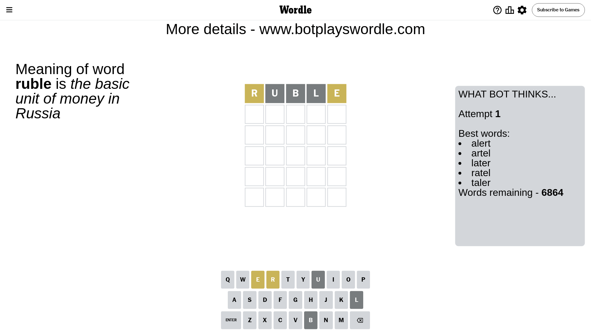
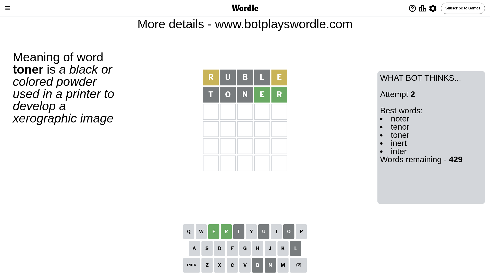
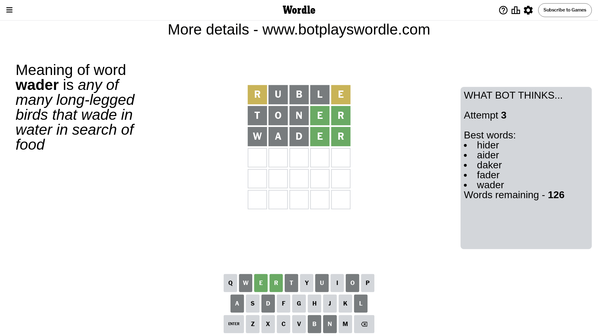
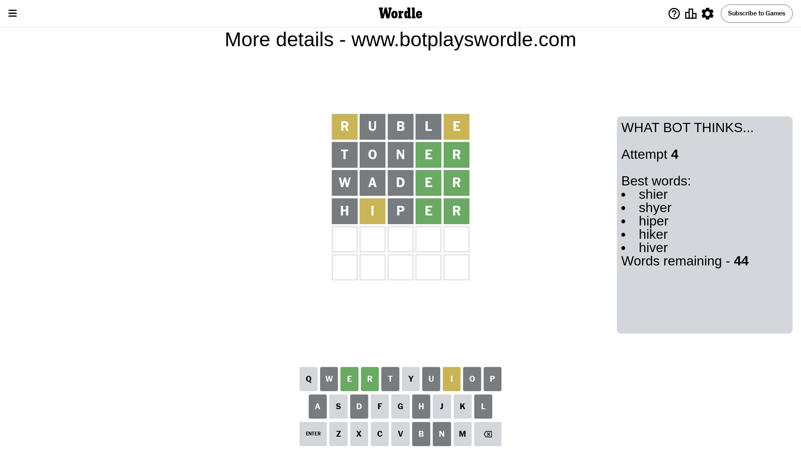
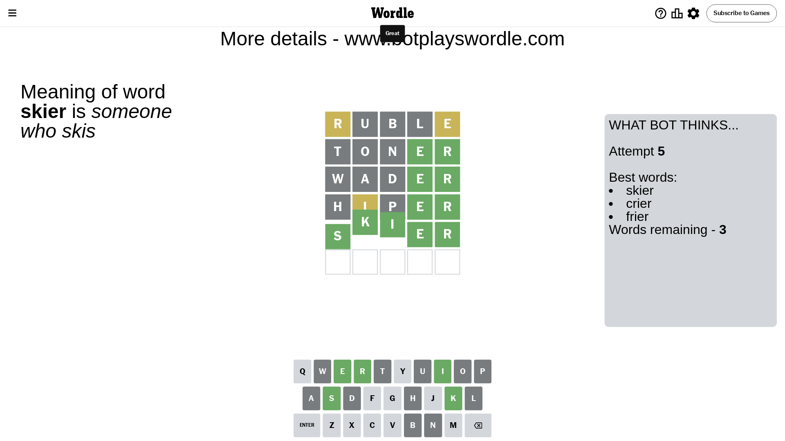

# Wordle for May 27, 2024 - \#1073

## Attempt 1

This is the first attempt and we'll choose a random word to start with.

Let's start with word `ruble`

Attempt for `ruble` gives us 0 correct letters, 2 present letters and 3 wrong letters.

If we look into details, we can see that:

Letter `r` is on a different spot - this means that it cannot be at position 1

Letter `u` is not present in the word and we will not use it any more

Letter `b` is not present in the word and we will not use it any more

Letter `l` is not present in the word and we will not use it any more

Letter `e` is on a different spot - this means that it cannot be at position 5

Some letters are missing (like `u`, `b`, `l`) but it's also important piece of information

Word should contain letters `[r e]`

That was a great guess that limited number of remaining words

## Attempt 2

Right now we have 429 words to choose from and best of them seem to be `[noter tenor toner inert inter]`

So far we know that possible letters are:

At position 1: `[a c d e f g h i j k m n o p q s t v w x y z]`

At position 2: `[a c d e f g h i j k m n o p q r s t v w x y z]`

At position 3: `[a c d e f g h i j k m n o p q r s t v w x y z]`

At position 4: `[a c d e f g h i j k m n o p q r s t v w x y z]`

At position 5: `[a c d f g h i j k m n o p q r s t v w x y z]`

Next guess is `toner`, let's see what it gives us

Attempt for `toner` gives us 2 correct letters, 0 present letters and 3 wrong letters.

If we look into details, we can see that:

Letter `t` is not present in the word and we will not use it any more

Letter `o` is not present in the word and we will not use it any more

Letter `n` is not present in the word and we will not use it any more

Letter `e` should be at position 4

Letter `r` should be at position 5

We got information about the correct letters and it should make next attempt easier

Some letters are missing (like `t`, `o`, `n`) but it's also important piece of information

Word should contain letters `[r e]`

Could be a better guess

## Attempt 3

Right now we have 126 words to choose from and best of them seem to be `[hider aider daker fader wader]`

So far we know that possible letters are:

At position 1: `[a c d e f g h i j k m p q s v w x y z]`

At position 2: `[a c d e f g h i j k m p q r s v w x y z]`

At position 3: `[a c d e f g h i j k m p q r s v w x y z]`

At position 4: `[e]`

At position 5: `[r]`

Next guess is `wader`, let's see what it gives us

Attempt for `wader` gives us 2 correct letters, 0 present letters and 3 wrong letters.

If we look into details, we can see that:

Letter `w` is not present in the word and we will not use it any more

Letter `a` is not present in the word and we will not use it any more

Letter `d` is not present in the word and we will not use it any more

Some letters are missing (like `w`, `a`, `d`) but it's also important piece of information

Word should contain letters `[r e]`

Could be a better guess

## Attempt 4

Right now we have 44 words to choose from and best of them seem to be `[shier shyer hiper hiker hiver]`

So far we know that possible letters are:

At position 1: `[c e f g h i j k m p q s v x y z]`

At position 2: `[c e f g h i j k m p q r s v x y z]`

At position 3: `[c e f g h i j k m p q r s v x y z]`

At position 4: `[e]`

At position 5: `[r]`

Next guess is `hiper`, let's see what it gives us

Attempt for `hiper` gives us 2 correct letters, 1 present letters and 2 wrong letters.

If we look into details, we can see that:

Letter `h` is not present in the word and we will not use it any more

Letter `i` is on a different spot - this means that it cannot be at position 2

Letter `p` is not present in the word and we will not use it any more

Some letters are missing (like `h`, `p`) but it's also important piece of information

Word should contain letters `[r e i]`

That was a great guess that limited number of remaining words

## Attempt 5

Right now we have 3 words to choose from and best of them seem to be `[skier crier frier]`

So far we know that possible letters are:

At position 1: `[c e f g i j k m q s v x y z]`

At position 2: `[c e f g j k m q r s v x y z]`

At position 3: `[c e f g i j k m q r s v x y z]`

At position 4: `[e]`

At position 5: `[r]`

Next guess is `skier`, let's see what it gives us

That's the correct answer! The word is `skier`!

## Conclusion

Today's word is `skier` and it took 5 attempts to guess it

