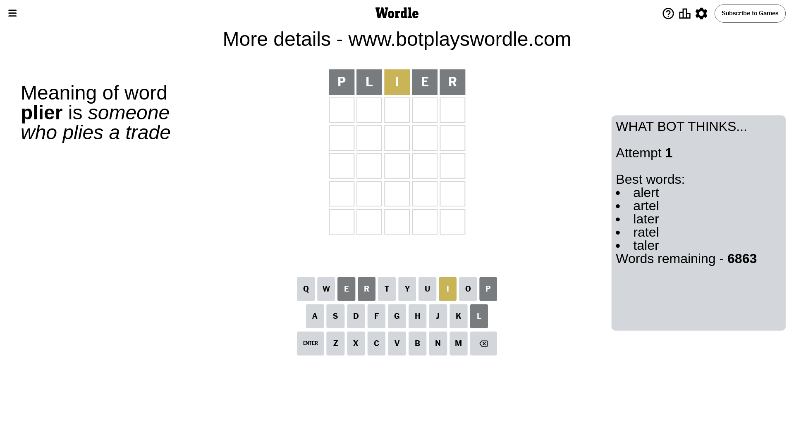
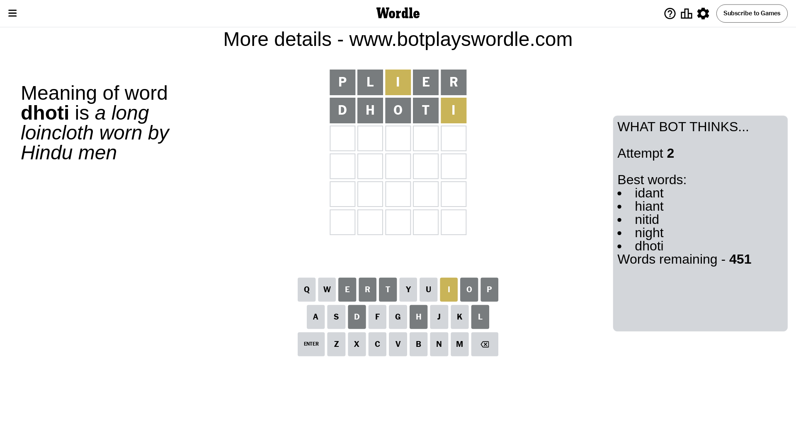
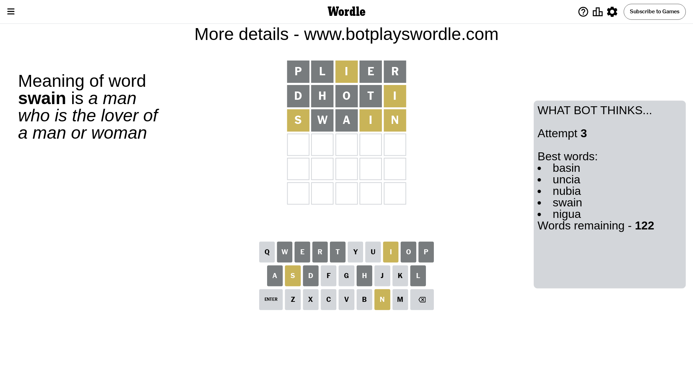
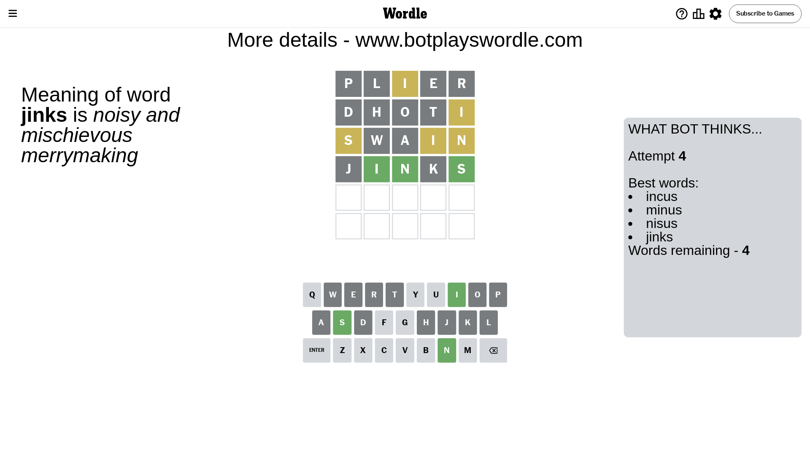
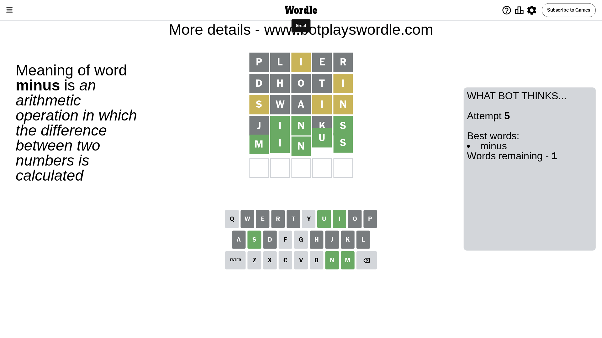

# Wordle for May 28, 2024 - \#1074

## Attempt 1

This is the first attempt and we'll choose a random word to start with.

Let's start with word `plier`

Attempt for `plier` gives us 0 correct letters, 1 present letters and 4 wrong letters.

If we look into details, we can see that:

Letter `p` is not present in the word and we will not use it any more

Letter `l` is not present in the word and we will not use it any more

Letter `i` is on a different spot - this means that it cannot be at position 3

Letter `e` is not present in the word and we will not use it any more

Letter `r` is not present in the word and we will not use it any more

Some letters are missing (like `p`, `l`, `e`, `r`) but it's also important piece of information

Word should contain letters `[i]`

That was a great guess that limited number of remaining words

## Attempt 2

Right now we have 451 words to choose from and best of them seem to be `[idant hiant nitid night dhoti]`

So far we know that possible letters are:

At position 1: `[a b c d f g h i j k m n o q s t u v w x y z]`

At position 2: `[a b c d f g h i j k m n o q s t u v w x y z]`

At position 3: `[a b c d f g h j k m n o q s t u v w x y z]`

At position 4: `[a b c d f g h i j k m n o q s t u v w x y z]`

At position 5: `[a b c d f g h i j k m n o q s t u v w x y z]`

Next guess is `dhoti`, let's see what it gives us

Attempt for `dhoti` gives us 0 correct letters, 1 present letters and 4 wrong letters.

If we look into details, we can see that:

Letter `d` is not present in the word and we will not use it any more

Letter `h` is not present in the word and we will not use it any more

Letter `o` is not present in the word and we will not use it any more

Letter `t` is not present in the word and we will not use it any more

Letter `i` is on a different spot - this means that it cannot be at position 5

Some letters are missing (like `d`, `h`, `o`, `t`) but it's also important piece of information

Word should contain letters `[i]`

Could be a better guess

## Attempt 3

Right now we have 122 words to choose from and best of them seem to be `[basin uncia nubia swain nigua]`

So far we know that possible letters are:

At position 1: `[a b c f g i j k m n q s u v w x y z]`

At position 2: `[a b c f g i j k m n q s u v w x y z]`

At position 3: `[a b c f g j k m n q s u v w x y z]`

At position 4: `[a b c f g i j k m n q s u v w x y z]`

At position 5: `[a b c f g j k m n q s u v w x y z]`

Next guess is `swain`, let's see what it gives us

Attempt for `swain` gives us 0 correct letters, 3 present letters and 2 wrong letters.

If we look into details, we can see that:

Letter `s` is on a different spot - this means that it cannot be at position 1

Letter `w` is not present in the word and we will not use it any more

Letter `a` is not present in the word and we will not use it any more

Letter `i` is on a different spot - this means that it cannot be at position 4

Letter `n` is on a different spot - this means that it cannot be at position 5

Some letters are missing (like `w`, `a`) but it's also important piece of information

Word should contain letters `[i s n]`

That was a great guess that limited number of remaining words

## Attempt 4

Right now we have 4 words to choose from and best of them seem to be `[incus minus nisus jinks]`

So far we know that possible letters are:

At position 1: `[b c f g i j k m n q u v x y z]`

At position 2: `[b c f g i j k m n q s u v x y z]`

At position 3: `[b c f g j k m n q s u v x y z]`

At position 4: `[b c f g j k m n q s u v x y z]`

At position 5: `[b c f g j k m q s u v x y z]`

Next guess is `jinks`, let's see what it gives us

Attempt for `jinks` gives us 3 correct letters, 0 present letters and 2 wrong letters.

If we look into details, we can see that:

Letter `j` is not present in the word and we will not use it any more

Letter `i` should be at position 2

Letter `n` should be at position 3

Letter `k` is not present in the word and we will not use it any more

Letter `s` should be at position 5

We got information about the correct letters and it should make next attempt easier

Some letters are missing (like `j`, `k`) but it's also important piece of information

Word should contain letters `[i s n]`

Could be a better guess

## Attempt 5

Right now we have 1 words to choose from and best of them seem to be `[minus]`

So far we know that possible letters are:

At position 1: `[b c f g i m n q u v x y z]`

At position 2: `[i]`

At position 3: `[n]`

At position 4: `[b c f g m n q s u v x y z]`

At position 5: `[s]`

It must be `minus`

That's the correct answer! The word is `minus`!

## Conclusion

Today's word is `minus` and it took 5 attempts to guess it

