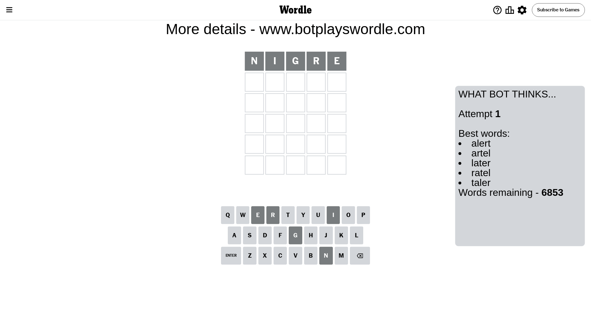
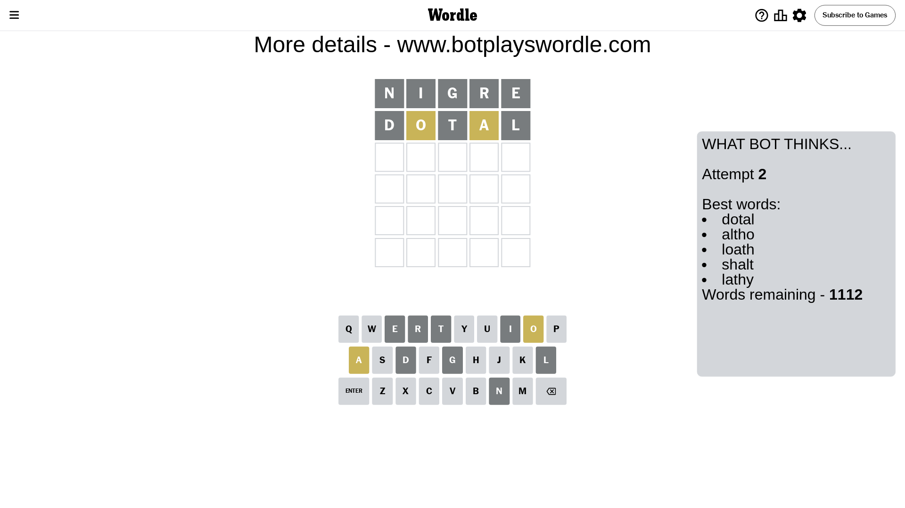
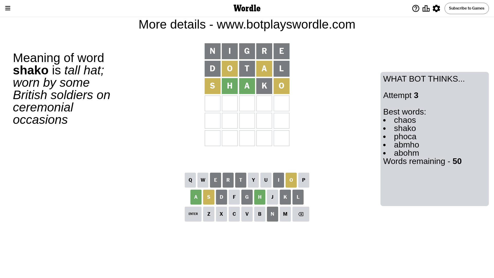
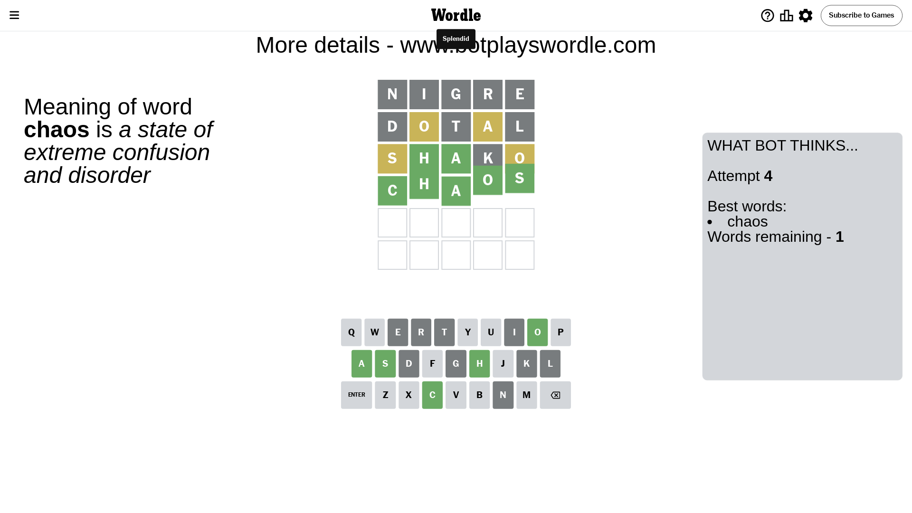

# Wordle for May 31, 2024 - \#1077

## Attempt 1

This is the first attempt and we'll choose a random word to start with.

Let's start with word `nigre`

Attempt for `nigre` gives us 0 correct letters, 0 present letters and 5 wrong letters.

If we look into details, we can see that:

Letter `n` is not present in the word and we will not use it any more

Letter `i` is not present in the word and we will not use it any more

Letter `g` is not present in the word and we will not use it any more

Letter `r` is not present in the word and we will not use it any more

Letter `e` is not present in the word and we will not use it any more

Some letters are missing (like `n`, `i`, `g`, `r`, `e`) but it's also important piece of information

So far we don't know any of the letters!

Not a bad guess in general

## Attempt 2

Right now we have 1112 words to choose from and best of them seem to be `[dotal altho loath shalt lathy]`

So far we know that possible letters are:

At position 1: `[a b c d f h j k l m o p q s t u v w x y z]`

At position 2: `[a b c d f h j k l m o p q s t u v w x y z]`

At position 3: `[a b c d f h j k l m o p q s t u v w x y z]`

At position 4: `[a b c d f h j k l m o p q s t u v w x y z]`

At position 5: `[a b c d f h j k l m o p q s t u v w x y z]`

Next guess is `dotal`, let's see what it gives us

Attempt for `dotal` gives us 0 correct letters, 2 present letters and 3 wrong letters.

If we look into details, we can see that:

Letter `d` is not present in the word and we will not use it any more

Letter `o` is on a different spot - this means that it cannot be at position 2

Letter `t` is not present in the word and we will not use it any more

Letter `a` is on a different spot - this means that it cannot be at position 4

Letter `l` is not present in the word and we will not use it any more

Some letters are missing (like `d`, `t`, `l`) but it's also important piece of information

Word should contain letters `[o a]`

That was a great guess that limited number of remaining words

## Attempt 3

Right now we have 50 words to choose from and best of them seem to be `[chaos shako phoca abmho abohm]`

So far we know that possible letters are:

At position 1: `[a b c f h j k m o p q s u v w x y z]`

At position 2: `[a b c f h j k m p q s u v w x y z]`

At position 3: `[a b c f h j k m o p q s u v w x y z]`

At position 4: `[b c f h j k m o p q s u v w x y z]`

At position 5: `[a b c f h j k m o p q s u v w x y z]`

Next guess is `shako`, let's see what it gives us

Attempt for `shako` gives us 2 correct letters, 2 present letters and 1 wrong letters.

If we look into details, we can see that:

Letter `s` is on a different spot - this means that it cannot be at position 1

Letter `h` should be at position 2

Letter `a` should be at position 3

Letter `k` is not present in the word and we will not use it any more

Letter `o` is on a different spot - this means that it cannot be at position 5

We got information about the correct letters and it should make next attempt easier

Some letters are missing (like `k`) but it's also important piece of information

Word should contain letters `[o a s h]`

That was a great guess that limited number of remaining words

## Attempt 4

Right now we have 1 words to choose from and best of them seem to be `[chaos]`

So far we know that possible letters are:

At position 1: `[a b c f h j m o p q u v w x y z]`

At position 2: `[h]`

At position 3: `[a]`

At position 4: `[b c f h j m o p q s u v w x y z]`

At position 5: `[a b c f h j m p q s u v w x y z]`

It must be `chaos`

That's the correct answer! The word is `chaos`!

## Conclusion

Today's word is `chaos` and it took 4 attempts to guess it

