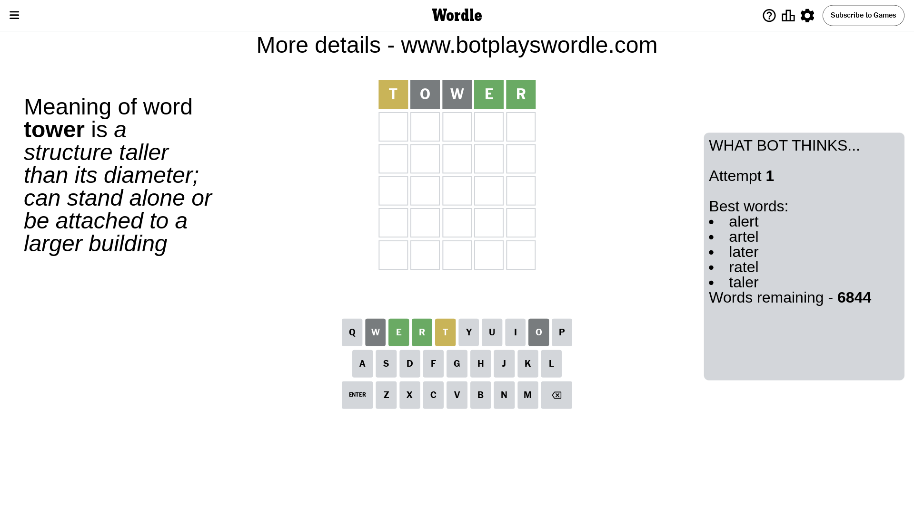
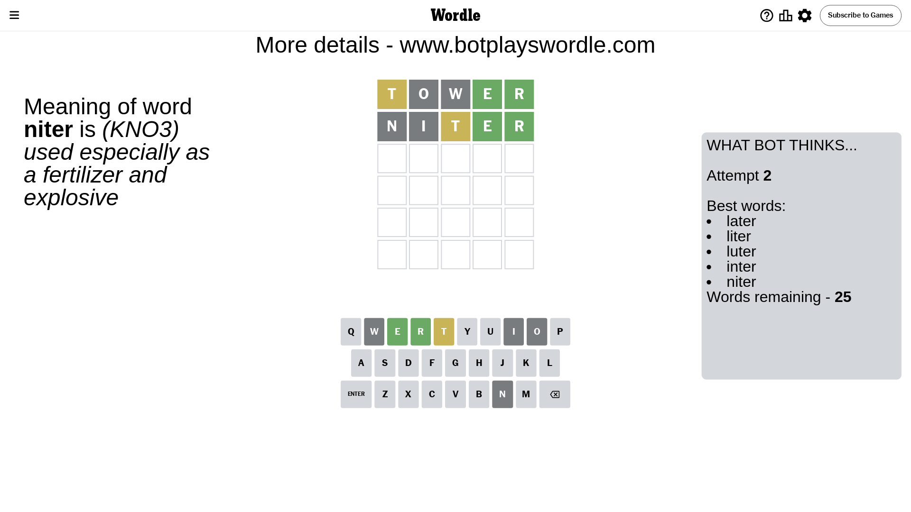
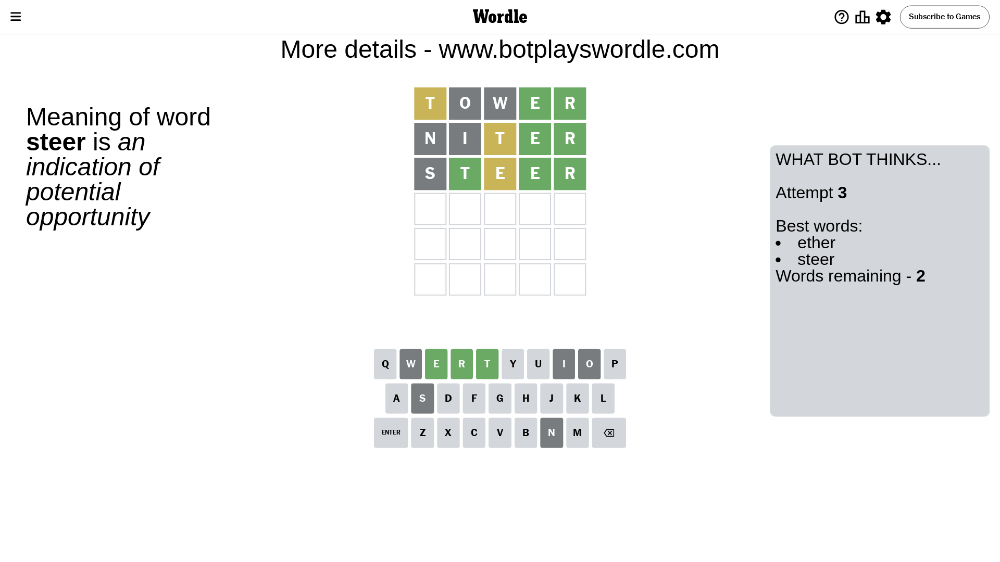
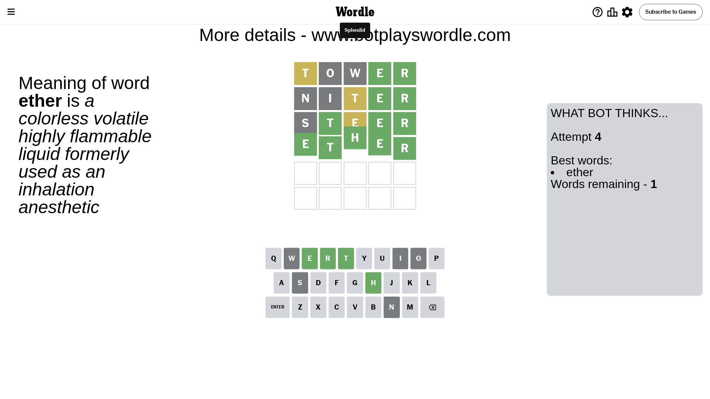

# Wordle for June 6, 2024 - \#1083

## Attempt 1

This is the first attempt and we'll choose a random word to start with.

Let's start with word `tower`

Attempt for `tower` gives us 2 correct letters, 1 present letters and 2 wrong letters.

If we look into details, we can see that:

Letter `t` is on a different spot - this means that it cannot be at position 1

Letter `o` is not present in the word and we will not use it any more

Letter `w` is not present in the word and we will not use it any more

Letter `e` should be at position 4

Letter `r` should be at position 5

We got information about the correct letters and it should make next attempt easier

Some letters are missing (like `o`, `w`) but it's also important piece of information

Word should contain letters `[t e r]`

That was a great guess that limited number of remaining words

## Attempt 2

Right now we have 25 words to choose from and best of them seem to be `[later liter luter inter niter]`

So far we know that possible letters are:

At position 1: `[a b c d e f g h i j k l m n p q r s u v x y z]`

At position 2: `[a b c d e f g h i j k l m n p q r s t u v x y z]`

At position 3: `[a b c d e f g h i j k l m n p q r s t u v x y z]`

At position 4: `[e]`

At position 5: `[r]`

Next guess is `niter`, let's see what it gives us

Attempt for `niter` gives us 2 correct letters, 1 present letters and 2 wrong letters.

If we look into details, we can see that:

Letter `n` is not present in the word and we will not use it any more

Letter `i` is not present in the word and we will not use it any more

Letter `t` is on a different spot - this means that it cannot be at position 3

Some letters are missing (like `n`, `i`) but it's also important piece of information

Word should contain letters `[t e r]`

That was a great guess that limited number of remaining words

## Attempt 3

Right now we have 2 words to choose from and best of them seem to be `[ether steer]`

So far we know that possible letters are:

At position 1: `[a b c d e f g h j k l m p q r s u v x y z]`

At position 2: `[a b c d e f g h j k l m p q r s t u v x y z]`

At position 3: `[a b c d e f g h j k l m p q r s u v x y z]`

At position 4: `[e]`

At position 5: `[r]`

Next guess is `steer`, let's see what it gives us

Attempt for `steer` gives us 3 correct letters, 1 present letters and 1 wrong letters.

If we look into details, we can see that:

Letter `s` is not present in the word and we will not use it any more

Letter `t` should be at position 2

Letter `e` is on a different spot - this means that it cannot be at position 3

We got information about the correct letters and it should make next attempt easier

Some letters are missing (like `s`) but it's also important piece of information

Word should contain letters `[t e r]`

This was a waste, almost no valuable information...

## Attempt 4

Right now we have 1 words to choose from and best of them seem to be `[ether]`

So far we know that possible letters are:

At position 1: `[a b c d e f g h j k l m p q r u v x y z]`

At position 2: `[t]`

At position 3: `[a b c d f g h j k l m p q r u v x y z]`

At position 4: `[e]`

At position 5: `[r]`

It must be `ether`

That's the correct answer! The word is `ether`!

## Conclusion

Today's word is `ether` and it took 4 attempts to guess it

